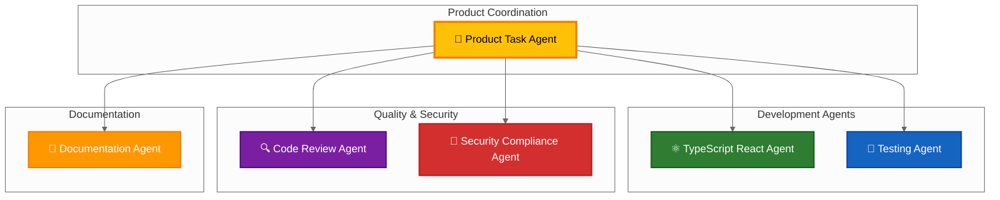

<!-- SPDX-FileCopyrightText: 2024-2026 Hack23 AB -->
<!-- SPDX-License-Identifier: Apache-2.0 -->

<p align="center">
  
</p>

<h1 align="center">📋 CIA Compliance Manager</h1>

<p align="center">
  <strong>Enterprise-Grade Security Assessment & Compliance Platform</strong><br>
  <em>🛡️ CIA triad assessment · 📊 Multi-framework compliance · 💰 Cost & ROI analysis · 🎯 Threat modeling · 🏷️ Data classification · 📈 Business impact quantification</em>
</p>

<p align="center">
  <a href="https://ciacompliancemanager.com"></a>
  <a href="https://ciacompliancemanager.com/docs/api/"></a>
  <a href="https://www.npmjs.com/package/cia-compliance-manager"></a>
</p>

<p align="center">
  <a href="#"></a>
  <a href="#"></a>
  <a href="#"></a>
  <a href="#"></a>
  <a href="#"></a>
</p>

---

**🔒 Supply-Chain Security & Provenance:**

[](https://scorecard.dev/viewer/?uri=github.com/Hack23/cia-compliance-manager)
[](https://www.bestpractices.dev/projects/10365)
[](https://github.com/Hack23/cia-compliance-manager/attestations)
[](https://app.fossa.com/projects/git%2Bgithub.com%2FHack23%2Fcia-compliance-manager?ref=badge_shield&issueType=license)
[](LICENSE)

**🚀 CI/CD Workflows:**

[](https://github.com/Hack23/cia-compliance-manager/actions/workflows/codeql.yml)
[](https://github.com/Hack23/cia-compliance-manager/actions/workflows/release.yml)
[](https://github.com/Hack23/cia-compliance-manager/actions/workflows/deploy-s3.yml)
[](https://github.com/Hack23/cia-compliance-manager/actions/workflows/zap-scan.yml)
[](https://github.com/Hack23/cia-compliance-manager/actions/workflows/lighthouse-performance.yml)
[](https://github.com/Hack23/cia-compliance-manager/actions/workflows/dependency-review.yml)
[](https://github.com/Hack23/cia-compliance-manager/actions/workflows/test-and-report.yml)
[](https://github.com/Hack23/cia-compliance-manager/actions/workflows/scorecards.yml)

**📊 Code Quality & Metrics:**

[](https://sonarcloud.io/summary/new_code?id=Hack23_cia-compliance-manager)
[](https://sonarcloud.io/summary/new_code?id=Hack23_cia-compliance-manager)
[](https://sonarcloud.io/summary/new_code?id=Hack23_cia-compliance-manager)
[](https://sonarcloud.io/summary/new_code?id=Hack23_cia-compliance-manager)
[](https://sonarcloud.io/summary/new_code?id=Hack23_cia-compliance-manager)
[](https://bundlephobia.com/package/cia-compliance-manager)

**🔐 ISMS & Compliance Framework:**

[](https://github.com/Hack23/ISMS-PUBLIC/blob/main/Information_Security_Policy.md)
[](https://github.com/Hack23/ISMS-PUBLIC/blob/main/NIST_CSF_Mapping.md)
[](https://github.com/Hack23/ISMS-PUBLIC/blob/main/CIS_Controls_Mapping.md)
[](https://github.com/Hack23/ISMS-PUBLIC)
[](https://github.com/Hack23/ISMS-PUBLIC/blob/main/Secure_Development_Policy.md)
[](https://github.com/Hack23/ISMS-PUBLIC/blob/main/Threat_Modeling.md)
[](https://github.com/Hack23/ISMS-PUBLIC/blob/main/Vulnerability_Management.md)
[](https://github.com/Hack23/ISMS-PUBLIC/blob/main/Open_Source_Policy.md)
[](https://github.com/Hack23/ISMS-PUBLIC/blob/main/ISMS_Transparency_Plan.md)

**📚 Documentation & Reports:**

[](https://deepwiki.com/Hack23/cia-compliance-manager)
[](https://ciacompliancemanager.com/docs/api/)
[](https://ciacompliancemanager.com/docs/coverage/index.html)
[](https://ciacompliancemanager.com/docs/cypress/mochawesome/index.html)

---

## 🌐 Explore the Platform

CIA Compliance Manager is both a live assessment platform **and** a reusable npm library for building security-first React applications. Two entry points serve different audiences:

<table>
  <tr>
    <td width="140" align="center" valign="top">
      <a href="https://ciacompliancemanager.com"></a>
    </td>
    <td>
      <strong><a href="https://ciacompliancemanager.com">🌐 Live Assessment Platform</a></strong><br>
      Interactive web application for performing CIA triad security assessments, generating compliance reports, estimating implementation costs (CAPEX/OPEX), and quantifying business impact across ISO 27001, NIST 800-53, GDPR, HIPAA, SOC 2, PCI DSS, and EU CRA frameworks. Features real-time dashboards, STRIDE threat modeling, Porter's Five Forces strategic analysis, and professional data classification tools. Built with React 19.x, TypeScript 6.x, Vite 8.x, and Tailwind 4.x — demonstrating Hack23's commitment to transparency and security by design.
    </td>
  </tr>
  <tr>
    <td width="140" align="center" valign="top">
      <a href="https://www.npmjs.com/package/cia-compliance-manager"></a>
    </td>
    <td>
      <strong><a href="https://www.npmjs.com/package/cia-compliance-manager">📦 npm Library — cia-compliance-manager@1.1.59</a></strong><br>
      Tree-shakeable ES module package with 10 subpath exports (<code>types</code>, <code>services</code>, <code>hooks</code>, <code>utils</code>, <code>components</code>, <code>components/widgets</code>, <code>constants</code>, <code>data</code>, <code>contexts</code>, plus root). Provides React components, hooks, and services for building security assessment and compliance management features into your own applications. Fully typed with TypeScript, peer-dependency-light (React 18.2+ or 19.x, optional Chart.js 4.x), and SLSA 3 provenance-signed. Suitable for embedding CIA triad assessments, compliance dashboards, threat modeling, or business impact analysis into enterprise portals, GRC platforms, or security operations consoles.
    </td>
  </tr>
  <tr>
    <td width="140" align="center" valign="top">
      <a href="https://ciacompliancemanager.com/sitemap.html"></a>
    </td>
    <td>
      <strong><a href="https://ciacompliancemanager.com/sitemap.html">🗺️ Full Site Map</a></strong><br>
      Comprehensive index of all platform pages, documentation sections, and reference materials. Includes assessment workflows, compliance mappings, technical architecture diagrams, and ISMS alignment documents. Best entry point for SEO crawlers and discovering deep-linked resources.
    </td>
  </tr>
  <tr>
    <td width="140" align="center" valign="top">
      <a href="https://ciacompliancemanager.com/docs/api/"></a>
    </td>
    <td>
      <strong><a href="https://ciacompliancemanager.com/docs/api/">📔 TypeDoc API Reference</a></strong><br>
      Complete API documentation for every exported symbol in the <code>cia-compliance-manager</code> package. Includes React components, TypeScript interfaces, service functions, custom hooks, utility helpers, and data constants. Companion <a href="https://ciacompliancemanager.com/docs/coverage/index.html">📓 Test Coverage</a> and <a href="https://ciacompliancemanager.com/docs/cypress/mochawesome/index.html">🎭 Cypress E2E Reports</a> available from the same documentation hub.
    </td>
  </tr>
</table>

---

## 🎯 Why This Exists

Security and compliance are **business-critical**, but they're also **expensive, complex, and frequently misunderstood** by non-specialists. Organizations face a maze of overlapping frameworks (ISO 27001, NIST 800-53, GDPR, HIPAA, SOC 2, PCI DSS, EU CRA), each with hundreds of controls, unclear mapping, and no built-in cost transparency. CISOs struggle to translate technical security requirements into business-justifiable budgets. Compliance officers can't easily demonstrate ROI for security investments. Small-to-medium enterprises lack the tools that large consulting firms use internally.

**CIA Compliance Manager bridges this gap** — it's the **transparent, open-source compliance assessment platform** that organizations can use to:

- **Assess security posture** systematically using the CIA triad (Confidentiality, Integrity, Availability) as the unifying lens across all frameworks.
- **Map controls automatically** to ISO 27001, NIST 800-53, GDPR, HIPAA, SOC 2, PCI DSS, and EU CRA — see exactly which framework controls apply to your assessed security levels.
- **Estimate costs realistically** with detailed CAPEX and OPEX breakdowns, so you can justify budgets and track ROI.
- **Model threats rigorously** using STRIDE methodology, attack trees, and risk quantification — go beyond checkbox compliance to actual risk management.
- **Quantify business impact** across financial, operational, reputational, and regulatory dimensions using our [Classification Framework](https://github.com/Hack23/ISMS-PUBLIC/blob/main/CLASSIFICATION.md).
- **Demonstrate transparency** — every methodology, every calculation, every control mapping is open-source and auditable.

This project is the open-source platform behind **[ciacompliancemanager.com](https://ciacompliancemanager.com)**: a production-ready assessment tool built following Hack23's [Secure Development Policy](https://github.com/Hack23/ISMS-PUBLIC/blob/main/Secure_Development_Policy.md) and classified according to our [ISMS standards](https://github.com/Hack23/ISMS-PUBLIC). It serves as both an **operational platform for security assessments** and a **live reference implementation** of security-by-design principles.

| Pillar | What it means in this project |
|---|---|
| 🛡️ **CIA Triad Assessment** | Every security decision is evaluated across Confidentiality, Integrity, and Availability dimensions. We use a 5-level maturity model (Level 1: Basic → Level 5: Optimized) mapped to concrete technical controls, so you know exactly what "High Confidentiality" means in practice (encryption at rest + in transit, key management, access controls, etc.). |
| 📊 **Multi-Framework Compliance** | Automated mapping to 7 major frameworks. Select your target security levels (e.g., "High Confidentiality, Medium Integrity, High Availability"), and the platform shows you which ISO 27001 Annex A controls, NIST 800-53 families, GDPR articles, HIPAA safeguards, SOC 2 criteria, PCI DSS requirements, and EU CRA essential requirements apply. |
| 💰 **Cost & ROI Transparency** | Security has a price. We calculate CAPEX (licenses, hardware, consulting) and OPEX (staffing, maintenance, subscription costs) for each security level, broken down by category. ROI calculator lets you compare risk reduction value against implementation costs. |
| 🎯 **Threat Modeling** | Integrated STRIDE analysis (Spoofing, Tampering, Repudiation, Information Disclosure, Denial of Service, Elevation of Privilege). Build attack trees, assign likelihood and impact scores, prioritize mitigations. Structured threat intelligence aligned with ISMS threat modeling standards. |
| 🏷️ **Data Classification** | Systematic data classification engine based on CIA requirements. Input your data sensitivity, integrity needs, and availability SLAs; get back a clear classification label (Public, Internal, Confidential, Restricted) with handling requirements and retention policies. |
| 📈 **Business Impact Analysis** | Quantify what happens when security fails. Our Business Impact Matrix scores financial loss, operational disruption, reputational damage, and regulatory penalties across 5 severity levels. Connect security controls to business value, not just compliance checkboxes. |

---

## 🎯 Purpose Statement

The **CIA Compliance Manager** is a comprehensive application designed to help organizations assess, implement, and manage security controls across the CIA triad (Confidentiality, Integrity, and Availability). It provides detailed security assessments, cost estimation tools, business impact analysis, and technical implementation guidance to support organizations in achieving their security objectives within budget constraints.

This compliance tool demonstrates Hack23 AB's commitment to **security by design** and **transparency**, serving as both an operational platform and a live demonstration of our cybersecurity consulting expertise. Built following our [Secure Development Policy](https://github.com/Hack23/ISMS-PUBLIC/blob/main/Secure_Development_Policy.md) and classified according to our [Classification Framework](https://github.com/Hack23/ISMS-PUBLIC/blob/main/CLASSIFICATION.md), this project exemplifies security best practices through transparent implementation.

*— James Pether Sörling, CEO/Founder, Hack23 AB*

---

## 🌟 Key Features

The CIA Compliance Manager provides enterprise-grade capabilities for security assessment and compliance management:

<table>
<tr>
  <td width="33%">
    <h3>🔐 Advanced CIA Triad Assessment</h3>
    <p>Automated security level assessment across Confidentiality, Integrity, and Availability dimensions with real-time control effectiveness tracking. 5-level maturity model (Basic → Optimized) mapped to concrete technical controls.</p>
  </td>
  <td width="33%">
    <h3>📋 Multi-Framework Compliance Mapping</h3>
    <p>Comprehensive compliance automation for NIST 800-53, ISO 27001, GDPR, HIPAA, SOC 2, PCI DSS, and EU Cyber Resilience Act (CRA). Automatic control mapping based on assessed security levels.</p>
  </td>
  <td width="33%">
    <h3>🎯 Sophisticated Threat Modeling</h3>
    <p>Integrated STRIDE threat analysis with risk quantification and attack tree visualization for comprehensive security assessment. Align threats to security controls and business impact.</p>
  </td>
</tr>
<tr>
  <td width="33%">
    <h3>📊 Enterprise Business Impact Analysis</h3>
    <p>Quantify financial, operational, reputational, and regulatory impacts using structured impact assessment methodologies from our <a href="https://github.com/Hack23/ISMS-PUBLIC/blob/main/CLASSIFICATION.md#business-impact-analysis-matrix">Classification Framework</a>.</p>
  </td>
  <td width="33%">
    <h3>💰 Cost Estimation & ROI Analysis</h3>
    <p>Calculate CAPEX (licenses, hardware, consulting) and OPEX (staffing, maintenance, subscriptions) for security implementations with detailed breakdown and ROI calculator to justify security investments.</p>
  </td>
  <td width="33%">
    <h3>🏷️ Professional Data Classification</h3>
    <p>Apply systematic data classification based on confidentiality, integrity, and availability requirements aligned with <a href="https://github.com/Hack23/ISMS-PUBLIC/blob/main/CLASSIFICATION.md">ISMS standards</a>. Generate handling requirements and retention policies.</p>
  </td>
</tr>
<tr>
  <td width="33%">
    <h3>📈 Interactive Dashboards</h3>
    <p>Real-time visualization of security posture, compliance status, and risk metrics through intuitive interactive charts and widgets. Export reports in multiple formats.</p>
  </td>
  <td width="33%">
    <h3>📝 Implementation Guidance</h3>
    <p>Detailed technical guidance and best practices for deploying security controls across all CIA triad levels. Step-by-step roadmaps for moving from current state to target state.</p>
  </td>
  <td width="33%">
    <h3>🔍 Automated Evidence Collection</h3>
    <p>Generate compliance reports and collect evidence artifacts for audit preparation and regulatory requirements. Traceable lineage from controls to evidence to frameworks.</p>
  </td>
</tr>
</table>

### 👥 Target Audience

This platform serves security professionals and decision-makers:

- **🎯 CISOs & Security Directors** — Strategic security posture management and compliance oversight
- **📋 Compliance & Risk Officers** — Regulatory compliance tracking and audit preparation
- **💼 IT Managers & System Administrators** — Security control implementation and operational management
- **🏗️ Security Architects & Engineers** — Technical security design and architecture validation
- **💰 Business Stakeholders** — Security investment decisions and ROI analysis

---

## 🤖 GitHub Copilot Custom Agents

CIA Compliance Manager includes a set of **specialized GitHub Copilot custom agents** tailored to this project's architecture, ISMS alignment, and quality standards. Each agent focuses on a specific domain (product, development, testing, documentation, or security) to provide **context-aware assistance** across the codebase.



### 📋 Available Agents

<table>
  <tr>
    <td width="50%">
      <h3>🎯 Product Task Agent</h3>
      <p><strong>File:</strong> <a href=".github/agents/product-task-agent.md"><code>.github/agents/product-task-agent.md</code></a></p>
      <p>Expert product coordinator for creating GitHub issues, assigning tasks to agents, and ensuring quality across code, UX, security, and ISMS dimensions.</p>
      <p><strong>Use for:</strong> product audits, issue creation, UI/UX and accessibility findings, ISMS alignment, and multi‑agent task coordination.</p>
    </td>
    <td width="50%">
      <h3>⚛️ TypeScript React Agent</h3>
      <p><strong>File:</strong> <a href=".github/agents/typescript-react-agent.md"><code>.github/agents/typescript-react-agent.md</code></a></p>
      <p>Specialist in React&nbsp;19.x and TypeScript 6.x for building secure, type‑safe components that follow the project's architecture and reusability standards.</p>
      <p><strong>Use for:</strong> new components, state management patterns, type definitions, refactoring, and type‑safe integrations.</p>
    </td>
  </tr>
  <tr>
    <td width="50%">
      <h3>🧪 Testing Agent</h3>
      <p><strong>File:</strong> <a href=".github/agents/testing-agent.md"><code>.github/agents/testing-agent.md</code></a></p>
      <p>Testing expert for Vitest 4.x, React Testing Library 16.x, and Cypress 15.x, aligned with the project's Secure Development Policy and coverage thresholds.</p>
      <p><strong>Use for:</strong> unit tests, integration tests, E2E scenarios, improving coverage, and debugging failing tests.</p>
    </td>
    <td width="50%">
      <h3>🔍 Code Review Agent</h3>
      <p><strong>File:</strong> <a href=".github/agents/code-review-agent.md"><code>.github/agents/code-review-agent.md</code></a></p>
      <p>Reviewer focused on code quality, maintainability, performance, accessibility (WCAG 2.1 AA), and security hygiene across the TypeScript/React codebase.</p>
      <p><strong>Use for:</strong> PR reviews, identifying code smells, performance tuning, and enforcing project coding standards.</p>
    </td>
  </tr>
  <tr>
    <td width="50%">
      <h3>📝 Documentation Agent</h3>
      <p><strong>File:</strong> <a href=".github/agents/documentation-agent.md"><code>.github/agents/documentation-agent.md</code></a></p>
      <p>Documentation specialist for Markdown, JSDoc/TypeDoc, and Mermaid diagrams, aligned with the project's C4 architecture model and ISMS documentation portfolio.</p>
      <p><strong>Use for:</strong> updating README files, writing API docs, creating architecture diagrams, and maintaining ISMS compliance docs.</p>
    </td>
    <td width="50%">
      <h3>🔐 Security &amp; Compliance Agent</h3>
      <p><strong>File:</strong> <a href=".github/agents/security-compliance-agent.md"><code>.github/agents/security-compliance-agent.md</code></a></p>
      <p>Security and compliance expert for CIA triad analysis, NIST/ISO/GDPR mapping, threat modeling (STRIDE), and secure coding practices aligned with OWASP Top 10.</p>
      <p><strong>Use for:</strong> security control implementation, framework mapping, threat modeling, risk assessment, and vulnerability remediation.</p>
    </td>
  </tr>
</table>

### 🚀 Using Agents in This Project

You can explicitly address agents in your prompts when working in this repository:

```text
@product-task-agent, create GitHub issues for improving the CRA assessment documentation.

@typescript-react-agent, refactor the SecuritySummaryWidget to reuse existing types and constants.

@testing-agent, add Vitest unit tests for the BusinessImpactAnalysisWidget.

@security-compliance-agent, review the cost estimation logic for compliance with the Classification Framework.
```

For full configuration details and advanced usage, see the **[Agent README](.github/agents/README.md)** and **[Skills Framework](.github/skills/README.md)**.

---

### 🎓 Foundational Skills Framework

Each agent is equipped with **domain-specific skills** that define reusable best practices, patterns, and compliance standards. Skills are stored in `.github/skills/` and loaded by agents to ensure consistent, ISMS-aligned behavior across the codebase.

**Core Skills:**

- **[documentation-standards.md](.github/skills/documentation-standards.md)** — JSDoc, TypeDoc, Markdown, Mermaid diagram standards
- **[c4-architecture-documentation.md](.github/skills/c4-architecture-documentation.md)** — C4 model (Context/Container/Component/Code) for architecture diagrams
- **[code-quality-excellence.md](.github/skills/code-quality-excellence.md)** — TypeScript best practices, React patterns, ESLint rules, code organization
- **[security-best-practices.md](.github/skills/security-best-practices.md)** — OWASP Top 10, secure coding patterns, input validation, authentication/authorization
- **[testing-excellence.md](.github/skills/testing-excellence.md)** — Vitest, React Testing Library, Cypress E2E, coverage thresholds, test design
- **[compliance-frameworks.md](.github/skills/compliance-frameworks.md)** — ISO 27001, NIST CSF 2.0, GDPR, HIPAA, SOC 2, PCI DSS, EU CRA control mapping

**How Skills Work:**

1. **Agents load skills** from `.github/skills/` based on their domain (e.g., Documentation Agent loads `documentation-standards.md` + `c4-architecture-documentation.md`)
2. **Skills define patterns** using examples, rules, and constraints that agents apply when generating code, docs, or tests
3. **Skills evolve with the project** — when you update a skill file, all agents that reference it immediately adopt the new standard
4. **Skills are versioned** alongside the codebase, ensuring traceability between code changes and the standards that governed them

**Example: Documentation Agent + Skills:**

When the Documentation Agent updates `SECURITY_ARCHITECTURE.md`, it:
- Follows **documentation-standards.md** for Markdown structure, heading hierarchy, and cross-references
- Applies **c4-architecture-documentation.md** for C4 Context/Container diagrams using the project's Mermaid palette
- Uses **STYLE_GUIDE.md** for CIA-triad colors (Confidentiality = Purple `#7B1FA2`, Integrity = DarkGreen `#2E7D32`, Availability = DarkBlue `#1565C0`)

This ensures every diagram, every heading, every cross-link follows the same visual and structural conventions.

---

## 📝 Featured Blog Posts

Expert analysis and thought leadership on CIA triad security, compliance frameworks, and business impact from industry professionals:

### 🎯 **CIA Triad & Business Impact Analysis**

<table>
  <tr>
    <td width="50%">
      <h4>📊 The CIA Triad for Business Impact Analysis</h4>
      <p><strong>Author:</strong> Simon Moon (Independent Security Consultant)</p>
      <p><strong>Published:</strong> DevGenius, 2024-12-15</p>
      <p>Deep dive into using the CIA triad (Confidentiality, Integrity, Availability) as the foundation for business impact analysis. Explores how security professionals can translate technical security requirements into business-justifiable metrics, quantify risk across financial/operational/reputational dimensions, and align security investments with organizational value.</p>
      <p><a href="https://blog.devgenius.io/the-cia-triad-for-business-impact-analysis-06c4b31d95f0"><strong>Read Full Article →</strong></a></p>
    </td>
    <td width="50%">
      <h4>🛡️ The CIA Triad: Your Secret Weapon for Smarter Security Decisions</h4>
      <p><strong>Author:</strong> George Dorn (Security Strategist & Risk Analyst)</p>
      <p><strong>Published:</strong> Medium, 2024-12-14</p>
      <p>Practical guide to leveraging the CIA triad for strategic security decision-making. Covers real-world scenarios where Confidentiality, Integrity, and Availability trade-offs drive architecture choices, technology selection, and budget prioritization. Includes case studies from financial services, healthcare, and SaaS platforms.</p>
      <p><a href="https://medium.com/@george.dorn/the-cia-triad-your-secret-weapon-for-smarter-security-decisions-e4c9f5c85aac"><strong>Read Full Article →</strong></a></p>
    </td>
  </tr>
</table>

**Want to contribute a blog post?** We welcome guest articles on CIA triad security, compliance automation, threat modeling, and GRC best practices. See our [Contributing Guidelines](CONTRIBUTING.md) for submission details.

---

## 📊 Current Status / At a Glance

**Version:** 1.1.59 (Effective: 2026-04-28 | Next Review: 2026-07-28)

**Package Health:**
- **Build Status:** ✅ All workflows passing
- **Test Coverage:** 85%+ (Vitest + Cypress E2E)
- **Bundle Size:** ~120 KB minified+gzipped (tree-shakeable)
- **Dependencies:** [](https://libraries.io/github/Hack23/cia-compliance-manager) | [](https://github.com/Hack23/cia-compliance-manager/graphs/commit-activity)
- **ISMS Posture:** ISO 27001:2022-aligned, NIST CSF 2.0-mapped, CIS Controls v8.1-compliant

**Package Layout (10 Subpath Exports):**
```typescript
import { SecurityProfile, ComplianceFramework } from 'cia-compliance-manager';                  // root
import { CIALevel, SecurityControlMapping } from 'cia-compliance-manager/types';               // types
import { AssessmentService, ComplianceService } from 'cia-compliance-manager/services';        // services
import { useSecurityProfile, useCompliance } from 'cia-compliance-manager/hooks';              // hooks
import { formatCurrency, calculateROI } from 'cia-compliance-manager/utils';                   // utils
import { SecurityDashboard, ComplianceMatrix } from 'cia-compliance-manager/components';       // components
import { BusinessImpactWidget, ThreatModelWidget } from 'cia-compliance-manager/components/widgets'; // widgets
import { SECURITY_LEVELS, COMPLIANCE_FRAMEWORKS } from 'cia-compliance-manager/constants';     // constants
import { controlData, frameworkMappings } from 'cia-compliance-manager/data';                  // data
import { SecurityProfileProvider, ComplianceContext } from 'cia-compliance-manager/contexts';  // contexts
```

**Technology Stack:**
- **Runtime:** Node ≥25.0.0, npm ≥10.0.0
- **Language:** TypeScript 6.0.3 (ES2025 target)
- **Framework:** React 19.2.5 + React DOM 19.2.5
- **Build:** Vite 8.0.10 (ES module bundler)
- **Styling:** Tailwind CSS 4.2.4
- **Testing:** Vitest 4.1.5, @vitest/coverage-v8 4.1.5, Cypress 15.14.1
- **Linting:** ESLint 10.2.1 + TypeScript ESLint 8.59.1
- **Documentation:** TypeDoc 0.28.19 + typedoc-plugin-mermaid 1.12.0
- **Code Quality:** Knip 6.7.0 (unused exports detection)

---

## 🏆 Business Value & Strategic Impact

### 🎯 Project Classification

CIA Compliance Manager is classified as **PUBLIC** per Hack23's [Classification Framework](https://github.com/Hack23/ISMS-PUBLIC/blob/main/CLASSIFICATION.md). This public classification enables transparency, community contributions, and serves as a reference implementation for security-by-design principles.

### 🔒 Security Classification

**CIA Triad Assessment:**
- **Confidentiality:** MEDIUM (Public data, but architecture patterns demonstrate security controls)
- **Integrity:** HIGH (Code provenance, SLSA 3 attestations, immutable audit trails)
- **Availability:** MEDIUM (Public CDN, GitHub Pages, S3 static hosting with CloudFront)

### ⏱️ Business Continuity

**Recovery Time Objective (RTO):** 4 hours  
**Recovery Point Objective (RPO):** 1 hour  
**Maximum Tolerable Downtime (MTD):** 24 hours

For detailed DR procedures, see [Business Continuity Plan](docs/architecture/BCPPlan.md).

### 💰 Business Impact Analysis Matrix

Assessment of impact if CIA Compliance Manager were unavailable or compromised:

| Impact Dimension | Severity Level | Financial Impact | Description |
|------------------|----------------|------------------|-------------|
| **Financial** | MEDIUM | $10K–$100K | Loss of demonstration platform affects consulting sales pipeline and SaaS revenue potential |
| **Operational** | LOW | <$10K | Alternative assessment tools available; manual processes feasible for short-term |
| **Reputational** | MEDIUM | Brand damage | Security consulting firm with insecure platform creates trust deficit; media coverage risk |
| **Regulatory** | LOW | Minimal | No regulated data processed; GDPR/HIPAA compliance demonstration affected but not business-critical |

*Detailed methodology and scoring rubric: [ISMS Classification Framework § Business Impact Matrix](https://github.com/Hack23/ISMS-PUBLIC/blob/main/CLASSIFICATION.md#business-impact-analysis-matrix)*

### 🛡️ Security Investment Returns

**Primary ROI Drivers:**

1. **Consulting Sales Enablement** — Live platform demonstrates Hack23's security expertise to potential clients; reference implementation shortens sales cycles
2. **Product Differentiation** — Only open-source CIA triad assessment platform with multi-framework mapping and cost transparency; competitive moat in GRC consulting
3. **Community Trust** — Transparency builds credibility; security professionals prefer vendors who "eat their own dog food"
4. **Reusable IP** — npm library enables Hack23 to embed compliance features into client projects; reduces custom development costs

### 🎯 Competitive Differentiation

**vs. Commercial GRC Platforms (e.g., OneTrust, LogicGate):**
- ✅ **Transparency:** Every control mapping, every calculation is auditable — no vendor lock-in
- ✅ **Cost:** Open-source library + self-hosted option vs. $50K+ annual licenses
- ✅ **Customization:** Fork, extend, embed — vs. rigid SaaS feature sets

**vs. Consulting Spreadsheets:**
- ✅ **Automation:** Real-time calculations, live dashboards vs. error-prone manual updates
- ✅ **Frameworks:** 7 frameworks mapped simultaneously vs. single-framework silos
- ✅ **Evidence:** Traceable lineage from controls to frameworks to audit artifacts

**vs. Other Open-Source Tools (e.g., OWASP Threat Dragon):**
- ✅ **Multi-Framework:** ISO 27001 + NIST + GDPR + HIPAA + SOC 2 + PCI DSS + EU CRA vs. single-purpose tools
- ✅ **Business Focus:** Cost estimation, ROI analysis, business impact quantification — not just technical checklists

### 📈 Porter's Five Forces Strategic Impact

**How CIA Compliance Manager affects Hack23's competitive position:**

| Force | Impact | Analysis |
|-------|--------|----------|
| **🆚 Competitive Rivalry** | **Reduces intensity** | Demonstrates superior technical capability vs. consulting competitors; transparent implementation builds trust faster than marketing claims |
| **🚪 Threat of New Entrants** | **Raises barriers** | Open-source platform + community contributions create network effects; new entrants must match feature breadth + framework coverage |
| **🔄 Supplier Power** | **Reduces dependency** | Self-hosted option eliminates reliance on third-party GRC vendors; control over roadmap and pricing |
| **👥 Buyer Power** | **Strengthens position** | Transparent pricing (free OSS + paid consulting) vs. opaque vendor contracts; clients choose based on value, not negotiation leverage |
| **🔀 Substitutes** | **Mitigates threat** | Superior UX + automation vs. manual spreadsheets; broader framework coverage vs. single-purpose tools; cost transparency vs. commercial SaaS black boxes |

---

#### 🎯 ISMS Compliance Highlights

CIA Compliance Manager is built and operated in full compliance with [Hack23's ISMS framework](https://github.com/Hack23/ISMS-PUBLIC):

- ✅ **Secure Development Policy:** SLSA 3 provenance, SBOM generation, automated vulnerability scanning (Dependabot, CodeQL, ZAP), peer-reviewed PRs
- ✅ **Threat Modeling:** STRIDE analysis documented in [THREAT_MODEL.md](docs/architecture/THREAT_MODEL.md); attack surfaces mapped to mitigations
- ✅ **Vulnerability Management:** 24-hour critical-patch SLA; automated dependency updates; public disclosure policy
- ✅ **Open Source Policy:** Apache-2.0 licensed; CLA for contributors; FOSSA license compliance checks
- ✅ **Transparency Plan:** Public ISMS docs, public roadmap, public incident response procedures
- ✅ **Data Classification:** No PII/PHI processed; all data is PUBLIC per classification framework
- ✅ **Business Continuity:** RTO 4h, RPO 1h, MTD 24h; DR procedures documented in [BCPPlan.md](docs/architecture/BCPPlan.md)

#### 📋 Framework Alignment

This project demonstrates compliance controls for multiple frameworks simultaneously:

| Framework | Standard/Version | Alignment Level | Evidence |
|-----------|------------------|-----------------|----------|
| **ISO 27001** | 2022 (Annex A controls) | HIGH | [Control Mapping](control-mapping.md), [ISMS Reference](ISMS_REFERENCE_MAPPING.md) |
| **NIST CSF** | 2.0 | HIGH | [Traceability Matrix](TRACEABILITY_MATRIX.md) |
| **CIS Controls** | v8.1 | MEDIUM | [CIS Mapping](https://github.com/Hack23/ISMS-PUBLIC/blob/main/CIS_Controls_Mapping.md) |
| **EU CRA** | 2024/2847 (Essential Requirements) | MEDIUM | [CRA Assessment](CRA-ASSESSMENT.md) |
| **GDPR** | Regulation 2016/679 | MEDIUM | Data minimization, no personal data processing |
| **OWASP Top 10** | 2021 | HIGH | Input validation, CSP, HTTPS-only, secure dependencies |
| **WCAG** | 2.1 Level AA | HIGH | Accessibility tested with Lighthouse, keyboard navigation, ARIA labels |

#### 🎯 Why This Matters to You

**If you're a CISO or Security Leader:**
- See how Hack23 implements its own ISMS policies in production code
- Use this platform to assess your own organization's security posture
- Fork and customize for your compliance framework mix

**If you're a Developer or Architect:**
- Study a real-world React 19 + TypeScript 6 + Vite 8 project with 85%+ test coverage
- Learn security-by-design patterns: input validation, CSP, HTTPS enforcement, least-privilege access
- Explore C4 architecture diagrams, STRIDE threat models, and state machines

**If you're a Compliance Professional:**
- Map your controls to multiple frameworks simultaneously
- Generate audit-ready evidence with traceable lineage
- Estimate compliance program costs with transparency

---

## 📚 Documentation Hub

### 📖 Quick Links

- **[🌐 Live Application](https://ciacompliancemanager.com)** — Interactive assessment platform
- **[📦 npm Package](https://www.npmjs.com/package/cia-compliance-manager)** — Reusable React library (v1.1.59)
- **[🗺️ Site Map](https://ciacompliancemanager.com/sitemap.html)** — All platform pages and docs
- **[📔 API Reference](https://ciacompliancemanager.com/docs/api/)** — TypeDoc-generated symbol documentation
- **[📓 Test Coverage](https://ciacompliancemanager.com/docs/coverage/index.html)** — Interactive Vitest coverage report
- **[🎭 E2E Report](https://ciacompliancemanager.com/docs/cypress/mochawesome/index.html)** — Cypress test results
- **[🤖 Ask DeepWiki](https://deepwiki.com/Hack23/cia-compliance-manager)** — AI-powered codebase Q&A

### 🏛️ Architecture Documentation

**Current State (v1.1.59):**

| Document | Description | Last Updated |
|----------|-------------|--------------|
| [ARCHITECTURE.md](docs/architecture/ARCHITECTURE.md) | C4 Context + Container diagrams; system boundaries; external integrations | 2026-04-28 |
| [SYSTEM_ARCHITECTURE.md](docs/architecture/SYSTEM_ARCHITECTURE.md) | Component-level architecture; React component tree; service layer | 2026-04-28 |
| [SECURITY_ARCHITECTURE.md](docs/architecture/SECURITY_ARCHITECTURE.md) | Trust boundaries, authentication/authorization, data flow security controls | 2026-04-28 |
| [THREAT_MODEL.md](docs/architecture/THREAT_MODEL.md) | STRIDE analysis; attack trees; mitigations mapped to threats | 2026-04-28 |
| [DATA_MODEL.md](docs/architecture/DATA_MODEL.md) | TypeScript interfaces; data structures; state management patterns | 2026-04-28 |
| [FLOWCHART.md](docs/architecture/FLOWCHART.md) | User workflows; assessment processes; compliance report generation | 2026-04-28 |
| [STATEDIAGRAM.md](docs/architecture/STATEDIAGRAM.md) | Security profile states; compliance status transitions | 2026-04-28 |
| [MINDMAP.md](docs/architecture/MINDMAP.md) | Conceptual overview; feature hierarchy; domain model | 2026-04-28 |
| [SWOT.md](docs/architecture/SWOT.md) | Strengths/Weaknesses/Opportunities/Threats analysis | 2026-04-28 |
| [WORKFLOWS.md](docs/architecture/WORKFLOWS.md) | CI/CD pipelines; GitHub Actions workflows; deployment process | 2026-04-28 |
| [WIDGET_ANALYSIS.md](docs/architecture/WIDGET_ANALYSIS.md) | Dashboard widget architecture; reusable component patterns | 2026-04-28 |

**Future State (Target Architecture):**

| Document | Description | Purpose |
|----------|-------------|---------|
| [FUTURE_ARCHITECTURE.md](docs/architecture/FUTURE_ARCHITECTURE.md) | Target system boundaries; planned integrations (SIEM, SOAR, GRC platforms) | Roadmap clarity |
| [FUTURE_SECURITY_ARCHITECTURE.md](docs/architecture/FUTURE_SECURITY_ARCHITECTURE.md) | Zero-trust model; mTLS; hardware security modules (HSM) integration | Security maturity |
| [FUTURE_THREAT_MODEL.md](docs/architecture/FUTURE_THREAT_MODEL.md) | Advanced persistent threats (APT); supply-chain attack scenarios | Proactive defense |
| [FUTURE_DATA_MODEL.md](docs/architecture/FUTURE_DATA_MODEL.md) | Multi-tenant data isolation; encrypted storage at rest | Scalability + privacy |
| [FUTURE_FLOWCHART.md](docs/architecture/FUTURE_FLOWCHART.md) | Automated remediation workflows; AI-assisted control selection | Automation vision |
| [FUTURE_STATEDIAGRAM.md](docs/architecture/FUTURE_STATEDIAGRAM.md) | Advanced compliance states (e.g., "Continuous Monitoring", "Auto-Remediation") | Maturity progression |
| [FUTURE_MINDMAP.md](docs/architecture/FUTURE_MINDMAP.md) | Strategic expansion into GRC, ITSM, DevSecOps tooling | Product vision |
| [FUTURE_SWOT.md](docs/architecture/FUTURE_SWOT.md) | Market analysis for SaaS offering; competitive positioning | Business strategy |
| [FUTURE_WORKFLOWS.md](docs/architecture/FUTURE_WORKFLOWS.md) | GitOps deployment; infrastructure-as-code pipelines | Operational excellence |

### 🔐 ISMS Compliance Documentation

| Document | Framework Alignment | Purpose |
|----------|---------------------|---------|
| [ISMS_IMPLEMENTATION_GUIDE.md](ISMS_IMPLEMENTATION_GUIDE.md) | ISO 27001:2022, NIST CSF 2.0 | How Hack23 implements ISMS controls in this project |
| [ISMS_REFERENCE_MAPPING.md](ISMS_REFERENCE_MAPPING.md) | ISO 27001 Annex A → Codebase | Traceable mapping from ISMS policies to code artifacts |
| [TRACEABILITY_MATRIX.md](TRACEABILITY_MATRIX.md) | NIST CSF 2.0, CIS Controls v8.1 | Control-to-evidence traceability for audits |
| [CRA-ASSESSMENT.md](CRA-ASSESSMENT.md) | EU Cyber Resilience Act 2024/2847 | Essential requirements compliance self-assessment |
| [control-mapping.md](control-mapping.md) | ISO 27001, NIST 800-53, GDPR, HIPAA, SOC 2, PCI DSS | Multi-framework control mapping by CIA level |
| [SECURITY.md](SECURITY.md) | ISMS Vulnerability Management Policy | Security disclosure process; vulnerability reporting |
| [BCPPlan.md](docs/architecture/BCPPlan.md) | ISO 22301 (BCMS) | Business continuity and disaster recovery procedures |

### 🎓 Contributing & Community

- **[CONTRIBUTING.md](CONTRIBUTING.md)** — How to contribute code, docs, or bug reports
- **[CODE_OF_CONDUCT.md](CODE_OF_CONDUCT.md)** — Community standards and expected behavior
- **[CODEOWNERS](CODEOWNERS)** — Maintainer responsibilities and review assignments
- **[.github/agents/README.md](.github/agents/README.md)** — GitHub Copilot custom agents documentation
- **[.github/skills/README.md](.github/skills/README.md)** — Shared skills framework for agents

---

## 🌍 Hack23 Ecosystem

CIA Compliance Manager is part of the **Hack23 open-source intelligence and security ecosystem**. Explore our family of projects:

### 🏢 Parent Organization

- **[Hack23.com](https://hack23.com/)** — Cybersecurity consulting, ISMS implementation, and political intelligence services

### 🛡️ Governance & Standards

- **[ISMS-PUBLIC](https://github.com/Hack23/ISMS-PUBLIC)** — Public Information Security Management System (ISO 27001:2022, NIST CSF 2.0, CIS Controls v8.1)

### 🗳️ Political Intelligence Platforms

- **[CIA (Citizen Intelligence Agency)](https://github.com/Hack23/cia)** — Political transparency platform for Swedish Riksdag data (Java, Spring, Hibernate)
  - **[riksdagsmonitor.com](https://riksdagsmonitor.com)** — Live Swedish Parliament monitor
- **[EU Parliament Monitor](https://github.com/Hack23/euparliamentmonitor)** — European Parliament political intelligence platform with AI-generated news in 14 languages
  - **[euparliamentmonitor.com](https://euparliamentmonitor.com)** — Live EU Parliament news + analysis portal
  - **[European Parliament MCP Server](https://github.com/Hack23/European-Parliament-MCP-Server)** — Model Context Protocol server for EP open data (60+ OSINT tools)

### 🎮 Reference Implementations

- **[Black Trigram](https://github.com/Hack23/blacktrigram)** — Korean-themed RPG game demonstrating secure gaming architecture and ISMS alignment

**Cross-Project Benefits:**
- Shared ISMS policies and compliance frameworks reduce audit overhead
- Reusable security patterns (e.g., SLSA 3 provenance, CodeQL scanning, ZAP penetration testing)
- Cross-linking boosts SEO across the Hack23 domain ecosystem
- Unified documentation standards (C4 diagrams, Mermaid, TypeDoc) accelerate onboarding

---

## 🚀 Getting Started

### Installation

```bash
# Install as npm dependency
npm install cia-compliance-manager

# or with yarn
yarn add cia-compliance-manager

# or with pnpm
pnpm add cia-compliance-manager
```

### Quick Start (Library Usage)

```typescript
import { SecurityProfile, AssessmentService } from 'cia-compliance-manager';
import { CIALevel } from 'cia-compliance-manager/types';

// Create a security profile
const profile: SecurityProfile = {
  confidentialityLevel: CIALevel.HIGH,
  integrityLevel: CIALevel.MEDIUM,
  availabilityLevel: CIALevel.HIGH
};

// Generate compliance mapping
const assessment = AssessmentService.generateAssessment(profile);

console.log(`Compliance Frameworks: ${assessment.frameworks.join(', ')}`);
console.log(`Total Controls: ${assessment.controls.length}`);
console.log(`Estimated Cost: $${assessment.estimatedCost.toLocaleString()}`);
```

### Quick Start (Development)

```bash
# Clone repository
git clone https://github.com/Hack23/cia-compliance-manager.git
cd cia-compliance-manager

# Install dependencies (requires Node ≥25.0.0, npm ≥10.0.0)
npm install

# Run development server
npm run dev

# Run tests
npm test

# Run E2E tests
npm run test:e2e

# Build library
npm run build:lib

# Generate documentation
npm run docs:bundle
```

### Subpath Exports

CIA Compliance Manager provides 10 subpath exports for tree-shaking and selective imports:

```typescript
// Root export (all public symbols)
import { SecurityProfile } from 'cia-compliance-manager';

// Type definitions
import { CIALevel, ComplianceFramework } from 'cia-compliance-manager/types';

// Services (assessment, compliance, cost estimation)
import { AssessmentService, ComplianceService } from 'cia-compliance-manager/services';

// React hooks
import { useSecurityProfile, useCompliance } from 'cia-compliance-manager/hooks';

// Utility functions
import { formatCurrency, calculateROI } from 'cia-compliance-manager/utils';

// React components
import { SecurityDashboard, ComplianceMatrix } from 'cia-compliance-manager/components';

// Dashboard widgets
import { BusinessImpactWidget, ThreatModelWidget } from 'cia-compliance-manager/components/widgets';

// Constants
import { SECURITY_LEVELS, COMPLIANCE_FRAMEWORKS } from 'cia-compliance-manager/constants';

// Data (control mappings, framework definitions)
import { controlData, frameworkMappings } from 'cia-compliance-manager/data';

// React contexts
import { SecurityProfileProvider, ComplianceContext } from 'cia-compliance-manager/contexts';
```

---

## 🤝 Contributing

We welcome contributions from the community! See [CONTRIBUTING.md](CONTRIBUTING.md) for guidelines on:

- **Code contributions** — Bug fixes, features, refactoring
- **Documentation** — Improving guides, fixing typos, adding examples
- **Testing** — Writing unit/integration/E2E tests
- **Security** — Responsible disclosure of vulnerabilities (see [SECURITY.md](SECURITY.md))
- **Compliance** — Adding framework mappings, improving control definitions

**Before submitting a PR:**
1. Read [CODE_OF_CONDUCT.md](CODE_OF_CONDUCT.md)
2. Ensure tests pass (`npm test`)
3. Run linter (`npm run lint`)
4. Update documentation if changing public APIs
5. Sign the Contributor License Agreement (CLA)

---

## 📄 License

This project is licensed under the **Apache License 2.0** — see [LICENSE](LICENSE) for details.

**Key permissions:**
- ✅ **Commercial use** — Use in proprietary products
- ✅ **Modification** — Fork, extend, customize
- ✅ **Distribution** — Redistribute modified versions
- ✅ **Patent grant** — Protection from patent litigation

**Conditions:**
- 📋 **License and copyright notice** — Include LICENSE and NOTICE files
- 📋 **State changes** — Document modifications clearly
- 📋 **Trademark** — Cannot use "Hack23" or "CIA Compliance Manager" trademarks without permission

---

## 🙏 Acknowledgments

- **James Pether Sörling** (CEO/Founder, Hack23 AB) — Architecture, ISMS implementation, product vision
- **Simon Moon** (Independent Security Consultant) — Business impact analysis methodology, blog post contributions
- **George Dorn** (Security Strategist) — CIA triad strategic analysis, threat modeling patterns
- **Hack23 Community Contributors** — Bug reports, feature requests, documentation improvements
- **OpenSSF Community** — Scorecards, best practices guidance, SLSA framework
- **OWASP Community** — Threat modeling resources, secure coding patterns

Special thanks to the maintainers of React, TypeScript, Vite, Vitest, Cypress, Tailwind CSS, and the broader open-source ecosystem.

---

## 📞 Support & Contact

- **🐛 Bug Reports:** [GitHub Issues](https://github.com/Hack23/cia-compliance-manager/issues)
- **💬 Discussions:** [GitHub Discussions](https://github.com/Hack23/cia-compliance-manager/discussions)
- **🔒 Security:** security@hack23.com (PGP key: [keybase.io/hack23](https://keybase.io/hack23))
- **📧 General:** info@hack23.com
- **🌐 Website:** [hack23.com](https://hack23.com)
- **💼 LinkedIn:** [Hack23 AB](https://www.linkedin.com/company/hack23)

---

<p align="center">
  <strong>Built with ❤️ by <a href="https://hack23.com">Hack23 AB</a></strong><br>
  <em>Security by Design · Transparency by Default · Compliance by Example</em>
</p>

<p align="center">
  <sub>Version 1.1.59 | Effective 2026-04-28 | Next Review 2026-07-28 | <a href="https://github.com/Hack23/ISMS-PUBLIC/blob/main/CLASSIFICATION.md">Classification: PUBLIC</a></sub>
</p>
