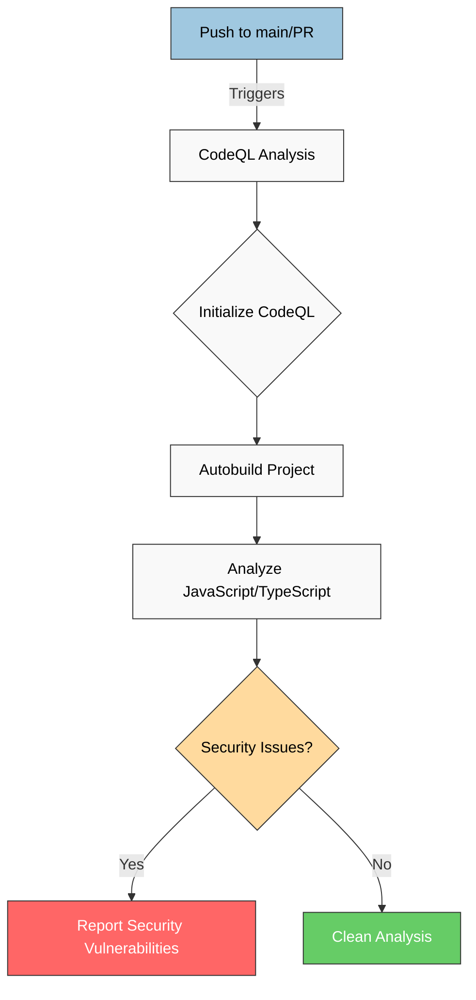
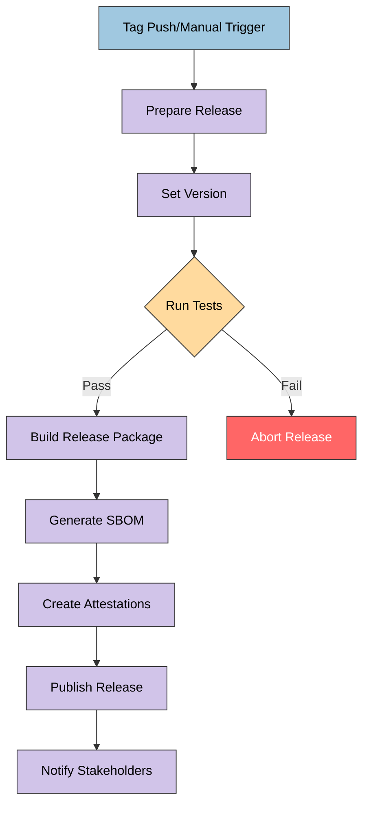
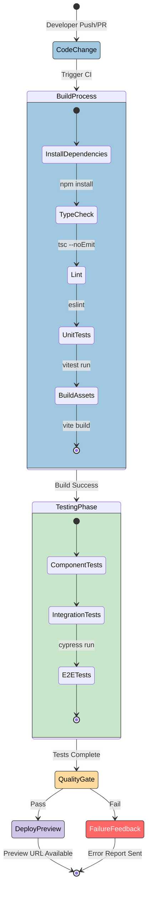
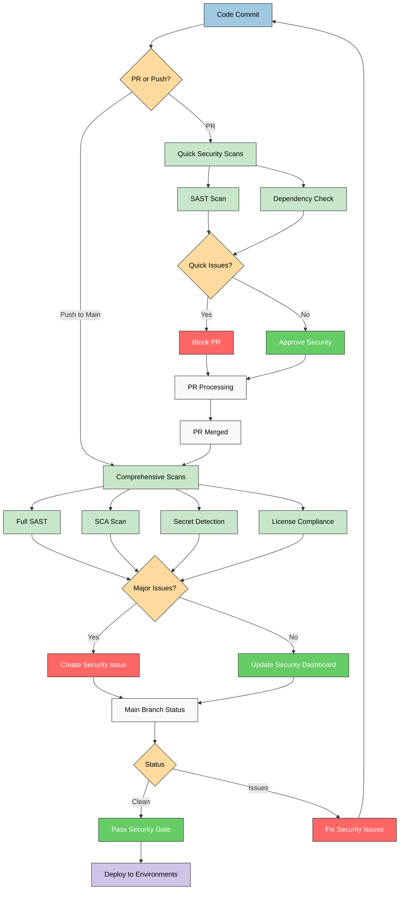

# CIA Compliance Manager CI/CD Workflows

This document describes the CI/CD workflows implemented for the CIA Compliance Manager project, illustrating the automated processes for code quality, security checks, testing, and release management.

## 📚 Related Architecture Documentation

| Document                                            | Focus           | Description                               |
| --------------------------------------------------- | --------------- | ----------------------------------------- |
| **[Current Architecture](ARCHITECTURE.md)**         | 🏛️ Architecture | C4 model showing current system structure |
| **[Future Architecture](FUTURE_ARCHITECTURE.md)**   | 🏛️ Architecture | Vision for context-aware platform         |
| **[State Diagrams](STATEDIAGRAM.md)**               | 🔄 Behavior     | Current system state transitions          |
| **[Future State Diagrams](FUTURE_STATEDIAGRAM.md)** | 🔄 Behavior     | Enhanced adaptive state transitions       |
| **[Process Flowcharts](FLOWCHART.md)**              | 🔄 Process      | Current security workflows                |
| **[Future Flowcharts](FUTURE_FLOWCHART.md)**        | 🔄 Process      | Enhanced context-aware workflows          |
| **[Mindmaps](MINDMAP.md)**                          | 🧠 Concept      | Current system component relationships    |
| **[Future Mindmaps](FUTURE_MINDMAP.md)**            | 🧠 Concept      | Future capability evolution               |
| **[SWOT Analysis](SWOT.md)**                        | 💼 Business     | Current strategic assessment              |
| **[Future SWOT Analysis](FUTURE_SWOT.md)**          | 💼 Business     | Future strategic opportunities            |
| **[Future Workflows](FUTURE_WORKFLOWS.md)**         | 🔧 DevOps       | Enhanced CI/CD with ML                    |
| **[Future Data Model](FUTURE_DATA_MODEL.md)**       | 📊 Data         | Context-aware data architecture           |

## Overview of CI/CD Pipeline

The project implements a comprehensive CI/CD pipeline with distinct workflows for:

1. **🔄 Continuous Integration (CI)** workflows that run on each PR and push
2. **🔒 Security analysis** workflows for vulnerability detection
3. **📦 Release automation** for creating verified, attested releases

## CodeQL Security Analysis Workflow

**🔒 Security Focus:** Automatically analyzes code for potential security vulnerabilities and coding errors using GitHub's CodeQL engine.

**🛡️ Risk Management Focus:** Provides early detection of security issues during development, preventing vulnerabilities from reaching production.

## Release Workflow

**🔗 Supply Chain Security Focus:** Implements secure build processes with attestations and provenance to ensure release integrity and verify authenticity.

**📦 Release Management Focus:** Automates the versioning, building, testing, and publishing process for new releases with comprehensive artifacts.

## Continuous Integration Process

**🔧 DevOps Focus:** Illustrates the automated build and test process that runs on every code change to maintain quality and prevent regressions.

**👷 Development Focus:** Shows how developers get immediate feedback on their code changes through automated testing and quality checks.

## Security Scanning Integration

**🔒 Security Focus:** Shows how automated security scans are integrated throughout the development lifecycle to identify vulnerabilities early.

**📋 Compliance Focus:** Illustrates the implementation of automated compliance checks and security policy enforcement via CI/CD.

## Key Workflow Features

### 1. CodeQL Security Scanning

The CodeQL workflow automatically scans for security vulnerabilities in:

- 🔍 JavaScript and TypeScript code
- 🧩 React component vulnerabilities
- 💉 Potential injection attacks
- 🐞 Insecure coding patterns

Results are reported through GitHub Security tab with automated alerts for maintainers.

### 2. Comprehensive Testing Integration

The release workflow ensures quality through:

- ✅ Vitest unit tests with high coverage requirements
- 🧪 Cypress end-to-end tests for user flows
- 👁️ Visual regression tests for UI components
- 📊 Test reports and artifacts published for review

### 3. Software Bill of Materials (SBOM)

Every release includes:

- 📋 Complete SBOM in SPDX JSON format
- 📦 Dependency listing with versions
- ⚖️ License compliance information
- 🔒 Known vulnerability status

### 4. Release Attestations

The workflow creates cryptographically signed attestations certifying:

- 🔗 Build provenance (who built it, when, and how)
- 📋 SBOM verification for dependency transparency
- 🔐 Artifact integrity through secure hashing

### 5. Pipeline Security Controls

Security throughout the CI/CD pipeline is maintained by:

- 🛡️ Hardened CI runner environments
- 🔒 Limited pipeline permissions
- 📌 Pinned action versions with SHA hashes
- 🔄 Dependency caching for build reproducibility
- 📝 Audit logging of all CI/CD operations

## Benefits of the CI/CD Approach

1. **🔄 Consistent Quality:** Automated testing ensures code quality across all changes
2. **🔒 Security Integration:** Security scanning is built into the development process
3. **✅ Release Confidence:** Every release has verified provenance and integrity
4. **📋 Compliance Support:** Automated attestations help meet regulatory requirements
5. **👩‍💻 Developer Experience:** Fast feedback on code quality and security issues

