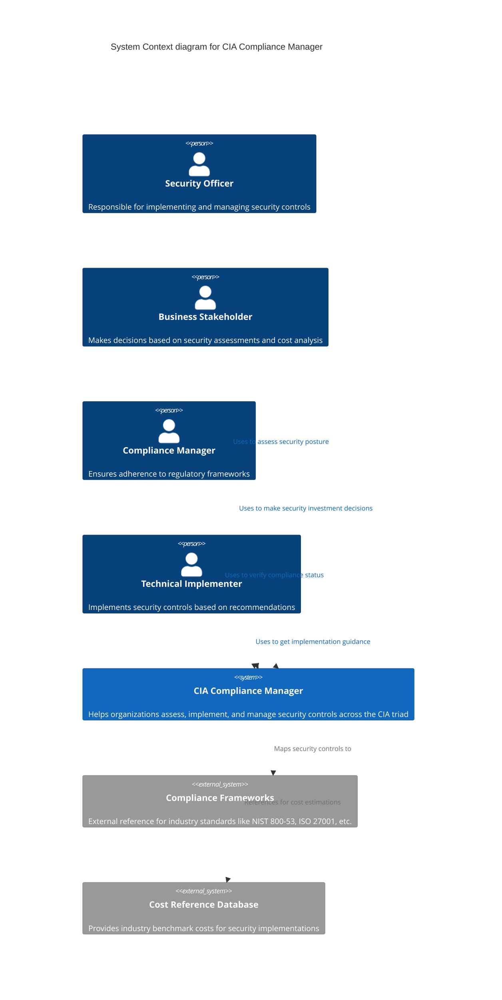
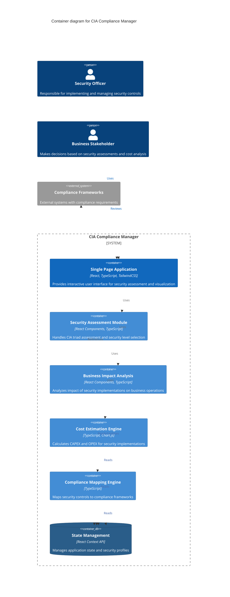
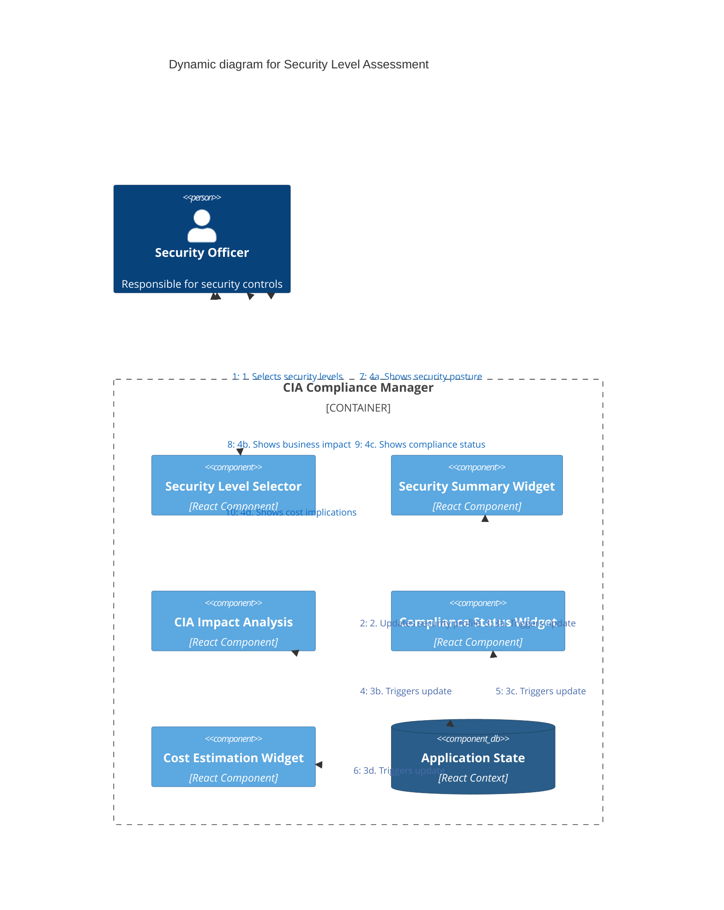

# CIA Compliance Manager Architecture

This document serves as the primary entry point for the CIA Compliance Manager's architectural documentation. It provides a comprehensive view of the system's design using the C4 model approach, starting from a high-level system context and drilling down to component interactions.

## Architecture Documentation Overview

The CIA Compliance Manager architecture is documented through multiple complementary views that help stakeholders understand different aspects of the system:

- **[C4 Model Diagrams](#c4-system-context-diagram)** - This document provides a structured view of the system at different abstraction levels
- **[State Diagrams](STATEDIAGRAM.md)** - Illustrates security profiles and compliance status transitions
- **[Process Flowcharts](FLOWCHART.md)** - Shows key operational workflows for security assessment and compliance evaluation
- **[Mindmaps](MINDMAP.md)** - Provides hierarchical visualization of system components and business concepts
- **[SWOT Analysis](SWOT.md)** - Strategic assessment of project strengths, weaknesses, opportunities and threats
- **[CI/CD Workflows](WORKFLOWS.md)** - Documents the automated processes for build, test, security scanning and release

These diagrams provide multiple perspectives to help different stakeholders understand the system's architecture, behavior, and value proposition. Technical teams can focus on the C4 diagrams and workflows, while business stakeholders might find the SWOT analysis and mindmaps more relevant to their needs.

## C4 System Context Diagram

The System Context diagram shows the CIA Compliance Manager in relation to its users and external systems.

**Business Focus:** Illustrates how different stakeholders interact with the system and the external dependencies required for compliance references and cost estimation.

**Security Focus:** Demonstrates clear boundaries between internal system components and external data sources, establishing the trust boundaries for security analysis.

## C4 Container Diagram

The Container diagram shows the high-level technical components of the CIA Compliance Manager.

**Architecture Focus:** Reveals the modular construction of the application with distinct components for security assessment, business impact analysis, cost estimation, and compliance mapping.

**Technical Focus:** Highlights how the single-page application architecture leverages React and TypeScript to create a responsive, client-side experience with centralized state management.

## C4 Component Diagram

The Component diagram shows the key components within the Security Assessment Module.

**Architecture Focus:** Demonstrates the internal structure of the Security Assessment Module, showing how individual UI components interact with data repositories and state management.

**Technical Focus:** Illustrates the component-based approach to security assessment, with specialized components for selection, visualization, calculation, and recommendations.

```mermaid
C4Component
  title Component diagram for Security Assessment Module

  Container_Boundary(securityAssessment, "Security Assessment Module") {
    Component(securityLevelSelector, "Security Level Selector", "React Component", "Allows selection of security levels for CIA components")
    Component(securitySummary, "Security Summary Widget", "React Component", "Displays overall security posture and recommendations")
    Component(ciaImpactAnalysis, "CIA Impact Analysis", "React Component", "Shows detailed impact analysis for each CIA element")
    Component(securityRadarChart, "Security Radar Chart", "Chart.js", "Visualizes security level selections across CIA dimensions")
    Component(securityScoreCalculator, "Security Score Calculator", "TypeScript", "Calculates overall security score based on selections")
    Component(securityRecommendations, "Security Recommendations", "React Component", "Provides actionable security recommendations")

    ComponentDb(securityLevels, "Security Levels Repository", "TypeScript", "Stores definitions of security levels and their characteristics")
  }

  System_Ext(complianceFrameworks, "Compliance Frameworks", "External systems providing compliance requirements")

  Container(stateManager, "State Management", "React Context API", "Manages application state")

  Rel(securityLevelSelector, securityLevels, "Reads levels from")
  Rel(securityLevelSelector, stateManager, "Updates security selections in")
  Rel(securitySummary, stateManager, "Reads security state from")
  Rel(ciaImpactAnalysis, stateManager, "Reads security state from")
  Rel(securityRadarChart, stateManager, "Reads security state from")
  Rel(securityScoreCalculator, stateManager, "Reads security state from")
  Rel(securityRecommendations, securityLevels, "Gets recommendations from")
  Rel(securityRecommendations, complianceFrameworks, "Maps recommendations to")

  UpdateLayoutConfig($c4ShapeInRow="3", $c4BoundaryInRow="1")

  %% Colors and styles
  UpdateElementStyle(securityLevelSelector, $fontColor="#ffffff", $bgColor="#5ca8e0", $borderColor="#2e6295")
  UpdateElementStyle(securitySummary, $fontColor="#ffffff", $bgColor="#5ca8e0", $borderColor="#2e6295")
  UpdateElementStyle(ciaImpactAnalysis, $fontColor="#ffffff", $bgColor="#5ca8e0", $borderColor="#2e6295")
  UpdateElementStyle(securityRadarChart, $fontColor="#ffffff", $bgColor="#5ca8e0", $borderColor="#2e6295")
  UpdateElementStyle(securityScoreCalculator, $fontColor="#ffffff", $bgColor="#5ca8e0", $borderColor="#2e6295")
  UpdateElementStyle(securityRecommendations, $fontColor="#ffffff", $bgColor="#5ca8e0", $borderColor="#2e6295")
  UpdateElementStyle(securityLevels, $fontColor="#ffffff", $bgColor="#2a5d89", $borderColor="#1b3a54")
  UpdateElementStyle(stateManager, $fontColor="#ffffff", $bgColor="#2a5d89", $borderColor="#1b3a54")
  UpdateElementStyle(complianceFrameworks, $fontColor="#ffffff", $bgColor="#999999", $borderColor="#6b6b6b")

  UpdateRelStyle(securityLevelSelector, securityLevels, "#707070", "solid")
  UpdateRelStyle(securityLevelSelector, stateManager, "#4b6cad", "solid")
  UpdateRelStyle(securitySummary, stateManager, "#4b6cad", "solid")
  UpdateRelStyle(ciaImpactAnalysis, stateManager, "#4b6cad", "solid")
  UpdateRelStyle(securityRadarChart, stateManager, "#4b6cad", "solid")
  UpdateRelStyle(securityScoreCalculator, stateManager, "#4b6cad", "solid")
  UpdateRelStyle(securityRecommendations, securityLevels, "#707070", "solid")
  UpdateRelStyle(securityRecommendations, complianceFrameworks, "#707070", "dashed")
```

## C4 Dynamic Diagram

The Dynamic diagram shows the core user flow for security assessment.

**User Experience Focus:** Maps the sequence of interactions from initial security level selection to the display of various business impacts and compliance status.

**Data Flow Focus:** Reveals how changes to security levels propagate through the application state to update multiple visualization components.

## Security Architecture Layers

### 1. Application Security

- **Content Security Policy (CSP)**: Restricts resource loading to prevent XSS attacks
- **Security Headers**: Implements modern web security headers (HSTS, X-Content-Type-Options, etc.)
- **Input Validation**: Validates all user inputs before processing
- **Output Sanitization**: Sanitizes data before rendering to prevent XSS
- **Error Handling**: Uses error boundaries to prevent exposing sensitive information

### 2. State Management Security

- **Immutable State**: Ensures state cannot be modified directly
- **State Validation**: Validates state transitions to prevent impossible states
- **Deep Object Freezing**: Prevents accidental state mutations

### 3. Network Security

- **HTTPS Only**: Enforces secure connections
- **API Request Validation**: Validates all API requests
- **Response Validation**: Validates API responses against expected schemas

### 4. Development Security

- **Dependency Scanning**: Automatically scans for vulnerable dependencies
- **Static Code Analysis**: Uses TypeScript strict mode and linting for code quality
- **Secrets Management**: No hardcoded secrets in codebase

## Architecture Color Legend

The color schemes used throughout the C4 diagrams follow these conventions:

| Element Type        | Color                 | Description                                         |
| ------------------- | --------------------- | --------------------------------------------------- |
| Person              | #08427b (Dark Blue)   | External users or roles interacting with the system |
| System              | #1168bd (Blue)        | The main system being described                     |
| Container           | #438dd5 (Medium Blue) | Main application containers within the system       |
| Component           | #5ca8e0 (Light Blue)  | Individual components within containers             |
| Database            | #2a5d89 (Navy Blue)   | Data storage components                             |
| External System     | #999999 (Gray)        | External systems or services                        |
| Active Relationship | #1168bd (Blue)        | User interactions with the system                   |
| Data Flow           | #4b6cad (Steel Blue)  | Data flows between components                       |
| Reference           | #707070 (Dark Gray)   | References to external systems or resources         |

This color scheme provides visual consistency across all architectural diagrams and helps distinguish between different types of components and their relationships.

## Testing Architecture

The CIA Compliance Manager implements comprehensive testing strategies to ensure reliability, security, and quality across all components.

### Unit Testing Strategy

[Unit Test Plan](../UnitTestPlan.md) - Our unit testing approach focuses on isolated component testing with mocked dependencies, using Vitest and React Testing Library. The plan details:

- Test organization and structure
- TestID patterns for reliable element selection
- Different types of component tests (rendering, interaction, state management)
- Best practices for testable components

### End-to-End Testing Strategy

[E2E Test Plan](../E2ETestPlan.md) - Our end-to-end testing strategy uses Cypress to validate complete user flows and business outcomes. The plan covers:

- User-centric testing approaches
- Resilient selector strategies
- Test patterns for business outcomes and user flows
- Custom commands and utilities for stable tests

These testing strategies work together to ensure the CIA Compliance Manager delivers consistent, reliable functionality while maintaining its security controls and architecture integrity.
