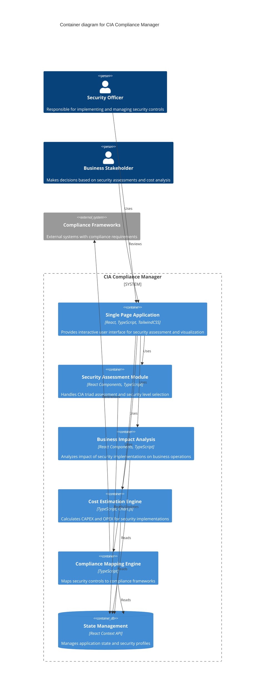
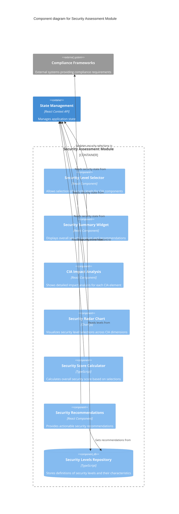
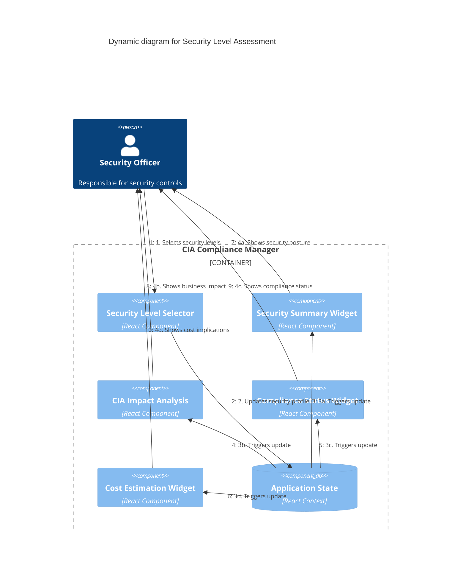

# CIA Compliance Manager Architecture

## C4 System Context Diagram

The System Context diagram shows the CIA Compliance Manager in relation to its users and external systems.

## C4 Container Diagram

The Container diagram shows the high-level technical components of the CIA Compliance Manager.

## C4 Component Diagram

The Component diagram shows the key components within the Security Assessment Module.

## C4 Dynamic Diagram

The Dynamic diagram shows the core user flow for security assessment.

## Security Architecture Layers

### 1. Application Security

- **Content Security Policy (CSP)**: Restricts resource loading to prevent XSS attacks
- **Security Headers**: Implements modern web security headers (HSTS, X-Content-Type-Options, etc.)
- **Input Validation**: Validates all user inputs before processing
- **Output Sanitization**: Sanitizes data before rendering to prevent XSS
- **Error Handling**: Uses error boundaries to prevent exposing sensitive information

### 2. State Management Security

- **Immutable State**: Ensures state cannot be modified directly
- **State Validation**: Validates state transitions to prevent impossible states
- **Deep Object Freezing**: Prevents accidental state mutations

### 3. Network Security

- **HTTPS Only**: Enforces secure connections
- **API Request Validation**: Validates all API requests
- **Response Validation**: Validates API responses against expected schemas

### 4. Development Security

- **Dependency Scanning**: Automatically scans for vulnerable dependencies
- **Static Code Analysis**: Uses TypeScript strict mode and linting for code quality
- **Secrets Management**: No hardcoded secrets in codebase
