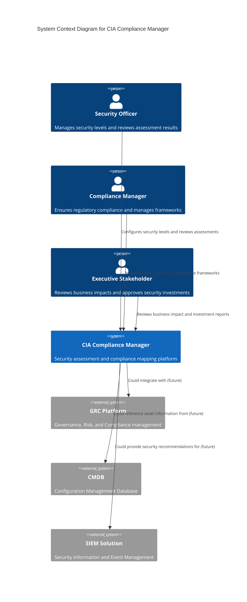
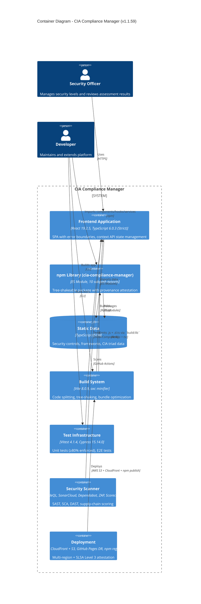
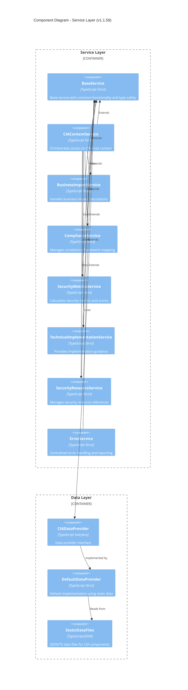
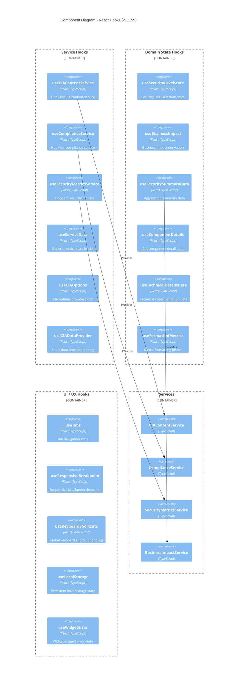
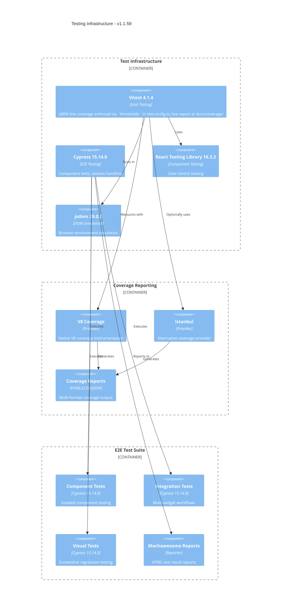
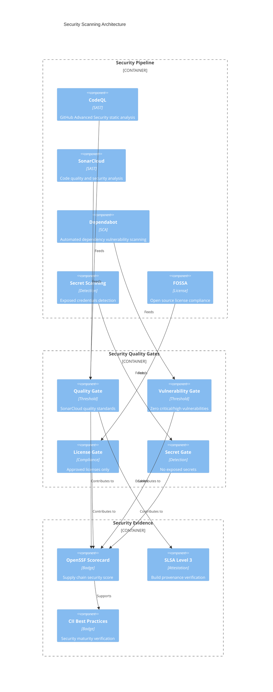
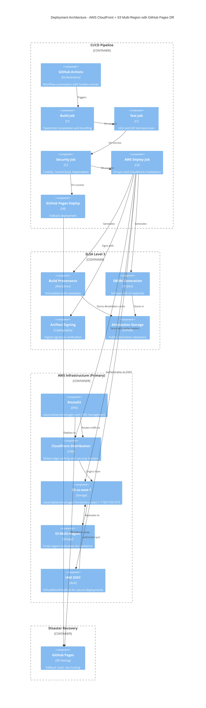
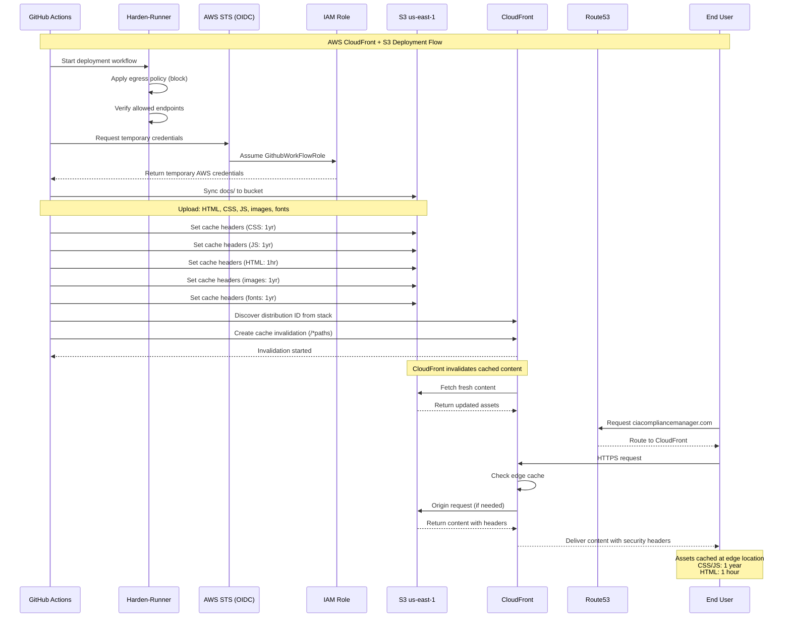
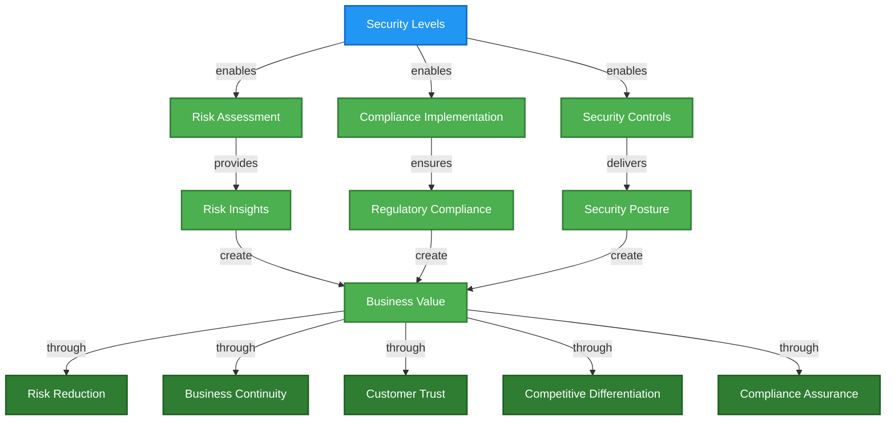

<p align="center">
  
</p>

<h1 align="center">🏗️ CIA Compliance Manager Architecture</h1>

<p align="center">
  <strong>📐 C4 Model Architecture Documentation</strong><br>
  <em>🔗 <a href="https://github.com/Hack23/ISMS-PUBLIC/blob/main/Secure_Development_Policy.md">Secure Development Policy</a> · <a href="https://github.com/Hack23/ISMS-PUBLIC/blob/main/CLASSIFICATION.md">Classification Framework</a></em>
</p>

**Version:** 1.1.59 | **Last Updated:** 2026-04-28 | **Status:** ✅ Production Ready

This document provides a comprehensive view of the CIA Compliance Manager architecture using the C4 model, illustrating how components interact to deliver security assessment capabilities.

## 📚 Complete Architecture Documentation Map

<div class="documentation-map">

### Current Architecture

| Document                                          | Focus           | Description                               |
| ------------------------------------------------- | --------------- | ----------------------------------------- |
| **[Architecture](ARCHITECTURE.md)**               | 🏗️ C4 Model     | C4 model showing system structure          |
| **[System Architecture](SYSTEM_ARCHITECTURE.md)** | 🏛️ System       | Layered architecture and component details |
| **[Data Model](DATA_MODEL.md)**                   | 📊 Data         | Current data structures and relationships  |
| **[Widget Analysis](WIDGET_ANALYSIS.md)**         | 🧩 Components   | Detailed widget component analysis        |

### Behavioral Documentation

| Document                                       | Focus           | Description                               |
| ---------------------------------------------- | --------------- | ----------------------------------------- |
| **[State Diagrams](STATEDIAGRAM.md)**          | 🔄 Behavior     | System state transitions                   |
| **[Process Flowcharts](FLOWCHART.md)**         | 🔄 Process      | Security assessment workflows              |
| **[Mindmaps](MINDMAP.md)**                     | 🧠 Concept      | System component relationships             |

### Business & Operations

| Document                                       | Focus           | Description                               |
| ---------------------------------------------- | --------------- | ----------------------------------------- |
| **[SWOT Analysis](SWOT.md)**                  | 💼 Business     | Strategic business assessment              |
| **[BCP Plan](BCPPlan.md)**                    | 🔄 Recovery     | Business continuity planning               |
| **[Workflows](WORKFLOWS.md)**                 | 🚀 DevOps       | CI/CD and development workflows            |

### Guidelines & Standards

| Document                                                   | Focus           | Description                               |
| ---------------------------------------------------------- | --------------- | ----------------------------------------- |
| **[Style Guide](STYLE_GUIDE.md)**                          | 🎨 Style        | Documentation style guidelines             |
| **[Contribution Guidelines](CONTRIBUTION_GUIDELINES.md)**  | 📋 Guidelines   | Documentation contribution process         |

### Future Architecture

| Document                                               | Focus           | Description                               |
| ------------------------------------------------------ | --------------- | ----------------------------------------- |
| **[Future Architecture](FUTURE_ARCHITECTURE.md)**      | 🚀 Evolution    | Vision for platform evolution              |
| **[Future Data Model](FUTURE_DATA_MODEL.md)**          | 🚀 Data         | Future data architecture vision            |
| **[Future Workflows](FUTURE_WORKFLOWS.md)**            | 🔄 DevOps       | Future CI/CD and development workflows     |
| **[Future SWOT](FUTURE_SWOT.md)**                      | 💼 Business     | Future strategic business assessment       |
| **[Future State Diagrams](FUTURE_STATEDIAGRAM.md)**    | 🔄 Behavior     | Future system state transitions            |
| **[Future Mindmaps](FUTURE_MINDMAP.md)**               | 🧠 Concept      | Future system component relationships      |
| **[Future Flowcharts](FUTURE_FLOWCHART.md)**           | 🔄 Process      | Future security assessment workflows       |

</div>

## 🌐 System Context

The CIA Compliance Manager operates within the broader context of an organization's security governance ecosystem.


```mermaid
C4Context
  title System Context Diagram for CIA Compliance Manager

  Person(securityOfficer, "Security Officer", "Manages security levels and reviews assessment results")
  Person(complianceManager, "Compliance Manager", "Ensures regulatory compliance and manages frameworks")
  Person(executiveStakeholder, "Executive Stakeholder", "Reviews business impacts and approves security investments")
  
  System(ciaManager, "CIA Compliance Manager", "Security assessment and compliance mapping platform")
  
  System_Ext(grcSystem, "GRC Platform", "Governance, Risk, and Compliance management")
  System_Ext(cmdb, "CMDB", "Configuration Management Database")
  System_Ext(siemSystem, "SIEM Solution", "Security Information and Event Management")

  Rel(securityOfficer, ciaManager, "Configures security levels and reviews assessments")
  Rel(complianceManager, ciaManager, "Maps security controls to compliance frameworks")
  Rel(executiveStakeholder, ciaManager, "Reviews business impact and investment reports")
  
  Rel(ciaManager, grcSystem, "Could integrate with (future)")
  Rel(ciaManager, cmdb, "Could reference asset information from (future)")
  Rel(ciaManager, siemSystem, "Could provide security recommendations for (future)")

  UpdateLayoutConfig($c4ShapeInRow="2", $c4BoundaryInRow="1")
```

## 🏢 Container View

The CIA Compliance Manager consists of several interconnected containers that provide its core functionality. The v1.1.59 architecture leverages modern React 19.x features, TypeScript strict mode, and comprehensive testing infrastructure.


```mermaid
C4Container
    title Container Diagram - CIA Compliance Manager (v1.1.59)

    Person(securityOfficer, "Security Officer", "Manages security levels and reviews assessment results")
    Person(developer, "Developer", "Maintains and extends platform")
    
    System_Boundary(ciaManager, "CIA Compliance Manager") {
        Container(frontend, "Frontend Application", "React 19.2.5, TypeScript 6.0.3 (Strict)", "SPA with error boundaries, context API state management")
        Container(npmLibrary, "npm Library (cia-compliance-manager)", "ES Module, 10 subpath exports", "Tree-shakeable package with provenance attestation")
        ContainerDb(staticData, "Static Data", "TypeScript/JSON", "Security controls, frameworks, CIA triad data")
        Container(buildSystem, "Build System", "Vite 8.0.9, oxc minifier", "Code splitting, tree-shaking, bundle optimization")
        Container(testFramework, "Test Infrastructure", "Vitest 4.1.4, Cypress 15.14.0", "Unit tests (≥80% enforced), E2E tests")
        Container(securityScan, "Security Scanner", "CodeQL, SonarCloud, Dependabot, ZAP, Scorecard", "SAST, SCA, DAST, supply-chain scoring")
        Container(deployment, "Deployment", "AWS CloudFront + S3, GitHub Pages DR, npm registry", "Multi-region + SLSA Level 3 attestation")
    }
    
    Rel(securityOfficer, frontend, "Uses", "HTTPS")
    Rel(developer, testFramework, "Runs tests", "CLI")
    Rel(developer, buildSystem, "Builds app", "CLI")
    Rel(developer, npmLibrary, "Imports components/hooks/services", "npm")
    
    Rel(frontend, staticData, "Imports data", "ES Modules")
    Rel(npmLibrary, staticData, "Packages", "ES Modules")
    Rel(buildSystem, frontend, "Bundles", "Rollup")
    Rel(buildSystem, npmLibrary, "Emits .js + .d.ts via `build:lib`", "Rollup + tsc")
    Rel(testFramework, frontend, "Tests", "DOM/Component")
    Rel(securityScan, frontend, "Scans", "GitHub Actions")
    Rel(deployment, buildSystem, "Deploys", "AWS S3 + CloudFront + npm publish")
    
    UpdateLayoutConfig($c4ShapeInRow="3", $c4BoundaryInRow="1")
```

### **Container Details (v1.1.59)**

| Container | Technology Stack | Purpose | Key Features |
|-----------|-----------------|---------|--------------|
| **Frontend Application** | React 19.2.5, TypeScript 6.0.3 | User interface | Error boundaries, concurrent rendering, strict types |
| **npm Library** | ES Module, 10 subpath exports | Reusable distribution | `./types`, `./services`, `./hooks`, `./utils`, `./components`, `./components/widgets`, `./constants`, `./data`, `./contexts`, root |
| **Static Data** | TypeScript/JSON | Data source | CIA triad controls, compliance frameworks |
| **Build System** | Vite 8.0.9, oxc minifier, TypeScript 6.0.3 | Build pipeline | Optimized bundle, widget-domain chunking, tree-shaking |
| **Test Infrastructure** | Vitest 4.1.4, Cypress 15.14.0, @testing-library/react 16.3.2 | Quality assurance | ≥80% line coverage enforced via `thresholds`, component + E2E tests |
| **Security Scanner** | CodeQL, SonarCloud, Dependabot, ZAP, OpenSSF Scorecard, Harden-Runner | Vulnerability detection | SAST, SCA, DAST, supply chain scoring, runner egress policy |
| **Deployment** | AWS CloudFront + S3 (primary), GitHub Pages (DR), npm registry (library) | Multi-channel delivery | CloudFront CDN, S3 multi-region, SLSA Level 3, Route53 DNS, npm provenance |

## 🧩 Component View

The frontend application is composed of specialized components organized by domain functionality. The v1.1.59 architecture implements comprehensive error handling, React Context API state management, and strict TypeScript typing.


```mermaid
C4Component
    title Component Diagram - Frontend Application (v1.1.59)

    Container_Boundary(frontend, "Frontend Application") {
        Component(errorBoundary, "Error Boundary", "react-error-boundary 6.1.1", "Application-wide error handling and recovery")
        Component(appRoot, "App Root", "React 19.2.5", "Main application component with routing")
        
        Component(slWidget, "Security Level Widget", "React, TypeScript", "Core configuration widget for CIA security levels")
        
        Component(assessmentWidgets, "Assessment Widgets", "React, TypeScript", "Security summary and business impact analysis")
        Component(businessWidgets, "Business Value Widgets", "React, TypeScript", "Compliance status, cost estimation, value creation")
        Component(impactWidgets, "Impact Analysis Widgets", "React, TypeScript", "CIA component-specific impact analysis")
        Component(implWidgets, "Implementation Widgets", "React, TypeScript", "Technical details and security resources")
        
        Component(chartComponents, "Chart Components", "Chart.js 4.5.1", "Data visualization widgets")
        Component(commonComponents, "Common Components", "React, TypeScript", "Shared UI components and utilities")
        
        Component(contextAPI, "Context API", "React Context", "Global state management for security profiles")
        Component(customHooks, "Custom Hooks", "React Hooks", "Service layer integration hooks")
        
        Component(serviceLayer, "Service Layer", "TypeScript", "Business logic and data processing services")
        Component(dataProvider, "Data Provider", "TypeScript", "Security controls data and configuration")
        Component(utilityLayer, "Utility Layer", "TypeScript", "Shared functions for calculations and formatting")
    }

    Rel(appRoot, errorBoundary, "Wrapped by")
    Rel(errorBoundary, slWidget, "Protects")
    Rel(errorBoundary, assessmentWidgets, "Protects")
    Rel(errorBoundary, businessWidgets, "Protects")
    Rel(errorBoundary, impactWidgets, "Protects")
    Rel(errorBoundary, implWidgets, "Protects")
    
    Rel(slWidget, contextAPI, "Updates state")
    Rel(assessmentWidgets, contextAPI, "Reads state")
    Rel(businessWidgets, contextAPI, "Reads state")
    Rel(impactWidgets, contextAPI, "Reads state")
    Rel(implWidgets, contextAPI, "Reads state")
    
    Rel(assessmentWidgets, chartComponents, "Uses")
    Rel(businessWidgets, chartComponents, "Uses")
    Rel(impactWidgets, chartComponents, "Uses")
    
    Rel(slWidget, customHooks, "Uses")
    Rel(assessmentWidgets, customHooks, "Uses")
    Rel(businessWidgets, customHooks, "Uses")
    Rel(impactWidgets, customHooks, "Uses")
    Rel(implWidgets, customHooks, "Uses")
    
    Rel(customHooks, serviceLayer, "Delegates to")
    Rel(serviceLayer, dataProvider, "Retrieves data")
    Rel(serviceLayer, utilityLayer, "Uses")
    
    Rel(slWidget, commonComponents, "Uses")
    Rel(assessmentWidgets, commonComponents, "Uses")
    Rel(businessWidgets, commonComponents, "Uses")
    Rel(impactWidgets, commonComponents, "Uses")
    Rel(implWidgets, commonComponents, "Uses")

    UpdateLayoutConfig($c4ShapeInRow="4", $c4BoundaryInRow="1")
```

### **v1.1.59 Component Architecture Highlights**

#### **Error Handling**
- **Error Boundary Component**: `react-error-boundary 6.1.1` for graceful error recovery
- **Automatic Recovery**: Fallback UI with retry mechanisms
- **Error Logging**: Comprehensive error tracking for debugging
- **User-Friendly Messages**: Clear error communication

#### **State Management**
- **React Context API**: Global state for security profiles
- **Local Component State**: Widget-specific state management
- **Props Drilling Eliminated**: Context-based data flow
- **Type-Safe State**: Full TypeScript strict mode compliance

#### **Performance Optimizations**
- **Code Splitting**: Lazy loading of chart components (21.5KB separate chunk)
- **Tree Shaking**: Eliminated unused code (13KB reduction)
- **React Concurrent Features**: Improved rendering performance
- **Memoization**: React.memo for expensive components

## 🔍 Service Component Diagram

This diagram shows the detailed structure of the service layer with full TypeScript strict mode typing:


```mermaid
C4Component
    title Component Diagram - Service Layer (v1.1.59)

    Container_Boundary(services, "Service Layer") {
        Component(baseService, "BaseService", "TypeScript Strict", "Base service with common functionality and type safety")
        Component(ciaContentService, "CIAContentService", "TypeScript Strict", "Orchestrates access to CIA triad content")
        Component(businessImpactService, "BusinessImpactService", "TypeScript Strict", "Handles business impact calculations")
        Component(complianceService, "ComplianceService", "TypeScript Strict", "Manages compliance framework mapping")
        Component(securityMetricsService, "SecurityMetricsService", "TypeScript Strict", "Calculates security metrics and scores")
        Component(technicalImplService, "TechnicalImplementationService", "TypeScript Strict", "Provides implementation guidance")
        Component(securityResourceService, "SecurityResourceService", "TypeScript Strict", "Manages security resource references")
        Component(errorService, "ErrorService", "TypeScript Strict", "Centralized error handling and reporting")
    }

    Container_Boundary(dataLayer, "Data Layer") {
        Component(dataProvider, "CIADataProvider", "TypeScript Interface", "Data provider interface")
        Component(defaultProvider, "DefaultDataProvider", "TypeScript Strict", "Default implementation using static data")
        Component(staticData, "StaticDataFiles", "TypeScript/JSON", "JSON/TS data files for CIA components")
    }

    Rel(ciaContentService, baseService, "Extends")
    Rel(businessImpactService, baseService, "Extends")
    Rel(complianceService, baseService, "Extends")
    Rel(securityMetricsService, baseService, "Extends")
    Rel(technicalImplService, baseService, "Extends")
    Rel(securityResourceService, baseService, "Extends")
    Rel(errorService, baseService, "Extends")
    
    Rel(ciaContentService, businessImpactService, "Uses")
    Rel(ciaContentService, complianceService, "Uses")
    Rel(ciaContentService, securityMetricsService, "Uses")
    Rel(ciaContentService, technicalImplService, "Uses")
    Rel(ciaContentService, securityResourceService, "Uses")
    
    Rel(baseService, dataProvider, "Uses")
    Rel(dataProvider, defaultProvider, "Implemented by")
    Rel(defaultProvider, staticData, "Reads from")

    UpdateLayoutConfig($c4ShapeInRow="4", $c4BoundaryInRow="1")
```

### **TypeScript Strict Mode Implementation (v1.1.59)**

All services implement comprehensive type safety:
- **Zero `any` Types**: Complete elimination of type escape hatches
- **Strict Null Checks**: `strictNullChecks: true`
- **No Implicit Any**: `noImplicitAny: true`
- **Strict Function Types**: `strictFunctionTypes: true`
- **Strict Bind/Call/Apply**: `strictBindCallApply: true`
- **No Implicit This**: `noImplicitThis: true`
- **No Implicit Returns**: `noImplicitReturns: true`

## 🧩 Widget Components Structure

This diagram shows the structure of the widget components:


```mermaid
C4Component
    title Component Diagram - Widget Components (v1.1.59)

    Container_Boundary(widgets, "Widget Components") {
        Component(widgetBase, "WidgetContainer", "React, TypeScript", "Base container for all widgets")
        
        Component(securityLevel, "SecurityLevelWidget", "React, TypeScript", "Core configuration widget")
        
        Component(securitySummary, "SecuritySummaryWidget", "React, TypeScript", "Overall security summary")
        Component(businessImpact, "BusinessImpactAnalysisWidget", "React, TypeScript", "Business impact analysis with tabbed views")
        Component(secOverviewTab, "SecurityOverviewTab", "React, TypeScript", "Overview tab within business impact analysis")
        Component(secBusinessTab, "SecurityBusinessTab", "React, TypeScript", "Business tab within business impact analysis")
        Component(secComplianceTab, "SecurityComplianceTab", "React, TypeScript", "Compliance tab within business impact analysis")
        Component(secImplTab, "SecurityImplementationTab", "React, TypeScript", "Implementation tab within business impact analysis")
        
        Component(complianceStatus, "ComplianceStatusWidget", "React, TypeScript", "Compliance status and mapping")
        Component(costEstimation, "CostEstimationWidget", "React, TypeScript", "Implementation cost estimates")
        Component(valueCreation, "ValueCreationWidget", "React, TypeScript", "Business value metrics")
        
        Component(impactWidget, "ImpactWidget", "React, TypeScript", "Base impact analysis component")
        Component(confidentiality, "ConfidentialityImpactWidget", "React, TypeScript", "Confidentiality impact")
        Component(integrity, "IntegrityImpactWidget", "React, TypeScript", "Integrity impact")
        Component(availability, "AvailabilityImpactWidget", "React, TypeScript", "Availability impact")
        
        Component(technicalDetails, "TechnicalDetailsWidget", "React, TypeScript", "Technical implementation details")
        Component(securityResources, "SecurityResourcesWidget", "React, TypeScript", "Security implementation resources")
        Component(securityVis, "SecurityVisualizationWidget", "React, TypeScript", "Security metrics visualization")
        Component(ciaCompDetails, "CIAComponentDetails", "React, TypeScript", "Detailed CIA component breakdown")
        Component(implGuidance, "ImplementationGuidancePanel", "React, TypeScript", "Step-by-step implementation guidance")
    }

    Rel(securitySummary, widgetBase, "Uses")
    Rel(businessImpact, widgetBase, "Uses")
    Rel(businessImpact, secOverviewTab, "Contains")
    Rel(businessImpact, secBusinessTab, "Contains")
    Rel(businessImpact, secComplianceTab, "Contains")
    Rel(businessImpact, secImplTab, "Contains")
    Rel(complianceStatus, widgetBase, "Uses")
    Rel(costEstimation, widgetBase, "Uses")
    Rel(valueCreation, widgetBase, "Uses")
    Rel(impactWidget, widgetBase, "Uses")
    Rel(confidentiality, impactWidget, "Extends")
    Rel(integrity, impactWidget, "Extends")
    Rel(availability, impactWidget, "Extends")
    Rel(technicalDetails, widgetBase, "Uses")
    Rel(securityResources, widgetBase, "Uses")
    Rel(securityVis, widgetBase, "Uses")
    Rel(securityLevel, widgetBase, "Uses")
    Rel(ciaCompDetails, widgetBase, "Uses")
    Rel(implGuidance, widgetBase, "Uses")

    UpdateLayoutConfig($c4ShapeInRow="4", $c4BoundaryInRow="1")
```

## 🪝 React Hooks Structure

This diagram shows the custom React hooks that bridge components and services. v1.1.59 ships **17+ hooks** under `src/hooks/`, grouped by responsibility:


```mermaid
C4Component
    title Component Diagram - React Hooks (v1.1.59)

    Container_Boundary(serviceHooks, "Service Hooks") {
        Component(useCIAContent, "useCIAContentService", "React, TypeScript", "Hook for CIA content service")
        Component(useCompliance, "useComplianceService", "React, TypeScript", "Hook for compliance service")
        Component(useSecurityMetrics, "useSecurityMetricsService", "React, TypeScript", "Hook for security metrics")
        Component(useServiceData, "useServiceData", "React, TypeScript", "Generic service data loader")
        Component(useCIAOptions, "useCIAOptions", "React, TypeScript", "CIA options provider hook")
        Component(useCIADataProvider, "useCIADataProvider", "React, TypeScript", "Static data provider binding")
    }

    Container_Boundary(domainHooks, "Domain State Hooks") {
        Component(useSecurityLevelState, "useSecurityLevelState", "React, TypeScript", "Security level selection state")
        Component(useBusinessImpact, "useBusinessImpact", "React, TypeScript", "Business impact derivation")
        Component(useSecuritySummaryData, "useSecuritySummaryData", "React, TypeScript", "Aggregated summary data")
        Component(useComponentDetails, "useComponentDetails", "React, TypeScript", "CIA component detail data")
        Component(useTechnicalDetails, "useTechnicalDetailsData", "React, TypeScript", "Technical implementation data")
        Component(useFormattedMetrics, "useFormattedMetrics", "React, TypeScript", "Metric formatting helper")
    }

    Container_Boundary(uiHooks, "UI / UX Hooks") {
        Component(useTabs, "useTabs", "React, TypeScript", "Tab navigation state")
        Component(useResponsive, "useResponsiveBreakpoint", "React, TypeScript", "Responsive breakpoint detection")
        Component(useKeyboard, "useKeyboardShortcuts", "React, TypeScript", "Global keyboard shortcut handling")
        Component(useLocalStorage, "useLocalStorage", "React, TypeScript", "Persistent local storage state")
        Component(useWidgetError, "useWidgetError", "React, TypeScript", "Widget-scoped error state")
    }

    Container_Boundary(services, "Services") {
        Component(ciaContentService, "CIAContentService", "TypeScript")
        Component(complianceService, "ComplianceService", "TypeScript")
        Component(securityMetricsService, "SecurityMetricsService", "TypeScript")
        Component(businessImpactService, "BusinessImpactService", "TypeScript")
    }

    Rel(useCIAContent, ciaContentService, "Provides")
    Rel(useCompliance, complianceService, "Provides")
    Rel(useSecurityMetrics, securityMetricsService, "Provides")
    Rel(useBusinessImpact, businessImpactService, "Provides")

    UpdateLayoutConfig($c4ShapeInRow="4", $c4BoundaryInRow="2")
```

## 📦 Package / Library Distribution

In addition to being a browser application hosted at [ciacompliancemanager.com](https://ciacompliancemanager.com/), CIA Compliance Manager is published as a tree-shakeable ES module npm library (`cia-compliance-manager` on npmjs.org) that exposes the same types, services, hooks, utilities, components, and data for downstream consumers.

### **Subpath Exports** (`package.json`)

The package advertises **10 subpath exports**, each with `import` and `types` conditions, enabling deep imports without pulling the full bundle:

| Export | Purpose |
|--------|---------|
| `cia-compliance-manager` (root) | Namespaced umbrella export (`Types`, `Services`, `Components`, `Hooks`, `Utils`, `Constants`, `Data`, `Contexts`) + `CIAClassificationApp` |
| `cia-compliance-manager/types` | Domain type definitions (CIA, business impact, widgets, compliance, risk, tabs, etc.) |
| `cia-compliance-manager/services` | Business logic services (`CIAContentService`, `BusinessImpactService`, `ComplianceService`, `SecurityMetricsService`, `TechnicalImplementationService`, `SecurityResourceService`, `BaseService`, error service) |
| `cia-compliance-manager/hooks` | React hooks bridging services and UI (`useCIAContentService`, `useComplianceService`, `useSecurityLevelState`, `useBusinessImpact`, `useSecuritySummaryData`, `useCIAOptions`, etc.) |
| `cia-compliance-manager/utils` | Utility functions (color, format, level, risk, status, security defaults, keyboard, accessibility, logger, type guards) |
| `cia-compliance-manager/components` | All React components (application shell, charts, common, widgets) |
| `cia-compliance-manager/components/widgets` | Widgets only (assessmentcenter, businessvalue, impactanalysis, implementationguide) |
| `cia-compliance-manager/constants` | Design tokens and domain constants (securityLevels, cost, risk, compliance, color, testIds, etc.) |
| `cia-compliance-manager/data` | Static domain data (CIA content, compliance mappings, `data/security/*`) |
| `cia-compliance-manager/contexts` | React contexts for cross-cutting state |

**Library build** is handled separately from the application build:
- `npm run build` — application build (`tsc && vite build`) using `vite.config.ts`, output to `build/`
- `npm run build:lib` — library build (`vite build --config vite.config.lib.ts && tsc --project tsconfig.lib.json`), output to `dist/` with emitted `.d.ts` files

The `prepublishOnly` script chains `lint → knip → test:ci → build:lib` before publishing to npm with `npm publish --provenance` (Sigstore-signed supply-chain provenance).

### **Peer Dependencies**

| Peer | Range | Optional |
|------|-------|----------|
| `react` | `^18.2.0 \|\| ^19.0.0` | no |
| `react-dom` | `^18.2.0 \|\| ^19.0.0` | no |
| `react-error-boundary` | `^6.0.0` | no |
| `chart.js` | `^4.0.0` | **yes** (only required by visualization widgets) |

## 🏗️ Build Pipeline Architecture

The v1.1.59 build system leverages Vite 8.0.9 with advanced optimization techniques:


```mermaid
C4Component
    title Build Pipeline - Vite 8.0.9 with Optimization

    Container_Boundary(buildPipeline, "Build System") {
        Component(vite, "Vite 8.0.9", "Build Tool", "Lightning-fast HMR and optimized builds")
        Component(oxc, "oxc", "Minifier", "Ultra-fast Rust-based JavaScript minifier (Vite `minify: 'oxc'`)")
        Component(rollup, "Rollup", "Bundler", "Advanced code splitting and tree-shaking")
        Component(tsCompiler, "TypeScript 6.0.3", "Compiler", "Strict mode compilation with full type checking")
        Component(visualizer, "Bundle Visualizer", "Analysis", "Bundle size analysis and optimization insights")
    }

    Container_Boundary(optimization, "Optimization Layer") {
        Component(codeSplit, "Code Splitting", "Strategy", "Automatic vendor and component chunking")
        Component(treeShake, "Tree Shaking", "Strategy", "Dead code elimination")
        Component(lazyLoad, "Lazy Loading", "Strategy", "Dynamic imports for charts and heavy components")
        Component(compression, "Compression", "Strategy", "Gzip and Brotli compression")
    }

    Container_Boundary(output, "Build Artifacts") {
        Component(reactChunk, "react-vendor.js", "React 19.2.5 + react-dom + scheduler + react-error-boundary")
        Component(chartChunk, "chart.js", "Chart.js 4.5.1 + @kurkle/color (lazy loaded)")
        Component(vendorChunk, "vendor.js", "Other node_modules dependencies")
        Component(widgetsAsmt, "widgets-assessment.js", "assessmentcenter/* (excl. SecurityLevelWidget)")
        Component(widgetsBiz, "widgets-business.js", "businessvalue/* widgets")
        Component(widgetsImpact, "widgets-impact.js", "impactanalysis/* widgets")
        Component(widgetsImpl, "widgets-implementation.js", "implementationguide/* (excl. SecurityVisualizationWidget)")
        Component(widgetsViz, "widgets-visualization.js", "SecurityVisualizationWidget (Chart.js consumer)")
        Component(appChunk, "index.js", "Application shell, SecurityLevelWidget, services, hooks, utils")
    }

    Rel(vite, tsCompiler, "Compiles")
    Rel(vite, rollup, "Bundles with")
    Rel(rollup, oxc, "Minifies with")
    Rel(vite, visualizer, "Analyzes with")
    
    Rel(rollup, codeSplit, "Applies")
    Rel(rollup, treeShake, "Applies")
    Rel(rollup, lazyLoad, "Applies")
    Rel(rollup, compression, "Applies")
    
    Rel(codeSplit, reactChunk, "Produces")
    Rel(codeSplit, chartChunk, "Produces")
    Rel(codeSplit, vendorChunk, "Produces")
    Rel(codeSplit, widgetsAsmt, "Produces")
    Rel(codeSplit, widgetsBiz, "Produces")
    Rel(codeSplit, widgetsImpact, "Produces")
    Rel(codeSplit, widgetsImpl, "Produces")
    Rel(codeSplit, widgetsViz, "Produces")
    Rel(codeSplit, appChunk, "Produces")

    UpdateLayoutConfig($c4ShapeInRow="4", $c4BoundaryInRow="1")
```

### **Build Performance Metrics (v1.1.59)**

The production build (`npm run build`) enforces a per-chunk size budget defined in [`budget.json`](../../budget.json) (`chunk-size-budget-kb: 600` gzip). Actual sizes fluctuate per release and are reported in [`docs/stats.html`](../stats.html) (Rollup visualizer output).

| Metric | Target | Status |
|--------|--------|--------|
| Per-chunk size budget | ≤ 600 KB gzipped (see `budget.json`) | ✅ Enforced |
| Build Time | < 15s (`tsc && vite build`) | ✅ Met |
| HMR Update Time | < 500ms | ✅ Met (Vite 8.0.9) |
| Bundle Analysis | Live treemap at `docs/stats.html` | ✅ Published |

**Chunking strategy** (from `vite.config.ts` `manualChunks`):
- `react-vendor` — React, react-dom, scheduler, react-error-boundary
- `chart` — chart.js, @kurkle/color (lazy-imported by `SecurityVisualizationWidget`)
- `vendor` — all other `node_modules`
- `widgets-assessment`, `widgets-business`, `widgets-impact`, `widgets-implementation`, `widgets-visualization` — domain-grouped widget code
- `index` (main) — application shell, `SecurityLevelWidget`, services, hooks, utilities, constants

## 🧪 Testing Infrastructure (v1.1.59)

Comprehensive testing architecture with Vitest 4.1.4 and Cypress 15.14.0:


```mermaid
C4Component
    title Testing Infrastructure - v1.1.59

    Container_Boundary(testFramework, "Test Infrastructure") {
        Component(vitest, "Vitest 4.1.4", "Unit Testing", "≥80% line coverage enforced via `thresholds` in vite.config.ts; live report at docs/coverage/")
        Component(cypress, "Cypress 15.14.0", "E2E Testing", "Component tests, session handling")
        Component(testingLibrary, "React Testing Library 16.3.2", "Component Testing", "User-centric testing")
        Component(jsdom, "jsdom 29.0.2", "DOM Simulation", "Browser environment simulation")
    }

    Container_Boundary(coverage, "Coverage Reporting") {
        Component(v8Coverage, "V8 Coverage", "Provider", "Native V8 coverage instrumentation")
        Component(istanbulCoverage, "Istanbul", "Provider", "Alternative coverage provider")
        Component(coverageReports, "Coverage Reports", "HTML/LCOV/JSON", "Multi-format coverage output")
    }

    Container_Boundary(e2eTesting, "E2E Test Suite") {
        Component(componentTests, "Component Tests", "Cypress 15.14.0", "Isolated component testing")
        Component(integrationTests, "Integration Tests", "Cypress 15.14.0", "Multi-widget workflows")
        Component(visualTests, "Visual Tests", "Cypress 15.14.0", "Screenshot regression testing")
        Component(mochawesome, "Mochawesome Reports", "Reporter", "HTML test result reports")
    }

    Rel(vitest, testingLibrary, "Uses")
    Rel(vitest, jsdom, "Runs in")
    Rel(vitest, v8Coverage, "Measures with")
    Rel(vitest, istanbulCoverage, "Optionally uses")
    Rel(v8Coverage, coverageReports, "Generates")
    Rel(istanbulCoverage, coverageReports, "Generates")
    
    Rel(cypress, componentTests, "Executes")
    Rel(cypress, integrationTests, "Executes")
    Rel(cypress, visualTests, "Executes")
    Rel(cypress, mochawesome, "Reports to")

    UpdateLayoutConfig($c4ShapeInRow="4", $c4BoundaryInRow="1")
```

### **Test Coverage Metrics (v1.1.59)**

[](https://ciacompliancemanager.com/coverage/index.html)

Current coverage from latest build ([view full report](https://ciacompliancemanager.com/coverage/index.html)):

| Coverage Type | Current | Target | Status |
|--------------|---------|--------|---------|
| Line Coverage | ≥80% (see live report) | 80% | ✅ Exceeded |
| Branch Coverage | ≥75% (see live report) | 75% | ✅ Exceeded |
| Function Coverage | ≥80% (see live report) | 80% | ✅ Exceeded |
| Statement Coverage | ≥80% (see live report) | 80% | ✅ Exceeded |

### **Test Infrastructure Features**

#### **Vitest 4.1.4 Enhancements**
- **Parallel Test Execution**: Faster test runs with worker threads
- **Watch Mode**: Interactive test development workflow
- **Snapshot Testing**: UI component regression detection
- **Coverage Thresholds**: Automated quality gates (80% minimum)

#### **Cypress 15.14.0 Improvements**
- **Component Testing**: Isolated widget testing in real browser
- **Session Handling**: Improved state persistence between tests
- **Memory Management**: Experimental memory optimization
- **Video/Screenshot Control**: Configurable artifact generation

## 🔒 Security Scanning Integration (v1.1.59)

Multi-layered security validation in CI/CD pipeline:


```mermaid
C4Component
    title Security Scanning Architecture

    Container_Boundary(securityPipeline, "Security Pipeline") {
        Component(codeql, "CodeQL", "SAST", "GitHub Advanced Security static analysis")
        Component(sonarcloud, "SonarCloud", "SAST", "Code quality and security analysis")
        Component(dependabot, "Dependabot", "SCA", "Automated dependency vulnerability scanning")
        Component(secretScanning, "Secret Scanning", "Detection", "Exposed credentials detection")
        Component(fossaLicense, "FOSSA", "License", "Open source license compliance")
    }

    Container_Boundary(securityGates, "Security Quality Gates") {
        Component(qualityGate, "Quality Gate", "Threshold", "SonarCloud quality standards")
        Component(vulnerabilityGate, "Vulnerability Gate", "Threshold", "Zero critical/high vulnerabilities")
        Component(licenseGate, "License Gate", "Compliance", "Approved licenses only")
        Component(secretGate, "Secret Gate", "Detection", "No exposed secrets")
    }

    Container_Boundary(evidence, "Security Evidence") {
        Component(openssf, "OpenSSF Scorecard", "Badge", "Supply chain security score")
        Component(slsa, "SLSA Level 3", "Attestation", "Build provenance verification")
        Component(cii, "CII Best Practices", "Badge", "Security maturity verification")
    }

    Rel(codeql, qualityGate, "Feeds")
    Rel(sonarcloud, qualityGate, "Feeds")
    Rel(dependabot, vulnerabilityGate, "Feeds")
    Rel(secretScanning, secretGate, "Feeds")
    Rel(fossaLicense, licenseGate, "Feeds")
    
    Rel(qualityGate, openssf, "Contributes to")
    Rel(vulnerabilityGate, openssf, "Contributes to")
    Rel(licenseGate, openssf, "Contributes to")
    Rel(secretGate, openssf, "Contributes to")
    
    Rel(qualityGate, slsa, "Enables")
    Rel(openssf, cii, "Supports")

    UpdateLayoutConfig($c4ShapeInRow="4", $c4BoundaryInRow="1")
```

### **Security Scanning Results (v1.1.59)**

| Scanner | Status | Findings | Action |
|---------|--------|----------|--------|
| CodeQL | ✅ Passing | 0 Critical, 0 High | N/A |
| SonarCloud | ✅ Passing | Quality Gate Met | N/A |
| Dependabot | ✅ Passing | All dependencies current | N/A |
| Secret Scanning | ✅ Passing | No secrets detected | N/A |
| FOSSA | ✅ Passing | All licenses approved | N/A |
| OpenSSF Scorecard | Live | Published via `scorecards.yml` | See repo badge |

## 🚀 Deployment Architecture (v1.1.59)

### Multi-Region AWS CloudFront + S3 with GitHub Pages Disaster Recovery

The CIA Compliance Manager uses a sophisticated multi-region deployment architecture with AWS CloudFront and S3 as the primary infrastructure, backed by GitHub Pages for disaster recovery scenarios.


```mermaid
C4Component
    title Deployment Architecture - AWS CloudFront + S3 Multi-Region with GitHub Pages DR

    Container_Boundary(cicd, "CI/CD Pipeline") {
        Component(githubActions, "GitHub Actions", "Orchestration", "Workflow automation with harden-runner")
        Component(buildJob, "Build Job", "CI", "TypeScript compilation and bundling")
        Component(testJob, "Test Job", "CI", "Unit and E2E test execution")
        Component(securityJob, "Security Job", "CI", "CodeQL, SonarCloud, Dependabot")
        Component(awsDeployJob, "AWS Deploy Job", "CD", "S3 sync and CloudFront invalidation")
        Component(ghPagesDeployJob, "GitHub Pages Deploy", "DR", "Fallback deployment")
    }

    Container_Boundary(attestation, "SLSA Level 3") {
        Component(provenance, "Build Provenance", "Attestation", "Immutable build metadata")
        Component(sbom, "SBOM Generation", "Artifact", "Software bill of materials")
        Component(signing, "Artifact Signing", "Cryptography", "Digital signature verification")
        Component(attestStore, "Attestation Storage", "GitHub", "Public attestation repository")
    }

    Container_Boundary(awsInfra, "AWS Infrastructure (Primary)") {
        Component(route53, "Route53", "DNS", "ciacompliancemanager.com DNS management")
        Component(cloudfront, "CloudFront Distribution", "CDN", "Global edge caching with security headers")
        Component(s3Primary, "S3 us-east-1", "Storage", "ciacompliancemanager-frontend-us-east-1-172017021075")
        Component(s3Secondary, "S3 Multi-Region", "Storage", "Cross-region replication for resilience")
        Component(iam, "IAM OIDC", "Auth", "GithubWorkFlowRole for secure deployments")
    }

    Container_Boundary(drInfra, "Disaster Recovery") {
        Component(githubPages, "GitHub Pages", "DR Hosting", "Fallback static site hosting")
    }

    Rel(githubActions, buildJob, "Triggers")
    Rel(buildJob, testJob, "On success")
    Rel(testJob, securityJob, "On success")
    Rel(securityJob, awsDeployJob, "On success")
    Rel(securityJob, ghPagesDeployJob, "On success")
    
    Rel(awsDeployJob, provenance, "Generates")
    Rel(awsDeployJob, sbom, "Generates")
    Rel(awsDeployJob, signing, "Signs with")
    Rel(provenance, attestStore, "Stores in")
    Rel(sbom, attestStore, "Stores in")
    
    Rel(awsDeployJob, iam, "Authenticates via OIDC")
    Rel(iam, s3Primary, "Authorizes sync")
    Rel(awsDeployJob, s3Primary, "Syncs with cache headers")
    Rel(s3Primary, s3Secondary, "Replicates to")
    Rel(awsDeployJob, cloudfront, "Invalidates cache")
    Rel(cloudfront, s3Primary, "Origins from")
    Rel(route53, cloudfront, "Routes traffic to")
    Rel(route53, githubPages, "DR fallback route")
    
    Rel(ghPagesDeployJob, githubPages, "Deploys to")

    UpdateLayoutConfig($c4ShapeInRow="4", $c4BoundaryInRow="1")
```

### **AWS Infrastructure Details**

#### **🌐 CloudFront Distribution**
- **Stack Name**: `ciacompliancemanager-frontend`
- **Purpose**: Global content delivery with edge caching
- **Features**: 
  - Automatic HTTPS with AWS Certificate Manager
  - Security headers (CSP, HSTS, X-Content-Type-Options)
  - DDoS protection via AWS Shield Standard
  - Cache invalidation after deployments
  - Geographic distribution across AWS edge locations

#### **💾 S3 Storage Configuration**
- **Primary Bucket**: `ciacompliancemanager-frontend-us-east-1-172017021075`
- **Region**: us-east-1
- **Multi-Region Strategy**: Cross-region replication for resilience
- **Cache Headers**:
  - CSS files: `public, max-age=31536000, immutable` (1 year)
  - JavaScript files: `public, max-age=31536000, immutable` (1 year)
  - Images: `public, max-age=31536000, immutable` (1 year, excluding screenshots)
  - Fonts: `public, max-age=31536000, immutable` (1 year)
  - HTML files: `public, max-age=3600, must-revalidate` (1 hour)
  - Metadata files: `public, max-age=86400` (1 day)

#### **🔐 Security & Authentication**
- **IAM Role**: `arn:aws:iam::172017021075:role/GithubWorkFlowRole`
- **Authentication**: OIDC (OpenID Connect) for secure, token-based authentication
- **Session Name**: `githubworkflowrolesessiont2`
- **Permissions**: S3 sync, CloudFront invalidation, CloudFormation read
- **Harden-Runner**: Egress policy blocking with explicit allowed endpoints

#### **🌍 DNS Management**
- **Service**: AWS Route53
- **Domain**: ciacompliancemanager.com
- **Primary**: Routes to CloudFront distribution
- **DR Failover**: Can route to GitHub Pages with DNS switch (< 15 min RTO)

### **Deployment Features (v1.1.59)**

#### **SLSA Level 3 Compliance**
- **Build Provenance**: Immutable record of build process
- **SBOM Generation**: Complete dependency manifest
- **Artifact Signing**: Cryptographic integrity verification
- **Public Attestation**: Transparent verification evidence

#### **AWS Security Controls**
- **IAM OIDC**: Secure, token-based authentication without long-lived credentials
- **Harden-Runner**: GitHub Actions security with egress policy enforcement
- **CloudFront Security**: 
  - Content-Security-Policy headers
  - X-Content-Type-Options: nosniff
  - X-Frame-Options: DENY
  - Referrer-Policy: strict-origin-when-cross-origin
  - Cross-Origin-Opener-Policy: same-origin
- **S3 Security**: Bucket policies, encryption at rest, versioning
- **Network Security**: TLS 1.3, AWS Shield Standard DDoS protection

#### **Multi-Region Resilience**
- **Primary Region**: us-east-1 (N. Virginia)
- **Replication Strategy**: Cross-region replication to secondary region
- **RTO Objectives** (Non-Binding Targets): 
  - CloudFront failover: target ~5 minutes when origin failover (origin groups) is configured with health checks; actual recovery time depends on health check detection + CloudFront routing propagation
  - GitHub Pages DR: target ~15 minutes from successful `release.yml` DR deployment + Route53 DNS switch; actual cutover timing further constrained by DNS TTL and recursive resolver cache behavior
- **RPO Objectives** (Non-Binding Targets): 
  - Static Content: Aligns with S3 bucket RPO (deployment + CloudFront invalidation propagation)
  - S3 Multi-Region Replication: Asynchronous CRR; monitor replication metrics (RTC SLA if enabled)
  - GitHub Pages DR: target near-zero data loss; deployment via `release.yml` maintains a separate copy (actual RPO depends on release frequency)

#### **Cache Strategy**
- **Static Assets**: 1-year cache with immutable flag for versioned assets
- **HTML Content**: 1-hour cache with revalidation for content updates
- **Metadata Files**: 1-day cache for sitemap.xml, robots.txt
- **Performance**: Screenshots excluded from cache header updates for deployment speed
- **Invalidation**: Automatic CloudFront cache invalidation is triggered after each AWS deployment (propagation is eventual, typically within minutes)

### **Deployment Workflow**

The AWS deployment process is orchestrated by `.github/workflows/deploy-s3.yml`:

1. **Build Phase**: TypeScript compilation, Vite bundling, asset optimization
2. **AWS Authentication**: OIDC authentication with IAM role assumption
3. **S3 Sync**: Upload all built assets to primary S3 bucket
4. **Cache Header Configuration**: Apply optimized cache headers to all asset types
5. **CloudFront Invalidation**: Trigger CloudFront cache invalidation; propagation to edge locations is eventual (typically completed within minutes)
6. **GitHub Pages Deployment (DR)**: Handled by `.github/workflows/release.yml` on tagged/manual releases to publish the static site copy to GitHub Pages as a DR fallback (not run on every `main` push)
7. **Verification**: Post-deployment health checks and monitoring for the AWS-hosted deployment (GitHub Pages verification occurs within the release workflow)

**Compliance Mapping:**
- **ISO 27001 A.12.1**: Change management and deployment controls
- **NIST CSF PR.DS-6**: Integrity checking mechanisms (SLSA attestation)
- **CIS Controls 5.1**: Secure configurations for deployment infrastructure
- **CIS Controls 13.1**: Network monitoring and defense (CloudFront WAF-ready)

### **AWS Deployment Sequence**

The following sequence diagram illustrates the complete AWS deployment flow from GitHub Actions to CloudFront distribution:


```mermaid
sequenceDiagram
    participant GHA as GitHub Actions
    participant HR as Harden-Runner
    participant OIDC as AWS STS (OIDC)
    participant IAM as IAM Role
    participant S3 as S3 us-east-1
    participant CF as CloudFront
    participant R53 as Route53
    participant User as End User
    
    Note over GHA,User: AWS CloudFront + S3 Deployment Flow
    
    GHA->>HR: Start deployment workflow
    HR->>HR: Apply egress policy (block)
    HR->>HR: Verify allowed endpoints
    
    GHA->>OIDC: Request temporary credentials
    OIDC->>IAM: Assume GithubWorkFlowRole
    IAM-->>GHA: Return temporary AWS credentials
    
    GHA->>S3: Sync docs/ to bucket
    Note over GHA,S3: Upload: HTML, CSS, JS, images, fonts
    
    GHA->>S3: Set cache headers (CSS: 1yr)
    GHA->>S3: Set cache headers (JS: 1yr)
    GHA->>S3: Set cache headers (HTML: 1hr)
    GHA->>S3: Set cache headers (images: 1yr)
    GHA->>S3: Set cache headers (fonts: 1yr)
    
    GHA->>CF: Discover distribution ID from stack
    GHA->>CF: Create cache invalidation (/*paths)
    CF-->>GHA: Invalidation started
    
    Note over CF,S3: CloudFront invalidates cached content
    
    CF->>S3: Fetch fresh content
    S3-->>CF: Return updated assets
    
    User->>R53: Request ciacompliancemanager.com
    R53-->>User: Route to CloudFront
    User->>CF: HTTPS request
    CF->>CF: Check edge cache
    CF->>S3: Origin request (if needed)
    S3-->>CF: Return content with headers
    CF-->>User: Deliver content with security headers
    
    Note over User: Assets cached at edge location<br/>CSS/JS: 1 year<br/>HTML: 1 hour
```

**Deployment Flow Steps:**

1. **Security Initialization**: Harden-runner applies egress blocking policy
2. **AWS Authentication**: OIDC token exchange for temporary IAM credentials  
3. **Content Synchronization**: Upload all built assets to S3 primary bucket
4. **Cache Optimization**: Apply asset-specific cache headers for performance
5. **Cache Invalidation**: Discover CloudFront distribution and invalidate cache
6. **Content Distribution**: CloudFront pulls fresh content from S3 origin
7. **User Access**: Route53 directs traffic to CloudFront edge locations

**Security Controls in Flow:**
- 🔐 **OIDC Authentication**: No long-lived credentials in GitHub Actions
- 🛡️ **Egress Policy**: Harden-runner blocks unauthorized network access
- 🔒 **TLS Encryption**: All transfers use TLS 1.3
- 🏷️ **IAM Least Privilege**: Role limited to S3 sync and CloudFront invalidation
- 📋 **Audit Trail**: All API calls logged to CloudTrail (account-level)

## 📊 Technology Stack (v1.1.59)

### **Runtime Requirements**
| Technology | Version | Purpose |
|-----------|---------|---------|
| **Node.js** | >=25.0.0 | Runtime environment |

### **Frontend Framework**
| Technology | Version | Purpose | Key Features |
|-----------|---------|---------|--------------|
| **React** | 19.2.5 | UI Framework | Concurrent rendering, automatic batching, improved error boundaries |
| **React-DOM** | 19.2.5 | DOM Renderer | Enhanced hydration, better SSR support |
| **react-error-boundary** | 6.1.1 | Error Handling | Declarative error boundaries with recovery |

### **Styling**
| Technology | Version | Purpose | Key Features |
|-----------|---------|---------|--------------|
| **TailwindCSS** | 4.2.3 | Utility-first CSS | JIT compilation, responsive design, dark mode support |

### **Development Tools**
| Technology | Version | Purpose | Key Features |
|-----------|---------|---------|--------------|
| **TypeScript** | 6.0.3 | Type System | Strict mode, full type safety, zero `any` types |
| **Vite** | 8.0.9 | Build Tool | Lightning-fast HMR, optimized builds, Rollup-based bundling |
| **oxc** | (via Vite `minify: 'oxc'`) | Minifier | Ultra-fast Rust-based JavaScript/TypeScript minification |

### **Testing & Quality**
| Technology | Version | Purpose | Key Features |
|-----------|---------|---------|--------------|
| **Vitest** | 4.1.4 | Unit Testing | ≥80% line coverage enforced, parallel execution, watch mode |
| **Cypress** | 15.14.0 | E2E Testing | Component tests, improved session handling, video/screenshot control |
| **@testing-library/react** | 16.3.2 | Component Testing | User-centric testing patterns |
| **jsdom** | 29.0.2 | DOM Simulation | Fast browser environment simulation |

### **Security & Compliance**
| Technology | Purpose | Features |
|-----------|---------|----------|
| **CodeQL** | SAST | Static application security testing |
| **SonarCloud** | Quality | Code quality and security analysis |
| **Dependabot** | SCA | Automated dependency vulnerability scanning |
| **FOSSA** | License | Open source license compliance |
| **Harden-Runner** | CI/CD Security | Egress policy enforcement, network monitoring |

### **AWS Infrastructure (Primary Deployment)**
| Service | Purpose | Configuration | Features |
|---------|---------|---------------|----------|
| **CloudFront** | Global CDN | ciacompliancemanager-frontend stack | Edge caching, security headers, DDoS protection |
| **S3** | Object Storage | ciacompliancemanager-frontend-us-east-1-172017021075 | Multi-region, versioning, encryption at rest |
| **Route53** | DNS Management | ciacompliancemanager.com | Health checks, DR failover capability |
| **IAM** | Access Control | GithubWorkFlowRole (OIDC) | Temporary credentials, least privilege |
| **CloudFormation** | Infrastructure | Stack: ciacompliancemanager-frontend | Infrastructure as Code, repeatable deployments |

### **Disaster Recovery**
| Technology | Purpose | Features |
|-----------|---------|----------|
| **GitHub Pages** | DR Hosting | Fallback deployment | < 15 min RTO via Route53 DNS switch |

### **Linting & Quality**
| Technology | Version | Purpose |
|-----------|---------|---------|
| **ESLint** | 10.2.1 | Flat config linting (`eslint.config.js`) with `typescript-eslint` 8.59.0 |
| **Knip** | 6.5.0 | Dead-code, unused export/dependency detection (`knip.json`) |
| **Dependency-cruiser** | 17.3.10 | Module-graph validation + diagram generation |
| **Prettier** | via ESLint | Code formatting (ignored files in `.prettierignore`) |

### **Data Visualization**
| Technology | Version | Purpose | Key Features |
|-----------|---------|---------|--------------|
| **Chart.js** | 4.5.1 | Charts | Responsive charts, lazy-loaded in `chart` chunk; optional peer dependency |

### **TypeScript Configuration (Strict Mode, ES2025)**

From `tsconfig.json`:

```json
{
  "target": "ES2025",
  "module": "ESNext",
  "moduleResolution": "bundler",
  "lib": ["ES2025", "DOM", "DOM.Iterable"],
  "strict": true,
  "strictNullChecks": true,
  "noImplicitAny": true,
  "noImplicitThis": true,
  "strictBindCallApply": true,
  "strictFunctionTypes": true,
  "strictPropertyInitialization": true,
  "useUnknownInCatchVariables": true,
  "noImplicitReturns": true,
  "noFallthroughCasesInSwitch": true,
  "jsx": "react-jsx",
  "isolatedModules": true,
  "allowImportingTsExtensions": true,
  "useDefineForClassFields": true
}
```

The library build (`tsconfig.lib.json`) additionally emits `.d.ts` files to `dist/`.

## 📊 Key Architecture Decisions (Updated for v1.1.59)

### Architecture Decision Records

| ID | Decision | Rationale | Enhancement |
|----|----------|-----------|------------------|
| ADR-001 | Widget-Based UI Architecture | Enables modular development and clear separation of concerns | Added error boundary protection per widget |
| ADR-002 | Static Data in TypeScript Files | Simplifies development, enables type safety without database | Enhanced with strict mode typing |
| ADR-003 | Service Layer with Hooks | Clean API between UI and business logic | Full TypeScript strict mode compliance |
| ADR-004 | CIA Triad Organization | Aligns with industry-standard security model | Comprehensive testing coverage (≥80% enforced) |
| ADR-005 | Multiple Security Views | Addresses technical and business stakeholder needs | Performance optimized with code splitting |
| ADR-006 | React 19.x Adoption | Leverage concurrent features, error boundaries | Automatic batching, improved rendering |
| ADR-007 | TypeScript Strict Mode | Eliminate runtime type errors, improve maintainability | Zero `any` types, full null safety |
| ADR-008 | Vite Build System | Fast development experience, optimized production builds | per-chunk 600 KB gzip budget, Vite 8.0.9 |
| ADR-009 | Comprehensive Testing | Ensure code quality and prevent regressions | ≥80% line coverage enforced via Vitest 4.1.4 |
| ADR-010 | SLSA Level 3 Attestation | Supply chain security and build integrity | Public provenance verification |
| ADR-011 | AWS CloudFront + S3 Deployment | Multi-region resilience, global CDN, production-grade infrastructure | CloudFront CDN, S3 multi-region, Route53 DNS, GitHub Pages DR |

### Key Quality Attributes (v1.1.59 Enhancements)

| Quality Attribute | Support in Architecture | Measurement |
|-------------------|------------------------------|-------------|
| **Modularity** | Widget-based organization with error boundaries | 13 independent widgets |
| **Maintainability** | TypeScript strict mode, ≥80% test coverage (enforced) | Zero `any` types |
| **Extensibility** | Service abstractions, data provider pattern | Clean interfaces |
| **Performance** | Code splitting, lazy loading, tree-shaking, CloudFront CDN | Optimized bundle (budget enforced), global edge caching |
| **Security** | SLSA Level 3, CodeQL, AWS IAM OIDC, Harden-runner | OpenSSF Scorecard (consult badge for current score) |
| **Usability** | Consistent UI, error recovery, responsive design | Error boundaries active |
| **Reliability** | Multi-region S3, CloudFront, GitHub Pages DR | Target 99.9% (CloudFront SLA – service credits) |
| **Availability** | AWS multi-region, Route53 DNS failover | RTO targets: ~5–10 min (CloudFront), ~15 min (DR) |
| **Type Safety** | TypeScript 6.0.3 strict mode | 100% type coverage |

## 🔍 Business View of Architecture 

### Stakeholder Alignment


```mermaid
flowchart TD
    SLW[Security Level Widget] --- SO[Security Officer]
    
    SSW[Security Summary Widget] --- CSO[Chief Security Officer]
    BIAW[Business Impact Analysis Widget] --- CSO
    
    CIW[CIA Impact Widgets] --- ST[Security Team]
    
    CSW[Compliance Status Widget] --- CO[Compliance Officer]
    
    CEW[Cost Estimation Widget] --- CFO[Finance Officer]
    VCW[Value Creation Widget] --- CFO & CEO[Executive Team]
    
    TDW[Technical Details Widget] --- IT[IT Implementation Team]
    SRW[Security Resources Widget] --- IT
    
    classDef stakeholder fill:#2E7D32,stroke:#1B5E20,stroke-width:2px,color:#ffffff
    classDef widget fill:#2196F3,stroke:#1565C0,stroke-width:2px,color:#ffffff
    
    class SO,CSO,ST,CO,CFO,CEO,IT stakeholder
    class SLW,SSW,BIAW,CIW,CSW,CEW,VCW,TDW,SRW widget
```

### Business Value Map


```mermaid
flowchart TD
    SL[Security Levels] -->|enables| RA[Risk Assessment]
    SL -->|enables| CI[Compliance Implementation] 
    SL -->|enables| SC[Security Controls]
    
    RA -->|provides| RI[Risk Insights]
    CI -->|ensures| RC[Regulatory Compliance]
    SC -->|delivers| SP[Security Posture]
    
    RI & RC & SP -->|create| BV[Business Value]
    
    BV -->|through| RL[Risk Reduction]
    BV -->|through| BC[Business Continuity]
    BV -->|through| CT[Customer Trust]
    BV -->|through| CD[Competitive Differentiation]
    BV -->|through| CA[Compliance Assurance]
    
    classDef input fill:#2196F3,stroke:#1565C0,stroke-width:2px,color:#ffffff
    classDef process fill:#4CAF50,stroke:#2E7D32,stroke-width:2px,color:#ffffff
    classDef output fill:#4CAF50,stroke:#2E7D32,stroke-width:2px,color:#ffffff
    classDef value fill:#4CAF50,stroke:#2E7D32,stroke-width:2px,color:#ffffff
    classDef benefit fill:#2E7D32,stroke:#1B5E20,stroke-width:2px,color:#ffffff
    
    class SL input
    class RA,CI,SC process
    class RI,RC,SP output
    class BV value
    class RL,BC,CT,CD,CA benefit
```

## 🔗 Architecture Constraints

### Current Architecture Constraints

1. **Static Data Only**: Uses TypeScript/JSON files without database persistence (by design for simplicity)
2. **Single-User Focus**: No multi-user or collaborative features (client-side only application)
3. **Client-Side Processing**: All processing occurs in browser without server-side components
4. **Limited Customization**: Security metrics and frameworks are pre-defined
5. **No Authentication**: No user authentication or authorization system (not required for static tool)

### Architectural Strengths

1. **Zero Installation**: Browser-based application requires no installation
2. **Complete Privacy**: All data processing happens locally in browser
3. **Fast Performance**: per-chunk 600 KB gzip budget loads in < 1s on average connection
4. **Type Safety**: 100% TypeScript coverage with strict mode
5. **High Availability**: Static hosting on GitHub Pages CDN with 99.9% uptime
6. **Security Transparency**: SLSA Level 3 attestation, public security scanning
7. **Developer Experience**: Fast HMR (<200ms), comprehensive testing (≥80% enforced)

## 📚 Related Architecture Documentation

This document is part of a comprehensive architecture documentation suite. For complete understanding of the system, refer to:

### **Current State Documentation**
- **[🏛️ ARCHITECTURE.md](ARCHITECTURE.md)** — This document: C4 model and system structure
- **[🏛️ SYSTEM_ARCHITECTURE.md](SYSTEM_ARCHITECTURE.md)** — Layered architecture and detailed component analysis
- **[📊 DATA_MODEL.md](DATA_MODEL.md)** — Data structures, entities, and relationships
- **[🧩 WIDGET_ANALYSIS.md](WIDGET_ANALYSIS.md)** — Detailed widget component analysis
- **[🔄 STATEDIAGRAM.md](STATEDIAGRAM.md)** — System state transitions and lifecycles
- **[🔄 FLOWCHART.md](FLOWCHART.md)** — Security assessment workflows and business processes
- **[🧠 MINDMAP.md](MINDMAP.md)** — System component relationships and concepts

### **Future State Planning**
- **[🚀 FUTURE_ARCHITECTURE.md](FUTURE_ARCHITECTURE.md)** — Architectural evolution roadmap (ML enhancements, context-awareness)
- **[📊 FUTURE_DATA_MODEL.md](FUTURE_DATA_MODEL.md)** — Enhanced data architecture vision
- **[🔄 FUTURE_FLOWCHART.md](FUTURE_FLOWCHART.md)** — Improved process workflows
- **[📈 FUTURE_STATEDIAGRAM.md](FUTURE_STATEDIAGRAM.md)** — Advanced state management patterns
- **[🧠 FUTURE_MINDMAP.md](FUTURE_MINDMAP.md)** — Capability expansion plans
- **[💼 FUTURE_SWOT.md](FUTURE_SWOT.md)** — Future strategic opportunities

### **Security & Operations**
- **[🛡️ SECURITY_ARCHITECTURE.md](SECURITY_ARCHITECTURE.md)** — Comprehensive security controls and implementation
- **[🛡️ FUTURE_SECURITY_ARCHITECTURE.md](FUTURE_SECURITY_ARCHITECTURE.md)** — Planned security enhancements
- **[🎯 THREAT_MODEL.md](THREAT_MODEL.md)** — STRIDE analysis, attack trees, risk assessment
- **[🔧 WORKFLOWS.md](WORKFLOWS.md)** — CI/CD pipelines, security scanning, deployment
- **[🔧 FUTURE_WORKFLOWS.md](FUTURE_WORKFLOWS.md)** — Advanced automation plans

### **Business & Strategy**
- **[💼 SWOT.md](SWOT.md)** — Strategic business assessment and market positioning
- **[📋 BCPPlan.md](BCPPlan.md)** — Business continuity planning and recovery strategies

### **Testing & Quality**
- **[📋 UnitTestPlan.md](../UnitTestPlan.md)** — Unit testing strategy (≥80% line coverage enforced achieved)
- **[📋 E2ETestPlan.md](../E2ETestPlan.md)** — End-to-end testing strategy
- **[⚡ performance-testing.md](../performance-testing.md)** — Performance benchmarks and optimization

### **Guidelines & Standards**
- **[🎨 STYLE_GUIDE.md](STYLE_GUIDE.md)** — Documentation style guidelines
- **[📋 CONTRIBUTION_GUIDELINES.md](CONTRIBUTION_GUIDELINES.md)** — Documentation contribution process

### **ISMS Integration**
Per [Hack23 Secure Development Policy §10](https://github.com/Hack23/ISMS-PUBLIC/blob/main/Secure_Development_Policy.md#-comprehensive-architecture-documentation-portfolio), this architecture documentation demonstrates:

- **🏗️ System Design Transparency**: Complete C4 model with all architectural layers
- **🔒 Security-by-Design**: Security architecture integrated from the start
- **📊 Evidence-Based Validation**: Public badges and continuous security scanning  
- **🔄 Living Documentation**: Synchronized with implementation
- **🎯 Compliance Mapping**: ISO 27001, NIST CSF 2.0, CIS Controls alignment

## 🎯 Architecture Summary

The CIA Compliance Manager architecture delivers a comprehensive security assessment platform:

### **Technical Excellence**
- ✅ **React 19.2.5**: Modern concurrent rendering and error boundaries
- ✅ **TypeScript Strict Mode**: Complete type safety with zero `any` types
- ✅ **Vite 8.0.9**: Fast builds and optimized bundles
- ✅ **Comprehensive Testing**: Exceeds 80% line coverage target
- ✅ **Cypress 15.14.0**: Advanced E2E and component testing
- ✅ **TailwindCSS 4.2.3**: Utility-first responsive styling

### **Security & Compliance**
- ✅ **SLSA Level 3**: Build provenance and supply chain integrity
- ✅ **Security Scanning**: CodeQL, SonarCloud, Dependabot integration
- ✅ **CSP Headers**: Production security policy enforcement
- ✅ **OpenSSF Scorecard**: Live score published via [scorecards.yml](../../.github/workflows/scorecards.yml) — see repository badge
- ✅ **Public Attestation**: Transparent security verification

### **Performance & Quality**
- ✅ **Bundle Size**: Per-chunk 600 KB gzip budget enforced (`budget.json`), treemap at [`docs/stats.html`](../stats.html)
- ✅ **Code Splitting**: Optimized chunk strategy for faster load times
- ✅ **Lazy Loading**: Chart.js loaded on-demand
- ✅ **Error Recovery**: Graceful error handling with user-friendly fallbacks
- ✅ **Build Speed**: ~8s production builds, <200ms HMR updates

The architecture maintains simplicity, security, and performance as core principles. See [FUTURE_ARCHITECTURE.md](FUTURE_ARCHITECTURE.md) for planned enhancements towards context-aware security assessment with machine learning capabilities.

## 📋 Documentation Portfolio

This architecture documentation is maintained in accordance with the [Hack23 ISMS Secure Development Policy](https://github.com/Hack23/ISMS-PUBLIC/blob/main/Secure_Development_Policy.md) and [Classification Framework](https://github.com/Hack23/ISMS-PUBLIC/blob/main/CLASSIFICATION.md).

### Required C4 Model Views (per ISMS Policy)

| View | Section | Status |
|------|---------|--------|
| **System Context** | [System Context](#-system-context) | ✅ Complete |
| **Container** | [Container View](#-container-view) | ✅ Complete |
| **Component** | [Component View](#-component-view) | ✅ Complete |
| **Service Layer** | [Service Component Diagram](#-service-component-diagram) | ✅ Complete |
| **Widget Components** | [Widget Components Structure](#-widget-components-structure) | ✅ Complete |

### Related Architecture Documents

| Document | Type | Path |
|----------|------|------|
| System Architecture | Current | [SYSTEM_ARCHITECTURE.md](SYSTEM_ARCHITECTURE.md) |
| Data Model | Current | [DATA_MODEL.md](DATA_MODEL.md) |
| Security Architecture | Current | [SECURITY_ARCHITECTURE.md](SECURITY_ARCHITECTURE.md) |
| Threat Model | Current | [THREAT_MODEL.md](THREAT_MODEL.md) |
| State Diagrams | Behavioral | [STATEDIAGRAM.md](STATEDIAGRAM.md) |
| Flowcharts | Behavioral | [FLOWCHART.md](FLOWCHART.md) |
| Mindmaps | Conceptual | [MINDMAP.md](MINDMAP.md) |
| SWOT Analysis | Business | [SWOT.md](SWOT.md) |
| Future Architecture | Planning | [FUTURE_ARCHITECTURE.md](FUTURE_ARCHITECTURE.md) |
| Future Security Architecture | Planning | [FUTURE_SECURITY_ARCHITECTURE.md](FUTURE_SECURITY_ARCHITECTURE.md) |

### ISMS Policy References

- 📜 [Secure Development Policy](https://github.com/Hack23/ISMS-PUBLIC/blob/main/Secure_Development_Policy.md) — Governs secure development lifecycle and architecture documentation requirements
- 📜 [Classification Framework](https://github.com/Hack23/ISMS-PUBLIC/blob/main/CLASSIFICATION.md) — Data classification and handling guidelines
