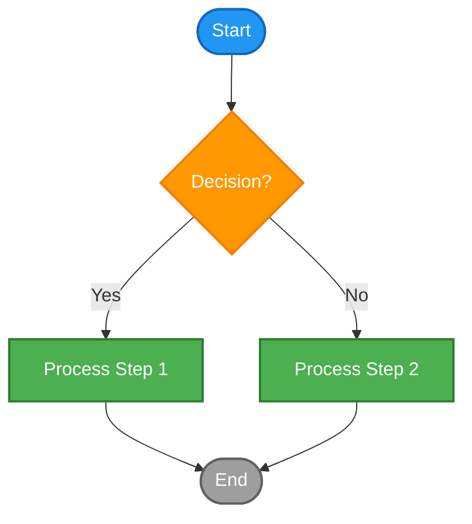
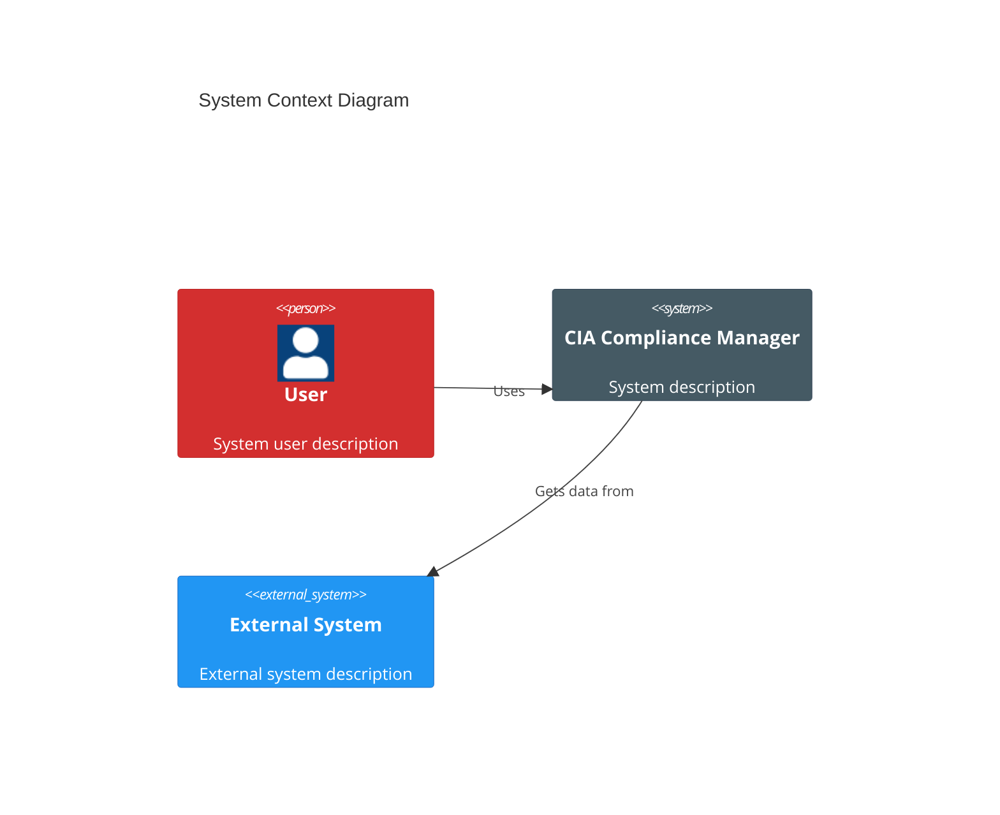
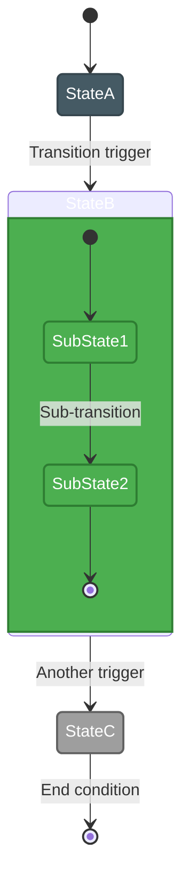
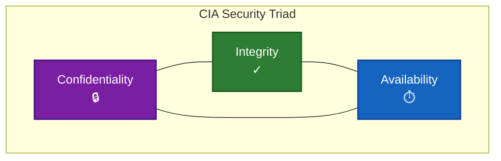
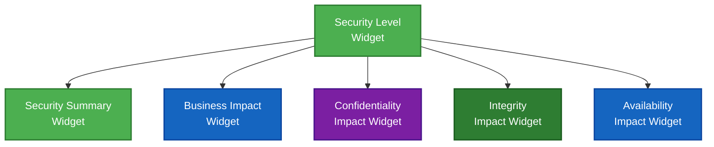
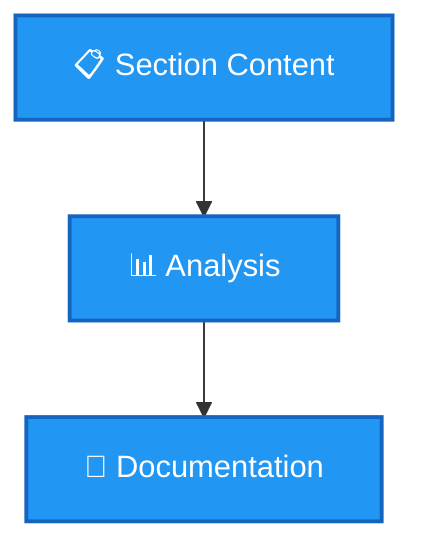

# 📋 Architecture Documentation Contribution Guidelines

This document provides guidelines for contributing to the CIA Compliance Manager's architecture documentation to maintain consistency, readability, and quality across all documentation.

## 📚 Documentation Structure

The architecture documentation follows a structured approach:

1. **Current Architecture Documents** - Present state of the system
2. **Future Architecture Documents** - Vision and roadmap for evolution
3. **Shared Documentation Elements** - Common components across documents

## 🎨 Style Guidelines

### 📊 Diagram Consistency

All architecture diagrams should follow these guidelines:

#### 🎯 Color Scheme

Use this enhanced color palette across all diagrams:

| Element Type           | Hex Color  | Usage                                  |
|------------------------|------------|-----------------------------------------|
| 🔒 Confidentiality     | `#8e44ad`  | Data protection, access control         |
| ✓ Integrity           | `#27ae60`  | Data validation, verification           |
| ⏱️ Availability        | `#2980b9`  | System uptime, reliability              |
| 🏛️ Core Architecture   | `#34495e`  | Primary system components               |
| 🧩 UI Components       | `#e74c3c`  | Interface elements, widgets             |
| ⚙️ Services            | `#3498db`  | Service layer, business logic           |
| 💼 Business Elements   | `#f1c40f`  | Business impact, value creation         |
| 🔄 Process Elements    | `#f39c12`  | Workflows, processes, activities        |
| 🧰 Utilities           | `#1abc9c`  | Helper functions, tools                 |
| ⚠️ Critical Items      | `#c0392b`  | High-priority or security-critical      |
| ✅ Success States      | `#2ecc71`  | Completion, successful outcomes         |
| 📊 Data Elements       | `#9b59b6`  | Information, storage, data flows        |

#### 📝 Text Formatting

- **Headers:** Use sentence case with emoji prefixes for section headers
- **Lists:** Use parallel structure and start action items with verbs
- **Terminology:** Be consistent with technical terms across documents
- **Acronyms:** Define acronyms on first use in each document

#### 📊 Diagram Best Practices

1. **Always include a title** that clearly describes the diagram's purpose
2. **Add a legend or class definitions** when using multiple colors/styles
3. **Keep diagram complexity manageable** (limit nodes to ~15-20 per diagram)
4. **Use consistent direction** (typically top-to-bottom or left-to-right)
5. **Balance visual elements** for aesthetic appeal and readability
6. **Use standardized shapes** for similar elements across diagrams
7. **Apply consistent colors** according to the project color scheme
8. **Highlight key elements** through size, position, or color emphasis

### 🧩 Mermaid Diagram Templates

#### Flowchart Template



#### C4 Diagram Template



#### State Diagram Template



#### CIA Triad Visualization Template



#### Widget Relationship Template



### 🔤 File Naming Conventions

1. Use UPPERCASE for all markdown files (e.g., `ARCHITECTURE.md`)
2. Use underscores for multi-word file names (e.g., `FUTURE_DATA_MODEL.md`)
3. Prefix future state documents with `FUTURE_` (e.g., `FUTURE_ARCHITECTURE.md`)
4. Use consistent file extensions (.md for Markdown, .svg for vector graphics)
5. Group related files with consistent prefixes

## 📝 Documentation Structure Template

Each architecture document should follow this standard structure:

```markdown
<!-- filepath: /path/to/document.md -->
# 🎯 Document Title

Brief introduction explaining the document's purpose (1-2 paragraphs).

## 📚 Related Documentation

<div class="documentation-map">

| Document | Focus | Description |
|----------|-------|-------------|
| [Link to Doc 1](path/to/doc1.md) | Focus 1 | Brief description |
| [Link to Doc 2](path/to/doc2.md) | Focus 2 | Brief description |

</div>

## 📋 Section 1 Title

Section content with appropriate diagrams and explanations.



### 📊 Subsection 1.1 Title

Subsection content.

## 🔄 Section 2 Title

Additional section content.

## 📝 Summary

Brief summary of key points (optional for shorter documents).
```

## 🔄 Review Process

All documentation changes undergo these review steps:

1. **Self-review** - Check against style guide and contribution guidelines
2. **Peer review** - Another team member reviews for technical accuracy
3. **Documentation lead review** - Ensures consistency with existing docs
4. **Final approval** - Merge after addressing all feedback

## 📋 Change Management

When updating architecture documentation:

1. **Create an issue** describing the needed documentation changes
2. **Reference requirements** that drive documentation updates
3. **Update all related documents** to maintain consistency
4. **Create cross-references** between related documents
5. **Update diagrams** to reflect the current architecture

By following these contribution guidelines, we ensure that our architecture documentation remains consistent, accurate, and valuable to all stakeholders.

