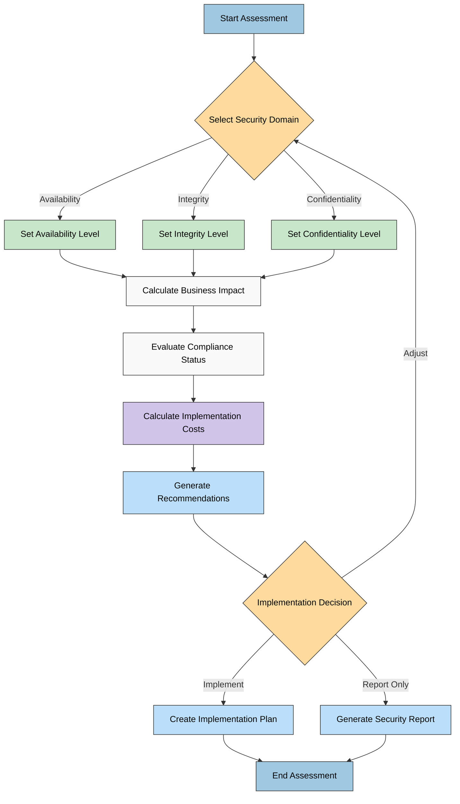
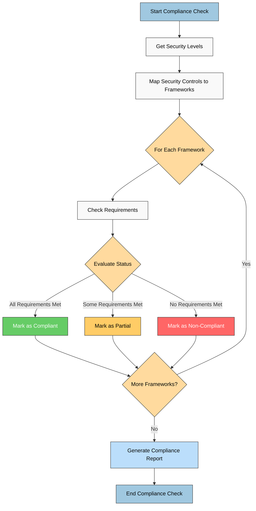

# CIA Compliance Manager Flowcharts

This document contains flowcharts that illustrate key processes within the CIA Compliance Manager.

## Security Level Assessment Workflow

**Business Focus:** Maps the decision process from security domain selection through business impact analysis, compliance evaluation, and cost calculation to final recommendations.

**User Journey Focus:** Illustrates the complete user flow for conducting a security assessment, showing decision points and alternative paths based on implementation choices.

## Compliance Evaluation Process

**Regulatory Focus:** Shows the step-by-step process of evaluating compliance status against multiple frameworks based on implemented security controls.

**Reporting Focus:** Illustrates how compliance findings are aggregated across frameworks to generate comprehensive compliance reports and status indicators.

These flowcharts illustrate key operational processes within the CIA Compliance Manager application. The color scheme provides visual distinction between different types of process steps:

- Blue represents start/end points and report generation
- Yellow/orange indicates decision points
- Green indicates compliance status
- Red indicates non-compliance
- Purple highlights cost-related calculations
