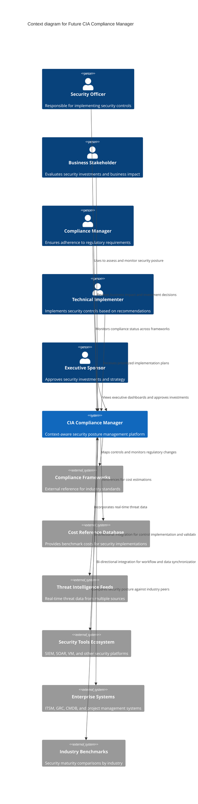
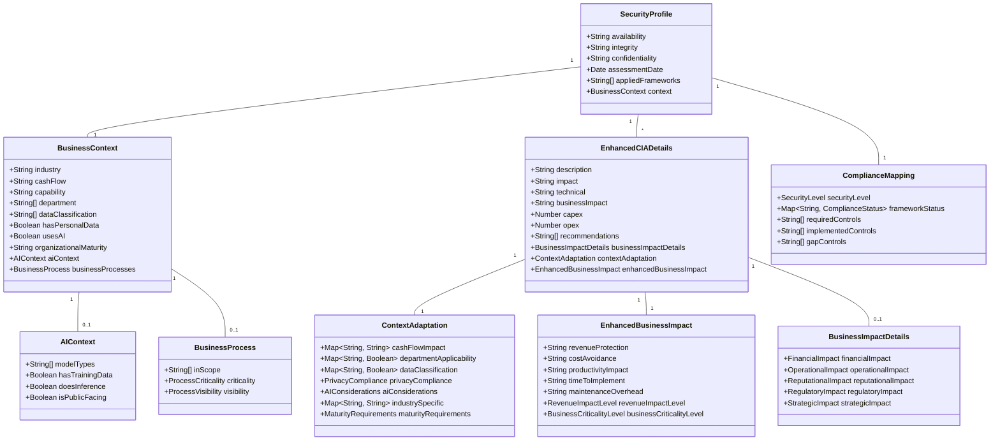

# CIA Compliance Manager Future Architecture

This document outlines the future architectural vision for the CIA Compliance Manager, detailing how the system will evolve to provide enhanced context awareness, adaptive security recommendations, and deeper business impact analysis.

## 📚 Related Architecture Documentation

| Document                                            | Focus           | Description                               |
| --------------------------------------------------- | --------------- | ----------------------------------------- |
| **[Current Architecture](ARCHITECTURE.md)**         | 🏛️ Architecture | C4 model showing current system structure |
| **[State Diagrams](STATEDIAGRAM.md)**               | 🔄 Behavior     | Current system state transitions          |
| **[Future State Diagrams](FUTURE_STATEDIAGRAM.md)** | 🔄 Behavior     | Context-aware state transitions           |
| **[Process Flowcharts](FLOWCHART.md)**              | 🔄 Process      | Current security workflows                |
| **[Future Flowcharts](FUTURE_FLOWCHART.md)**        | 🔄 Process      | Enhanced context-aware workflows          |
| **[Mindmaps](MINDMAP.md)**                          | 🧠 Concept      | Current system component relationships    |
| **[Future Mindmaps](FUTURE_MINDMAP.md)**            | 🧠 Concept      | Future capability evolution               |
| **[SWOT Analysis](SWOT.md)**                        | 💼 Business     | Current strategic assessment              |
| **[Future SWOT Analysis](FUTURE_SWOT.md)**          | 💼 Business     | Future strategic opportunities            |
| **[CI/CD Workflows](WORKFLOWS.md)**                 | 🔧 DevOps       | Current automation processes              |
| **[Future Workflows](FUTURE_WORKFLOWS.md)**         | 🔧 DevOps       | Enhanced CI/CD with ML                    |
| **[Future Data Model](FUTURE_DATA_MODEL.md)**       | 📊 Data         | Context-aware data architecture           |

## Architectural Vision Overview

The CIA Compliance Manager is evolving from a static security assessment tool into a dynamic, context-aware security posture management platform that adapts recommendations based on organizational context, learns from implementation outcomes, and provides continuous compliance monitoring. This evolution is driven by several key architectural principles:

- **🏢 Context-Aware Security:** Moving beyond one-size-fits-all recommendations to tailored security profiles based on industry, size, data sensitivity, and regulatory environment
- **🔄 Continuous Adaptation:** Transitioning from point-in-time assessments to continuous monitoring with dynamic adjustment to changing conditions
- **💼 Business-Driven Security:** Deepening the connection between security controls and business outcomes through advanced impact modeling
- **🧠 Machine Learning Enhancement:** Leveraging ML for pattern recognition, predictive recommendations, and anomaly detection
- **🔌 Integration Ecosystem:** Expanding integrations with security tools, GRC platforms, and enterprise systems

## Future C4 Context Diagram

**💼 Business Focus:** Illustrates how the enhanced platform serves multiple stakeholder roles with different information needs and connects with a broader ecosystem of external systems.

**🔒 Security Focus:** Defines expanded trust boundaries that include bidirectional integrations with security tools and enterprise systems.

## Future C4 Container Diagram

**🏛️ Architecture Focus:** Shows the modular design with specialized containers for context awareness, recommendations, integrations, and machine learning capabilities.

**🔧 Technical Focus:** Illustrates the API-first approach with centralized gateway, diverse database technologies, and ML pipeline integration.

```mermaid
C4Container
  title Container diagram for Future CIA Compliance Manager

  Person(securityOfficer, "Security Officer", "Responsible for implementing security controls")

  System_Boundary(ciaCM, "CIA Compliance Manager Platform") {
    Container(uiLayer, "Web Application", "React, TypeScript, TailwindCSS", "Provides interactive user interface with role-based views")
    Container(apiGateway, "API Gateway", "Node.js, Express", "Provides unified API access with authentication, rate limiting and logging")

    Container(contextEngine, "Context Engine", "TypeScript, Rules Engine", "Analyzes organizational context and adapts security recommendations")
    Container(securityAssessment, "Security Assessment Module", "TypeScript", "Handles CIA triad assessment and security level selection")
    Container(businessImpact, "Business Impact Analysis", "TypeScript, ML Models", "Analyzes impact of security implementations on business outcomes")
    Container(complianceEngine, "Compliance Engine", "TypeScript", "Maps security controls to compliance frameworks and tracks status")
    Container(recommendationEngine, "Recommendation Engine", "TypeScript, ML Pipeline", "Generates tailored security recommendations")

    Container(mlPipeline, "ML Pipeline", "Python, TensorFlow", "Trains and manages recommendation models")
    Container(integrationHub, "Integration Hub", "Node.js", "Manages connections with external systems")
    Container(notificationService, "Notification Service", "Node.js", "Delivers alerts and scheduled reports")

    ContainerDb(stateManager, "State Management", "Redux, Context API", "Manages application state")
    ContainerDb(assessmentDb, "Assessment Database", "MongoDB", "Stores assessment data and security profiles")
    ContainerDb(organizationDb, "Organization Database", "MongoDB", "Stores organization context and preferences")
    ContainerDb(mlModels, "ML Model Repository", "Model files, training data", "Stores trained ML models")
  }

  System_Ext(securityTools, "Security Tools Ecosystem", "SIEM, SOAR, VM, and other security platforms")
  System_Ext(enterpriseSystems, "Enterprise Systems", "ITSM, GRC, CMDB, and project management systems")

  Rel(securityOfficer, uiLayer, "Uses")
  Rel(uiLayer, apiGateway, "API Requests")

  Rel(apiGateway, contextEngine, "Routes requests")
  Rel(apiGateway, securityAssessment, "Routes requests")
  Rel(apiGateway, businessImpact, "Routes requests")
  Rel(apiGateway, complianceEngine, "Routes requests")
  Rel(apiGateway, recommendationEngine, "Routes requests")
  Rel(apiGateway, integrationHub, "Routes requests")

  Rel(contextEngine, organizationDb, "Reads/Writes")
  Rel(securityAssessment, assessmentDb, "Reads/Writes")
  Rel(businessImpact, assessmentDb, "Reads")
  Rel(complianceEngine, assessmentDb, "Reads")
  Rel(recommendationEngine, assessmentDb, "Reads")
  Rel(recommendationEngine, mlModels, "Uses models")

  Rel(mlPipeline, mlModels, "Creates/Updates")
  Rel(mlPipeline, assessmentDb, "Reads training data")

  Rel(integrationHub, securityTools, "Bi-directional integration")
  Rel(integrationHub, enterpriseSystems, "Bi-directional integration")

  Rel(recommendationEngine, notificationService, "Triggers notifications")
  Rel(complianceEngine, notificationService, "Triggers notifications")

  Rel(notificationService, securityOfficer, "Sends alerts")

  UpdateLayoutConfig($c4ShapeInRow="4", $c4BoundaryInRow="1")
```

## Enhanced Context Engine Component Diagram

**🏛️ Architecture Focus:** Provides detailed insight into the Context Engine's internal components and their interactions with data sources and other system components.

**💼 Business Focus:** Shows how organizational context parameters are collected, analyzed, and applied to security recommendations.

```mermaid
C4Component
  title Component diagram for Enhanced Context Engine

  Container_Boundary(contextEngine, "Context Engine") {
    Component(contextCollector, "Context Collector", "TypeScript", "Gathers organizational context from multiple sources")
    Component(industryAnalyzer, "Industry Analyzer", "TypeScript", "Analyzes industry-specific security requirements")
    Component(organizationSizer, "Organization Sizer", "TypeScript", "Determines appropriate controls based on org size and cash flow")
    Component(dataClassifier, "Data Classification Analyzer", "TypeScript", "Analyzes data sensitivity and privacy requirements")
    Component(aiSecurityAnalyzer, "AI Security Analyzer", "TypeScript", "Determines AI-specific security controls and considerations")
    Component(deptAnalyzer, "Department Analyzer", "TypeScript", "Maps department-specific security requirements")
    Component(maturityEvaluator, "Maturity Evaluator", "TypeScript", "Assesses organizational security maturity")
    Component(contextAdapter, "Context Adapter", "TypeScript, Rules Engine", "Adapts security parameters based on complete context")
    Component(contextDashboard, "Context Dashboard", "React", "Visualizes organization context factors and impacts")

    ComponentDb(contextRules, "Context Rules Repository", "JSON", "Stores context adaptation rules")
    ComponentDb(industryProfiles, "Industry Profiles", "JSON", "Stores industry-specific security profiles")
    ComponentDb(contextTemplates, "Context Templates", "JSON", "Stores predefined context templates by industry")
  }

  Container(organizationDb, "Organization Database", "MongoDB", "Stores organization context")
  Container(recommendationEngine, "Recommendation Engine", "TypeScript", "Generates security recommendations")
  Container(businessImpact, "Business Impact Analysis", "TypeScript", "Analyzes business impact of security controls")
  Container(uiLayer, "Web Application", "React", "User interface")

  Rel(contextCollector, organizationDb, "Reads/Writes context data")
  Rel(industryAnalyzer, industryProfiles, "Reads industry profiles")
  Rel(contextCollector, contextTemplates, "Uses predefined templates")
  Rel(contextAdapter, contextRules, "Applies adaptation rules")

  Rel(contextAdapter, organizationSizer, "Gets size-appropriate controls")
  Rel(contextAdapter, industryAnalyzer, "Gets industry-specific requirements")
  Rel(contextAdapter, dataClassifier, "Gets data protection requirements")
  Rel(contextAdapter, aiSecurityAnalyzer, "Gets AI security requirements")
  Rel(contextAdapter, deptAnalyzer, "Gets department-specific requirements")
  Rel(contextAdapter, maturityEvaluator, "Gets maturity-appropriate controls")

  Rel(contextDashboard, contextCollector, "Displays collected context")

  Rel(contextAdapter, recommendationEngine, "Provides context-aware parameters")
  Rel(contextAdapter, businessImpact, "Provides context for impact analysis")
  Rel(contextDashboard, uiLayer, "Renders in UI")

  UpdateLayoutConfig($c4ShapeInRow="3", $c4BoundaryInRow="1")
```

## Enhanced Data Model Architecture

**📊 Data Focus:** Illustrates the comprehensive data model that powers context-aware security recommendations with rich organizational factors.

**🔧 Technical Focus:** Shows the entity relationships between business context, security profiles, and impact analysis components.

## Key Architectural Changes

### 1. Context-Aware Security Framework

The future architecture introduces a dedicated Context Engine that:

- Collects and analyzes organization-specific context factors
- Maps organizations to appropriate industry profiles
- Identifies applicable regulatory requirements based on data types and jurisdictions
- Calibrates security recommendations based on organization size and maturity
- Adapts business impact calculations to reflect specific organization characteristics

### 2. Enhanced Business Impact Analysis

The Business Impact Analysis component now features:

- Context-specific financial impact quantification
- Department-specific impact analysis
- Industry-based risk scoring
- Revenue impact level assessment
- Comprehensive business criticality evaluation
- ROI calculations based on actual organizational factors

### 3. Machine Learning Enhancement

The ML Pipeline introduces intelligence to the platform:

- Trains recommendation models based on historical assessment data
- Learns patterns from similar organizations to improve recommendations
- Identifies anomalies in security posture and implementation
- Prioritizes recommendations based on organization-specific risk factors
- Adapts to changing threat landscapes and implementation outcomes

### 4. Integration Ecosystem

The Integration Hub expands connectivity:

- Bi-directional integration with security tools for control validation
- Synchronization with GRC platforms for unified compliance management
- Connection to ITSM systems for implementation workflow management
- Import/export capabilities for security assessment data
- Webhook and event-driven architecture for real-time updates

### 5. Continuous Monitoring & Adaptation

The architecture shifts from point-in-time assessment to continuous monitoring:

- Real-time security posture dashboards
- Automated detection of context changes that impact security requirements
- Compliance drift detection and alerting
- Dynamic adjustment of recommendations based on emerging threats
- Continuous validation of implemented controls

### 6. Advanced Analytics & Reporting

Enhanced intelligence provides deeper insights:

- Predictive risk modeling based on security decisions
- Comparative analysis against industry benchmarks
- Investment optimization recommendations
- Executive-level impact visualization
- Custom reporting with role-based views

## Technology Migration Path

The architectural evolution will follow these migration phases:

### Phase 1: Foundation (0-6 months)

1. **Enhanced Data Model Implementation**

   - Implement BusinessContext model
   - Create EnhancedCIADetails with context-awareness
   - Develop context parameters UI

2. **Basic Context Collection**

   - Implement industry, size, and data classification collection
   - Create simple adaptation rules engine
   - Build initial context-aware recommendation logic

3. **Foundation Integration**
   - Create standardized API interfaces
   - Implement basic export capabilities
   - Build simple integration points

### Phase 2: Intelligence & Advanced Context (6-12 months)

1. **Machine Learning Foundation**

   - Create initial ML model training pipeline
   - Implement pattern recognition based on context
   - Develop basic analytics engine

2. **Enhanced Context Processing**

   - Implement department-specific recommendations
   - Create AI security control adaptation
   - Develop maturity-based calibration

3. **Integration Expansion**
   - Build security tool integration connectors
   - Implement GRC platform synchronization
   - Create ITSM system integration

### Phase 3: Continuous Monitoring (12-24 months)

1. **Real-Time Monitoring Implementation**

   - Build security posture dashboard
   - Create continuous compliance monitoring
   - Implement context change detection

2. **Advanced ML Capabilities**

   - Deploy comprehensive ML recommendation engine
   - Implement anomaly detection
   - Create predictive security models

3. **Full Integration Ecosystem**
   - Complete bi-directional tool integrations
   - Implement event-driven architecture
   - Create comprehensive API ecosystem

### Phase 4: Advanced Analytics (24+ months)

1. **Comprehensive Business Analytics**

   - Implement detailed ROI modeling
   - Create business outcome prediction
   - Develop investment optimization engine

2. **Executive Intelligence**

   - Build executive dashboards
   - Create strategic planning tools
   - Implement security investment planning

3. **Industry Benchmarking**
   - Deploy peer comparison analytics
   - Implement industry-specific benchmarks
   - Create maturity assessment tools

## Security Architecture Considerations

### 1. API Security Layer

- OAuth 2.0 with PKCE for authentication
- Role-based access control for all API endpoints
- Rate limiting and anomaly detection for API abuse
- Input validation and output sanitization
- Security headers and proper CORS configuration

### 2. Data Protection

- End-to-end encryption for sensitive assessment data
- Field-level encryption for high-value elements
- Data anonymization for machine learning training
- Comprehensive access logging and audit trails
- Data retention policies and automated purging

### 3. Integration Security

- Verified partner connections with mutual TLS
- API keys and tokens with limited scope and rotation
- Payload validation and schema enforcement
- Integration monitoring and anomaly detection
- Secure webhook validation mechanism

### 4. ML Pipeline Security

- Secure model storage and versioning
- Training data protection and anonymization
- Model validation against adversarial examples
- Prevention of model poisoning attacks
- Secure inference environment

### 5. Context Data Protection

- Granular access control to organizational context
- Minimization of sensitive context data collection
- Secure storage of business context parameters
- Context data validation and boundary enforcement
- Audit logging for context changes

## Conclusion

The future architecture of the CIA Compliance Manager represents a significant evolution from its current state, transforming it from a static assessment tool into a dynamic, context-aware security posture management platform. By incorporating organizational context, machine learning, integration capabilities, and continuous monitoring, the platform will provide more accurate, relevant, and actionable security recommendations tailored to each organization's specific needs and circumstances.

The enhanced context-awareness capabilities being implemented will allow the platform to consider critical factors like industry, company size, data sensitivity, department-specific needs, and organizational maturity when providing security recommendations. This will result in more precise business impact analysis and more effective security investments.

This architectural vision aligns with the broader industry trend toward continuous security validation and adaptation, moving away from point-in-time assessments to a more dynamic and responsive approach to security management. The integration capabilities will ensure the CIA Compliance Manager becomes a central hub in the organization's security ecosystem, connecting with operational tools to both inform and validate security implementations.

As organizations face increasingly complex security challenges and regulatory requirements, this evolution will help them navigate these challenges more effectively, optimize their security investments, and maintain an appropriate security posture that balances risk, compliance, and business needs.
