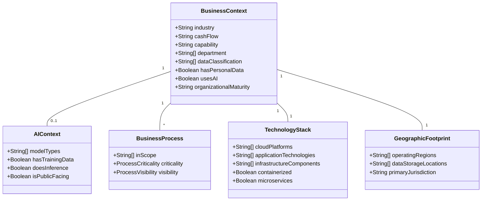
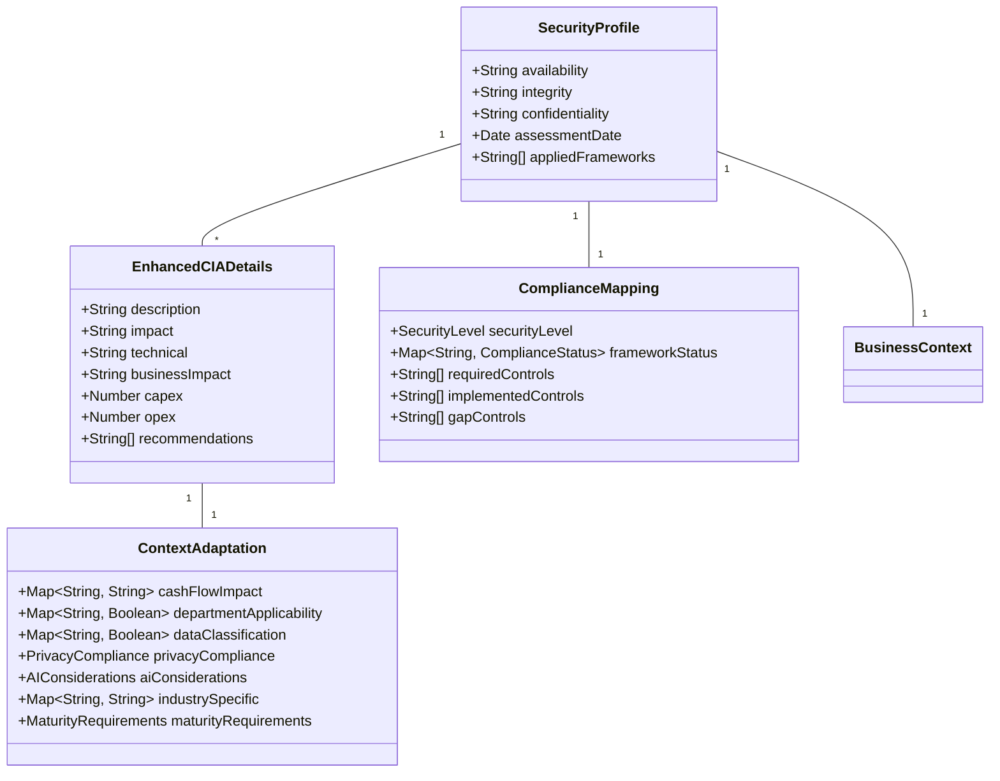
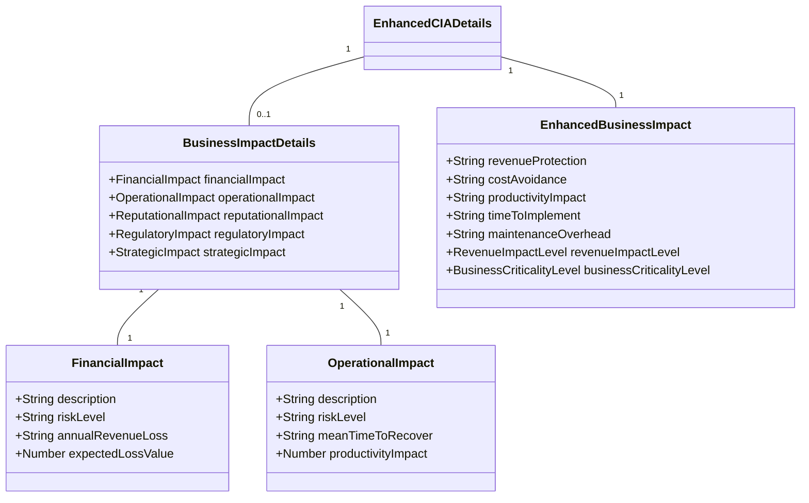
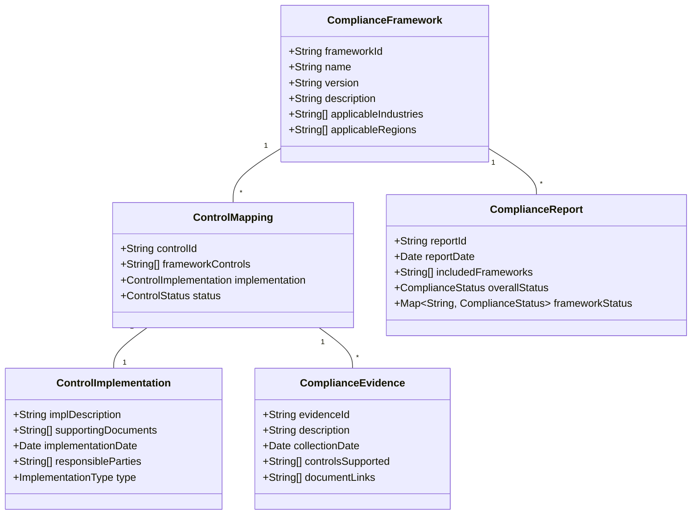
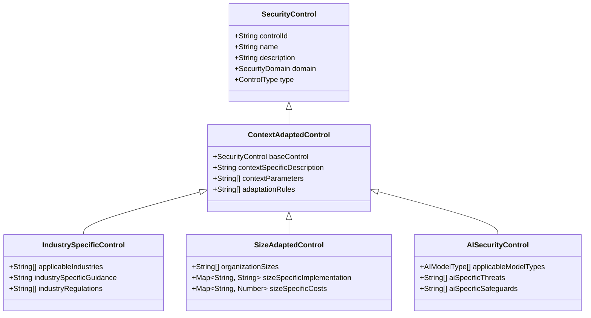

# CIA Compliance Manager Future Data Model

This document describes the future data model for the CIA Compliance Manager, focusing on the enhanced context-aware security assessment capabilities, business impact analysis, and compliance mapping.

## 📚 Related Architecture Documentation

| Document                                            | Focus           | Description                               |
| --------------------------------------------------- | --------------- | ----------------------------------------- |
| **[Current Architecture](ARCHITECTURE.md)**         | 🏛️ Architecture | C4 model showing current system structure |
| **[Future Architecture](FUTURE_ARCHITECTURE.md)**   | 🏛️ Architecture | Vision for context-aware platform         |
| **[State Diagrams](STATEDIAGRAM.md)**               | 🔄 Behavior     | Current system state transitions          |
| **[Future State Diagrams](FUTURE_STATEDIAGRAM.md)** | 🔄 Behavior     | Enhanced adaptive state transitions       |
| **[Process Flowcharts](FLOWCHART.md)**              | 🔄 Process      | Current security workflows                |
| **[Future Flowcharts](FUTURE_FLOWCHART.md)**        | 🔄 Process      | Enhanced context-aware workflows          |
| **[Mindmaps](MINDMAP.md)**                          | 🧠 Concept      | Current system component relationships    |
| **[Future Mindmaps](FUTURE_MINDMAP.md)**            | 🧠 Concept      | Future capability evolution               |
| **[SWOT Analysis](SWOT.md)**                        | 💼 Business     | Current strategic assessment              |
| **[Future SWOT Analysis](FUTURE_SWOT.md)**          | 💼 Business     | Future strategic opportunities            |
| **[CI/CD Workflows](WORKFLOWS.md)**                 | 🔧 DevOps       | Current automation processes              |
| **[Future Workflows](FUTURE_WORKFLOWS.md)**         | 🔧 DevOps       | Enhanced CI/CD with ML                    |

## Core Data Model Overview

The future CIA Compliance Manager data model centers around three interconnected domains:

1. **📊 Organizational Context** - Captures the specific characteristics and environment of an organization
2. **🔒 Security Assessment** - Evaluates security posture across the CIA triad with context-aware adaptations
3. **💼 Business Impact** - Quantifies the business implications of security decisions with context-specific metrics

This model enables highly tailored security recommendations based on an organization's specific situation rather than generic security guidance.

## Organizational Context Domain

**💼 Business Focus:** Captures the essential business context parameters that influence security requirements and recommendations.

**🔧 Implementation Focus:** Shows the entity relationships and data structures that enable context-aware security assessments.

## Security Assessment Domain

**🔒 Security Focus:** Illustrates the enhanced security profile model that incorporates context adaptation and tailored security controls.

**🏛️ Architecture Focus:** Shows how security assessments are structured and linked to business context for deeper relevance.

## Business Impact Domain

**💼 Business Focus:** Provides a comprehensive model for quantifying business impacts across multiple dimensions based on security decisions.

**📊 Financial Focus:** Shows how security implementations are linked to specific business outcomes and financial metrics.

## Compliance Mapping Model

**📋 Regulatory Focus:** Shows how security controls map to specific compliance requirements across multiple frameworks.

**🔒 Security Focus:** Illustrates the relationship between implemented controls and compliance achievement.

## Context-Aware Security Controls

**🔒 Security Focus:** Details how security controls adapt to specific organizational contexts such as industry and size.

**💼 Business Focus:** Shows how controls are tailored to business needs rather than using a one-size-fits-all approach.

## Key Data Model Enhancements

### 1. Rich Context Modeling

The enhanced data model captures detailed organizational context through:

- 🏭 **Industry-specific parameters** for targeted security profiles
- 📊 **Size and capability modeling** for appropriate control scaling
- 👥 **Department-specific considerations** for role-based security
- 🔐 **Data classification integration** for sensitivity-appropriate controls
- 🤖 **AI/ML usage parameters** for specialized security considerations
- 🌎 **Geographic considerations** for regulatory alignment

### 2. Context-Adapted Security Profiles

Security profiles are enhanced with context adaptations that:

- 🔄 **Adjust security recommendations** based on organizational factors
- 🤖 **Provide specialized controls** for AI/ML applications
- 👥 **Tailor recommendations** to departmental needs
- 📏 **Scale controls appropriately** for organization size
- 🏭 **Account for industry-specific** threat models

### 3. Enhanced Business Impact Modeling

The business impact domain is expanded to include:

- 💰 **Financial modeling** with revenue impact quantification
- ⚙️ **Operational impact** with productivity measures
- 🎯 **Strategic impact** for long-term planning
- 📉 **Cost avoidance metrics** for ROI calculation
- ⏱️ **Implementation timeline** considerations

### 4. Compliance Enhancement

The compliance mapping domain is improved with:

- 🔗 **Framework-specific control mapping** with bidirectional traceability
- 🔍 **Gap analysis** with compliance status visualization
- 🛠️ **Remediation recommendations** for non-compliant controls
- 🌎 **Jurisdiction-specific** regulatory requirements
- ✅ **Control implementation tracking** with evidence management

## Implementation Strategy

The data model enhancements will be implemented in phases:

### Phase 1: Core Context Model (0-3 months)

- ✅ Implement BusinessContext with basic parameters
- ✅ Add simple context adaptation logic
- ✅ Create industry-specific templates

### Phase 2: Enhanced Business Impact (3-6 months)

- ✅ Implement detailed business impact domain
- ✅ Create context-specific impact calculations
- ✅ Develop ROI and cost avoidance metrics

### Phase 3: Advanced Context Adaptation (6-9 months)

- 🔄 Implement AI context parameters
- 🔄 Add geographic considerations
- 🔄 Develop department-specific controls

### Phase 4: Full Integration (9-12 months)

- 📋 Create bidirectional compliance mapping
- 📈 Implement continuous context monitoring
- 🤖 Develop ML-based recommendation tuning

## Technical Implementation Details

The data model will be implemented using:

- **TypeScript Interfaces** - For type safety and development-time validation
- **JSON Schema** - For runtime validation of data structures
- **MongoDB Schema** - For persistent storage with flexible schema evolution
- **GraphQL Types** - For API type definitions and query/mutation interfaces

Key technical considerations include:

1. **Backward Compatibility** - Maintaining support for existing implementations
2. **Progressive Enhancement** - Adding context awareness incrementally
3. **Schema Versioning** - Managing schema evolution without breaking changes
4. **Data Migration** - Strategies for migrating existing assessments to enhanced model

## Conclusion

The enhanced data model provides the foundation for the CIA Compliance Manager's evolution into a context-aware security posture management platform. By capturing rich organizational context and adapting security recommendations to specific business environments, the platform will deliver more relevant, actionable guidance that resonates with each organization's unique needs and constraints.

This data-driven approach will enable security professionals to make more informed decisions about security investments, focusing resources where they provide the greatest business value and risk reduction for their specific context, rather than applying generic security recommendations that may be misaligned with organizational realities.
