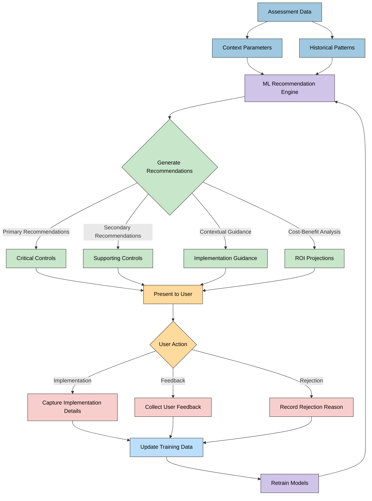
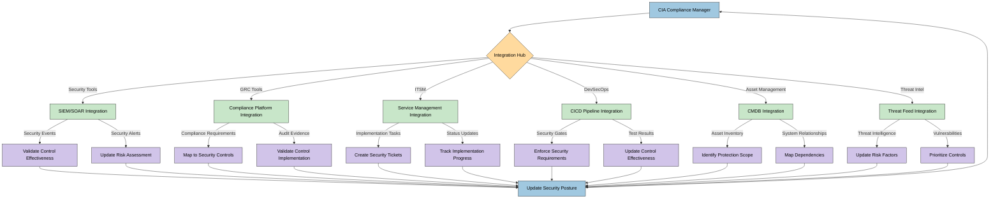
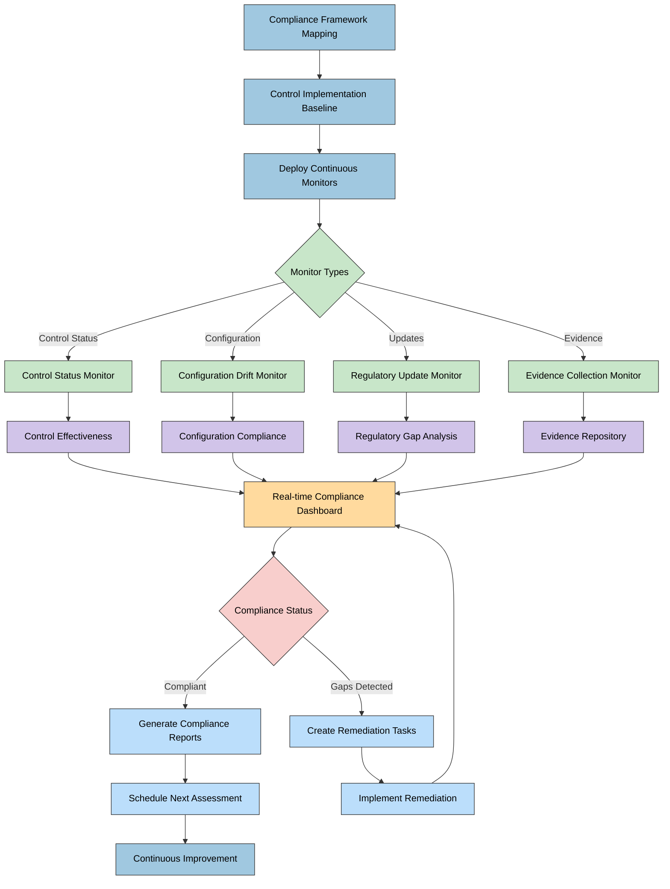
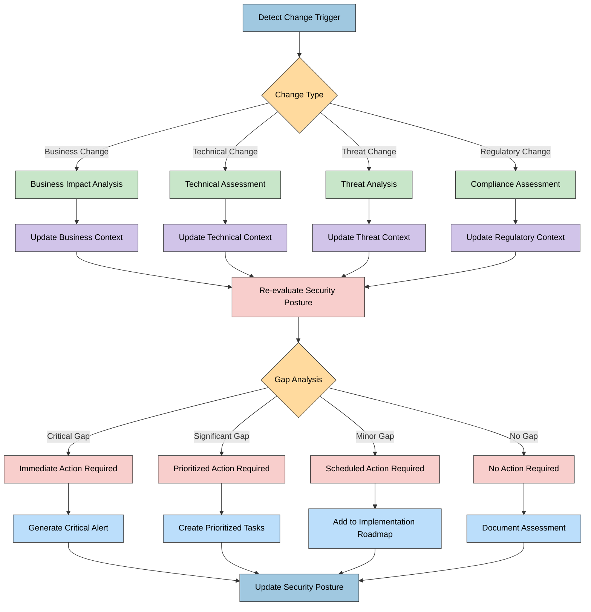

# CIA Compliance Manager Future Flowcharts

This document illustrates key process flows and decision trees planned for the future evolution of the CIA Compliance Manager, focusing on context-aware assessment, machine learning enhancements, and integration capabilities.

## 📚 Related Architecture Documentation

<div class="documentation-map">

| Document                                            | Focus           | Description                               |
| --------------------------------------------------- | --------------- | ----------------------------------------- |
| **[Current Architecture](ARCHITECTURE.md)**         | 🏛️ Architecture | C4 model showing current system structure |
| **[Future Architecture](FUTURE_ARCHITECTURE.md)**   | 🏛️ Architecture | Vision for context-aware platform         |
| **[State Diagrams](STATEDIAGRAM.md)**               | 🔄 Behavior     | Current system state transitions          |
| **[Future State Diagrams](FUTURE_STATEDIAGRAM.md)** | 🔄 Behavior     | Enhanced adaptive state transitions       |
| **[Process Flowcharts](FLOWCHART.md)**              | 🔄 Process      | Current security workflows                |
| **[Mindmaps](MINDMAP.md)**                          | 🧠 Concept      | Current system component relationships    |
| **[Future Mindmaps](FUTURE_MINDMAP.md)**            | 🧠 Concept      | Future capability evolution               |
| **[SWOT Analysis](SWOT.md)**                        | 💼 Business     | Current strategic assessment              |
| **[Future SWOT Analysis](FUTURE_SWOT.md)**          | 💼 Business     | Future strategic opportunities            |
| **[CI/CD Workflows](WORKFLOWS.md)**                 | 🔧 DevOps       | Current automation processes              |
| **[Future Workflows](FUTURE_WORKFLOWS.md)**         | 🔧 DevOps       | Enhanced CI/CD with ML                    |
| **[Future Data Model](FUTURE_DATA_MODEL.md)**       | 📊 Data         | Context-aware data architecture           |

</div>

## Context-Aware Security Assessment Flow

**💼 Business Focus:** Maps the enhanced decision process that incorporates organizational context parameters to deliver tailored security recommendations.

**👤 User Experience Focus:** Shows how the assessment experience will evolve to collect contextual data and use it to generate organization-specific guidance.

```mermaid
flowchart TD
    A[Start Assessment] --> B[Collect Organization Context]
    B --> C{Context Type}

    C -->|Industry| D1[Determine Industry-Specific Requirements]
    C -->|Size & Maturity| D2[Calculate Organizational Capacity]
    C -->|Data Classification| D3[Determine Data Protection Needs]
    C -->|Regulatory Environment| D4[Map Compliance Requirements]
    C -->|Business Processes| D5[Analyze Process Criticality]
    C -->|Technology Stack| D6[Evaluate Technical Environment]

    D1 & D2 & D3 & D4 & D5 & D6 --> E[Create Context-Aware Profile]

    E --> F[Calculate Context-Adapted Security Levels]
    F --> G[Generate Tailored Security Recommendations]
    G --> H[Determine Business-Specific Impact]
    H --> I[Create Implementation Roadmap]

    I --> J{Implementation Decision}
    J -->|Execute| K[Generate Implementation Plan]
    J -->|Adjust| E
    J -->|Report Only| L[Generate Security Report]

    K & L --> M[End Assessment]

    classDef start fill:#a0c8e0,stroke:#333,stroke-width:1px,color:black
    classDef context fill:#ffda9e,stroke:#333,stroke-width:1px,color:black
    classDef profile fill:#c8e6c9,stroke:#333,stroke-width:1px,color:black
    classDef decision fill:#f8cecc,stroke:#333,stroke-width:1px,color:black
    classDef implementation fill:#d1c4e9,stroke:#333,stroke-width:1px,color:black
    classDef report fill:#bbdefb,stroke:#333,stroke-width:1px,color:black
    classDef end fill:#a0c8e0,stroke:#333,stroke-width:1px,color:black

    class A,M start,end
    class B,C,D1,D2,D3,D4,D5,D6 context
    class E,F,G,H profile
    class J decision
    class I,K implementation
    class L report
```

## Machine Learning-Enhanced Recommendation Flow

**🧠 Intelligence Focus:** Illustrates how the recommendation engine will be enhanced with machine learning to deliver increasingly accurate and relevant recommendations over time.

**🔄 Learning Focus:** Shows the continuous learning loop that improves recommendations based on implementation outcomes and user feedback.



## Integration Ecosystem Workflow

**🔌 Integration Focus:** Shows how the CIA Compliance Manager will interact with external tools and systems to create a comprehensive security management ecosystem.

**📊 Data Flow Focus:** Illustrates the bidirectional data flows between the CIA Compliance Manager and other enterprise systems.



## Continuous Compliance Monitoring Process

**📋 Compliance Focus:** Illustrates how the system will evolve to provide continuous compliance monitoring rather than point-in-time assessments.

**🔄 Operational Focus:** Shows the automated monitoring and detection processes that maintain ongoing compliance visibility.



## Adaptive Security Decision Tree

**🔄 Adaptability Focus:** Shows the decision logic that will adjust security recommendations based on changing business and threat landscapes.

**🧠 Decision Making Focus:** Illustrates the complex decision matrix that drives adaptive security recommendations.



<div class="diagram-legend">
These flowcharts provide a detailed view of how the CIA Compliance Manager will evolve to incorporate context awareness, machine learning, integration capabilities, continuous monitoring, and adaptive security decision-making. They show the complex processes and decision pathways that will enable the system to provide increasingly tailored and relevant security recommendations as it matures.

The color coding across diagrams helps to identify similar process stages:

- 🔵 Blue shades for core processes, data, and start/end points
- 🟡 Yellow/orange for context information and user interactions
- 🟢 Green for profiles, recommendations, and monitoring activities
- 🟣 Purple for implementation, ML, and integration components
- 🔴 Red for decision points and status updates
</div>
