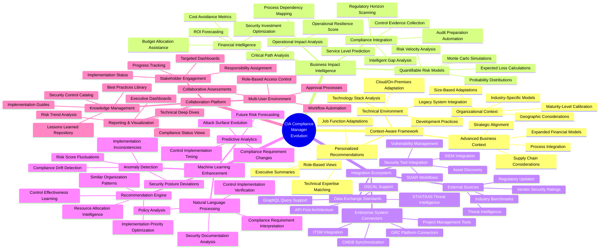
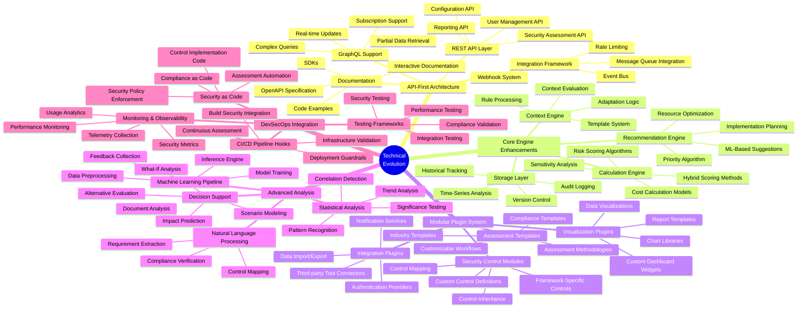

# CIA Compliance Manager Future Architecture Mindmap

This mindmap outlines the future vision and architecture evolution for the CIA Compliance Manager, focusing on enhanced context awareness, integration capabilities, and advanced analytics.

## System Evolution Mindmap

**Business Focus:** Maps how the CIA Compliance Manager will evolve to provide deeper business insights, more tailored security recommendations, and enhanced regulatory alignment.

**Strategic Focus:** Illustrates the transition from static security assessments to dynamic, context-aware security posture management with continuous adaptation capabilities.

## Technical Architecture Evolution

**Architecture Focus:** Shows the evolution of technical components and architecture patterns toward a more modular, integration-ready platform.

**Implementation Focus:** Highlights key technical enablers including API-first design, plugin architecture, and machine learning integration that will support the expanded capabilities.

These mindmaps illustrate the ambitious vision for the CIA Compliance Manager's evolution into a comprehensive security posture management platform that leverages context awareness, advanced analytics, and integration capabilities to deliver highly tailored security recommendations and insights. The technical architecture will evolve to support these capabilities through a modular, API-first approach that enables easier integration and extension.
