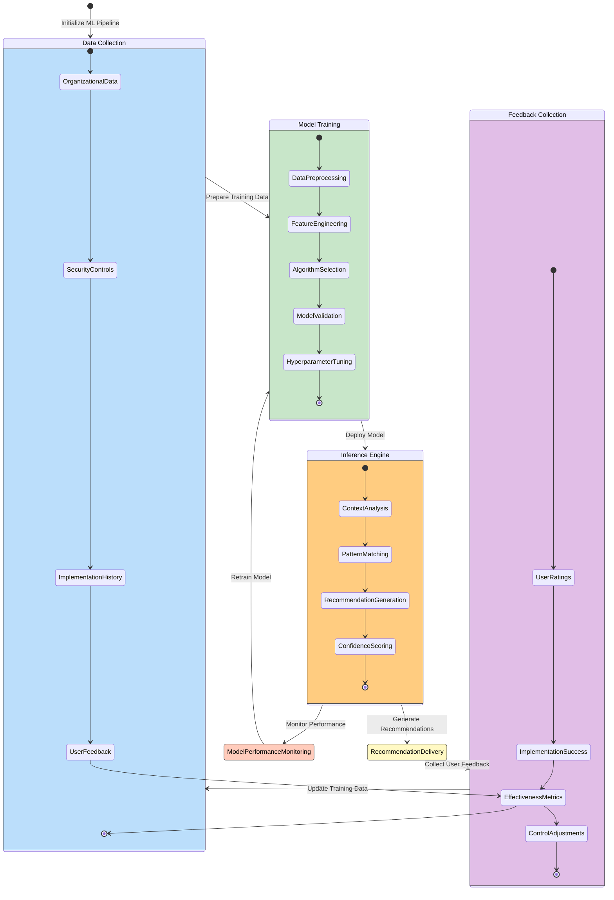

# CIA Compliance Manager Future State Diagrams

This document illustrates the future state transitions and behavior of the enhanced CIA Compliance Manager system, focused on context awareness, adaptive security, and dynamic compliance.

## Context-Aware Security Assessment State Diagram

**Business Focus:** Demonstrates how the system will adapt security assessments based on organization context factors, showing how recommendations and security profiles will dynamically adjust as business context changes.

**Security Focus:** Illustrates the relationship between organizational context factors and resulting security profiles, showing transitions between different context-influenced security states.

```mermaid
stateDiagram-v2
    [*] --> InitialProfile: Start Assessment

    state "Initial Context Collection" as ContextCollection {
        [*] --> IndustryContext
        IndustryContext --> SizeContext
        SizeContext --> DataContext
        DataContext --> RegulatoryContext
        RegulatoryContext --> TechnicalContext
        TechnicalContext --> [*]
    }

    InitialProfile --> ContextCollection: Gather Context

    ContextCollection --> BaselineAssessment: Generate Profile

    state "Context-Aware Assessment" as BaselineAssessment {
        [*] --> SecurityLevels
        SecurityLevels --> BusinessImpact
        BusinessImpact --> ComplianceMapping
        ComplianceMapping --> RecommendationGeneration
        RecommendationGeneration --> [*]
    }

    BaselineAssessment --> OptimizedProfile: Initial Assessment

    state "Profile Optimization" as Optimization {
        [*] --> BudgetConstraints
        BudgetConstraints --> BusinessPriorities
        BusinessPriorities --> RiskTolerance
        RiskTolerance --> CapabilityFactors
        CapabilityFactors --> [*]
    }

    OptimizedProfile --> Optimization: Refine Profile
    Optimization --> OptimizedProfile: Update Profile

    OptimizedProfile --> ImplementationPlan: Accept Profile

    state "Dynamic Monitoring" as Monitoring {
        [*] --> ContextChanges
        ContextChanges --> BusinessChanges
        BusinessChanges --> ThreatChanges
        ThreatChanges --> ComplianceChanges
        ComplianceChanges --> [*]
    }

    ImplementationPlan --> Monitoring: Implement Controls
    Monitoring --> ContextCollection: Significant Change Detected

    ImplementationPlan --> [*]: Complete Assessment

    classDef start fill:#a0c8e0,stroke:#333,stroke-width:1px,color:black
    classDef context fill:#ffda9e,stroke:#333,stroke-width:1px,color:black
    classDef assessment fill:#c8e6c9,stroke:#333,stroke-width:1px,color:black
    classDef optimization fill:#d1c4e9,stroke:#333,stroke-width:1px,color:black
    classDef monitoring fill:#ffccbc,stroke:#333,stroke-width:1px,color:black

    class InitialProfile,ContextCollection context
    class BaselineAssessment assessment
    class OptimizedProfile,Optimization optimization
    class Monitoring monitoring
    class ImplementationPlan start
```

## Adaptive Compliance Management State Diagram

**Compliance Focus:** Shows how the system will evolve to maintain dynamic compliance across multiple frameworks, adapting to both regulatory changes and system modifications.

**Operational Focus:** Illustrates the continuous compliance assessment process that replaces point-in-time assessments with ongoing monitoring and adjustment.

```mermaid
stateDiagram-v2
    [*] --> FrameworkMapping: Select Frameworks

    state "Framework Mapping" as FrameworkMapping {
        [*] --> ControlIdentification
        ControlIdentification --> ControlMapping
        ControlMapping --> GapAnalysis
        GapAnalysis --> [*]
    }

    FrameworkMapping --> ComplianceAssessment: Map Requirements

    state "Compliance Assessment" as ComplianceAssessment {
        [*] --> SecurityReview
        SecurityReview --> EvidenceCollection
        EvidenceCollection --> ControlValidation
        ControlValidation --> ComplianceScoring
        ComplianceScoring --> [*]
    }

    ComplianceAssessment --> ComplianceStatus: Generate Report

    state "Continuous Monitoring" as ContinuousMonitoring {
        [*] --> SecurityChanges
        SecurityChanges --> ControlChanges
        ControlChanges --> RegulatoryUpdates
        RegulatoryUpdates --> BusinessChanges
        BusinessChanges --> [*]
    }

    ComplianceStatus --> ContinuousMonitoring: Establish Monitoring

    state "Automated Remediation" as AutomatedRemediation {
        [*] --> GapDetection
        GapDetection --> RemediationPlanning
        RemediationPlanning --> PriorityAssignment
        PriorityAssignment --> TaskAssignment
        TaskAssignment --> [*]
    }

    ContinuousMonitoring --> ComplianceStatus: Update Status
    ContinuousMonitoring --> AutomatedRemediation: Identify Gap
    AutomatedRemediation --> ComplianceAssessment: Implement Fix

    ComplianceStatus --> ComplianceReporting: Generate Reports

    ComplianceReporting --> [*]: Complete Cycle

    classDef mapping fill:#bbdefb,stroke:#333,stroke-width:1px,color:black
    classDef assessment fill:#c8e6c9,stroke:#333,stroke-width:1px,color:black
    classDef monitoring fill:#ffccbc,stroke:#333,stroke-width:1px,color:black
    classDef remediation fill:#e1bee7,stroke:#333,stroke-width:1px,color:black
    classDef status fill:#fff9c4,stroke:#333,stroke-width:1px,color:black
    classDef report fill:#d1c4e9,stroke:#333,stroke-width:1px,color:black

    class FrameworkMapping mapping
    class ComplianceAssessment assessment
    class ContinuousMonitoring monitoring
    class AutomatedRemediation remediation
    class ComplianceStatus status
    class ComplianceReporting report
```

## Machine Learning Enhancement State Diagram

**Technical Focus:** Illustrates the machine learning enhancement lifecycle that will improve security recommendations over time through continuous learning.

**Adaptability Focus:** Shows how the system will learn from implementation outcomes and user feedback to refine its recommendation engine.

These state diagrams illustrate the future behavior and state transitions of the CIA Compliance Manager system, focusing on:

1. **Context-Aware Security Assessment**: How organizational context will drive adaptive security profiles
2. **Adaptive Compliance Management**: How continuous compliance monitoring will replace static point-in-time assessments
3. **Machine Learning Enhancement**: How the system will improve recommendations through continuous learning

The color schemes provide visual distinction between different process phases:

- Blues represent mapping and data collection activities
- Greens represent assessment and training operations
- Purples represent optimization and reporting functions
- Oranges/yellows represent active states like deployment and monitoring
- Reds represent monitoring and alerting functions
