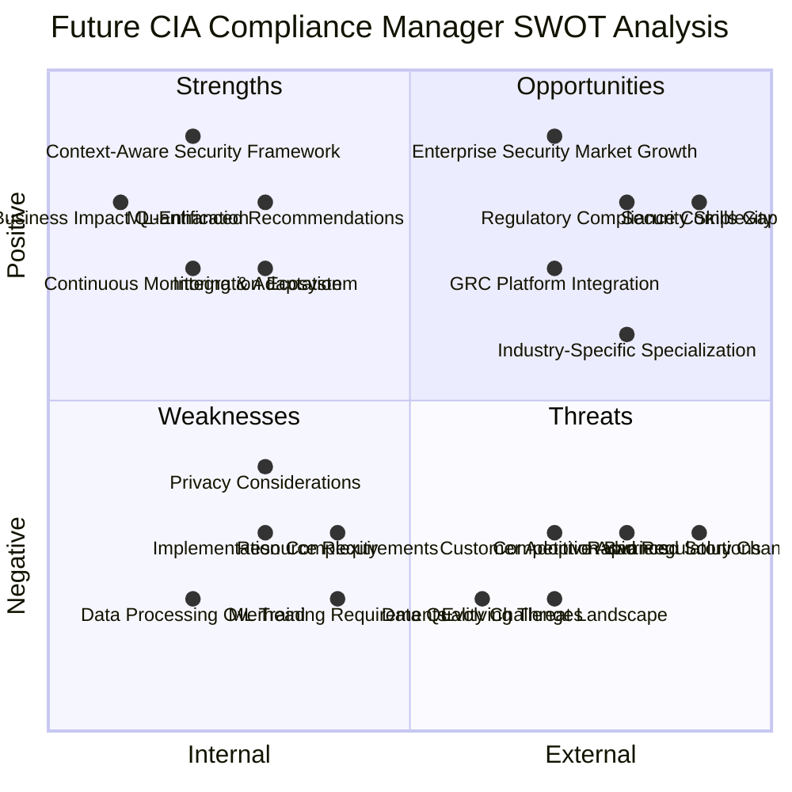
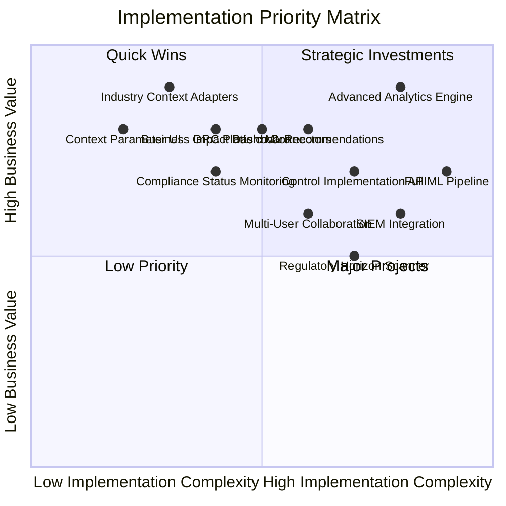

# CIA Compliance Manager Future Strategic Analysis (SWOT)

This strategic analysis examines the future vision for the CIA Compliance Manager, assessing its Strengths, Weaknesses, Opportunities, and Threats as it evolves from a static security assessment tool to a context-aware, adaptable security posture management platform.

## Related Architecture Documentation

- [Future Architecture Overview](FUTURE_ARCHITECTURE.md) - Core architectural vision and principles
- [Process Flows](FUTURE_FLOWCHART.md) - Key workflows and processes
- [System States](FUTURE_STATEDIAGRAM.md) - State transitions and system behavior
- [Concept Maps](FUTURE_MINDMAP.md) - Hierarchical visualization of system components
- [DevOps Workflows](FUTURE_WORKFLOWS.md) - Implementation and CI/CD processes
- [Data Model](FUTURE_DATA_MODEL.md) - Enhanced data architecture

## Executive Summary

The future CIA Compliance Manager represents a significant evolution from static security assessment to dynamic, context-aware security management. By leveraging organizational context, machine learning, and continuous monitoring capabilities, the platform is positioned to deliver highly tailored security recommendations with specific business impact insights. This transformation addresses key market needs while presenting implementation challenges that must be strategically managed.

## Strategic Quadrant Analysis

## Detailed SWOT Analysis

### Strengths (Internal Positive)

#### 1. Context-Aware Security Framework

The enhanced architecture allows the system to adapt security recommendations based on multiple organizational factors:

- **Industry-Specific Models**: Tailored security recommendations for healthcare, finance, retail, etc.
- **Size-Based Adaptations**: Security controls optimized for organizations of different sizes
- **Maturity-Level Calibration**: Recommendations that align with organizational capabilities
- **Data Classification Integration**: Security levels mapped to data sensitivity requirements

#### 2. ML-Enhanced Recommendations

Machine learning capabilities enable increasingly intelligent security guidance:

- **Pattern Recognition**: Learns from similar organizations to improve recommendations
- **Anomaly Detection**: Identifies security posture inconsistencies
- **Recommendation Prioritization**: Uses organizational risk factors to order implementation steps
- **Predictive Security Posture**: Anticipates security needs based on trends and patterns

#### 3. Business Impact Quantification

Enhanced business impact modeling provides meaningful ROI analysis:

- **Financial Impact Modeling**: Detailed financial risk assessment with specific cost projections
- **Revenue Protection Metrics**: Clear mapping between security controls and revenue safeguards
- **Operational Resilience Scoring**: Measures implementation impact on business continuity
- **Executive Communication Tools**: Business-oriented dashboards for security investments

#### 4. Continuous Monitoring & Adaptation

Dynamic security posture assessment replaces point-in-time evaluation:

- **Real-Time Dashboard**: Continuous visibility into security posture
- **Automated Control Verification**: Validation of implemented security measures
- **Compliance Drift Detection**: Alerts when security posture no longer meets requirements
- **Threat-Driven Updates**: Recommendations evolve with changing threat landscape

#### 5. Integration Ecosystem

Comprehensive connectivity supports operational integration:

- **Security Tool Integration**: Bi-directional data sharing with security platforms
- **GRC Platform Connectors**: Unified compliance and risk management
- **ITSM Systems Connection**: Streamlined implementation workflow
- **API-First Architecture**: Extensible design for custom integrations

### Weaknesses (Internal Negative)

#### 1. Implementation Complexity

The enhanced framework introduces technical challenges:

- **Architecture Complexity**: More sophisticated components increase system complexity
- **Integration Requirements**: Dependencies on external system connections
- **Data Model Complexity**: Complex organizational context model may be difficult to maintain
- **Testing Challenges**: Expanded test matrix for all context combinations

#### 2. Data Processing Overhead

Context-aware processing creates performance considerations:

- **Computational Requirements**: ML processing and context adaptation increase resource needs
- **Performance Optimization Needs**: Additional work required to maintain responsiveness
- **Storage Requirements**: Context and historical data increase storage needs
- **Cache Invalidation Complexity**: Determining when to refresh context-based recommendations

#### 3. ML Training Requirements

Machine learning enhancements introduce new dependencies:

- **Training Data Volume**: Requires significant data for effective model training
- **Quality Assurance Challenge**: Ensuring recommendation quality across contexts
- **Model Management Overhead**: Version control and governance for ML models
- **Cold Start Problem**: Initial implementation will have limited training data

#### 4. Privacy Considerations

Enhanced context awareness introduces privacy challenges:

- **Sensitive Context Data**: Organizational context may include sensitive information
- **Data Minimization Needs**: Balancing context collection with privacy principles
- **Cross-Border Data Concerns**: Navigating data sovereignty for global deployments
- **Privacy Compliance Overhead**: Meeting GDPR and other privacy requirements

#### 5. Resource Requirements

Implementation demands significant resources:

- **Development Investment**: Substantial engineering effort for full implementation
- **Specialized Expertise Needs**: ML, security, and domain expertise requirements
- **Infrastructure Scaling**: Enhanced architecture requires more robust infrastructure
- **Maintenance Complexity**: More sophisticated system requires advanced maintenance

### Opportunities (External Positive)

#### 1. Enterprise Security Market Growth

Market trends favor advanced security posture management:

- **Growing Security Budgets**: Organizations increasing security investments
- **Board-Level Security Focus**: Security gaining executive visibility
- **Security Platform Consolidation**: Desire for integrated security solutions
- **Risk-Based Security Approach**: Shift towards business-aligned security investments

#### 2. Regulatory Compliance Complexity

Increasing regulatory requirements create market demand:

- **Expanding Compliance Scope**: More industries facing regulatory requirements
- **Cross-Framework Requirements**: Need to satisfy multiple overlapping frameworks
- **Continuous Compliance Need**: Shift from point-in-time to continuous compliance
- **Audit Efficiency Demands**: Pressure to reduce compliance management costs

#### 3. GRC Platform Integration

Integration capabilities open new market channels:

- **GRC Market Expansion**: Growing governance, risk, and compliance market
- **Platform Partnership Potential**: Integration with established GRC platforms
- **Complementary Capabilities**: Enhancing existing GRC with security context
- **Enterprise Workflow Alignment**: Connecting security to broader governance processes

#### 4. Security Skills Gap

Industry-wide talent shortage increases tool value:

- **Security Expertise Shortage**: Persistent gap in qualified security professionals
- **Automation Necessity**: Organizations seeking automation to bridge skill gaps
- **Guidance Value**: Premium on tools providing actionable recommendations
- **Knowledge Amplification**: Tools that make existing staff more effective

#### 5. Industry-Specific Specialization

Vertical specialization creates targeted opportunities:

- **Sector-Specific Requirements**: Industries seeking specialized security guidance
- **Compliance Differentiation**: Industry-specific compliance requirements
- **Tailored Value Proposition**: Clear ROI communication for specific industries
- **Reduced Competition**: Fewer competitors in specialized niches

### Threats (External Negative)

#### 1. Competitive Advanced Solutions

Market competition may challenge differentiation:

- **Established GRC Vendors**: Large vendors adding similar capabilities
- **Security Tool Consolidation**: Platform vendors absorbing point solutions
- **Rapid Feature Matching**: Competitors quickly implementing similar features
- **Price Competition**: Pressure on subscription and implementation pricing

#### 2. Evolving Threat Landscape

Changing threats require continuous adaptation:

- **Zero-Day Vulnerabilities**: Novel threats requiring rapid response
- **Attack Sophistication**: Increasingly complex attack methods
- **Threat Actor Evolution**: Changing motivations and capabilities of attackers
- **Recommendation Obsolescence Risk**: Security guidance becoming outdated

#### 3. Rapid Regulatory Changes

Regulatory volatility creates implementation challenges:

- **Framework Proliferation**: Increasing number of security frameworks
- **Jurisdictional Complexity**: Region-specific requirements and interpretations
- **Framework Evolution**: Existing frameworks undergoing significant revision
- **Compliance Timeline Pressure**: Short implementation windows for new regulations

#### 4. Data Quality Challenges

Context-aware capabilities depend on data quality:

- **Customer Data Limitations**: Insufficient or inaccurate contextual information
- **Integration Data Quality**: Reliability issues with connected systems
- **Historical Data Gaps**: Limited historical data for pattern recognition
- **Context Accuracy Issues**: Difficulty capturing true organizational context

#### 5. Customer Adoption Barriers

Sophisticated capabilities face adoption challenges:

- **Implementation Complexity Concerns**: Customer resistance to complex deployments
- **Change Management Requirements**: Organizational resistance to new approaches
- **Feature Underutilization Risk**: Advanced features may go unused
- **ROI Demonstration Challenges**: Difficulty proving value prior to implementation

## Strategic Implementation Priorities

**Strategic Focus:** This matrix prioritizes implementation features based on business value versus implementation complexity.

## Strategic Recommendations

### 1. Near-Term Implementation Focus (0-6 months)

1. **Implement Core Context Parameters**: Begin with industry, size, and data classification parameters
2. **Develop Enhanced Business Impact Dashboard**: Create visualizations for context-specific business impact
3. **Create Industry-Specific Templates**: Develop security profiles for top 5 industries
4. **Build Context Parameter UI**: Create intuitive interface for collecting organizational context

### 2. Mid-Term Enhancement Strategy (6-12 months)

1. **Implement Basic ML Recommendation Engine**: Deploy initial pattern-based recommendation system
2. **Develop GRC Integration Framework**: Create standards-based integration with GRC platforms
3. **Build Continuous Compliance Monitoring**: Implement real-time compliance status tracking
4. **Create Enhanced ROI Calculator**: Develop financial modeling based on organizational context

### 3. Long-Term Vision Implementation (12-24 months)

1. **Deploy Advanced ML Pipeline**: Implement comprehensive machine learning capabilities
2. **Build Security Tools Integration Ecosystem**: Create bi-directional integrations with security tools
3. **Implement Predictive Analytics Engine**: Develop forward-looking security posture projections
4. **Create Multi-User Collaboration Platform**: Enable team-based security assessment and management

## Conclusion

The future CIA Compliance Manager's evolution to a context-aware, adaptive security posture management platform represents a significant strategic opportunity. By leveraging the strengths of context adaptation, machine learning, and business impact quantification while systematically addressing implementation challenges, the platform can establish itself as a leader in the growing market for security management solutions.

The strategic implementation plan prioritizes quick wins with high business value to establish market position while building toward more sophisticated capabilities that will cement long-term differentiation. Through this balanced approach, the CIA Compliance Manager can successfully navigate competitive threats and emerge as an essential tool for organizations seeking to optimize their security investments and maintain robust security postures in an increasingly complex environment.
