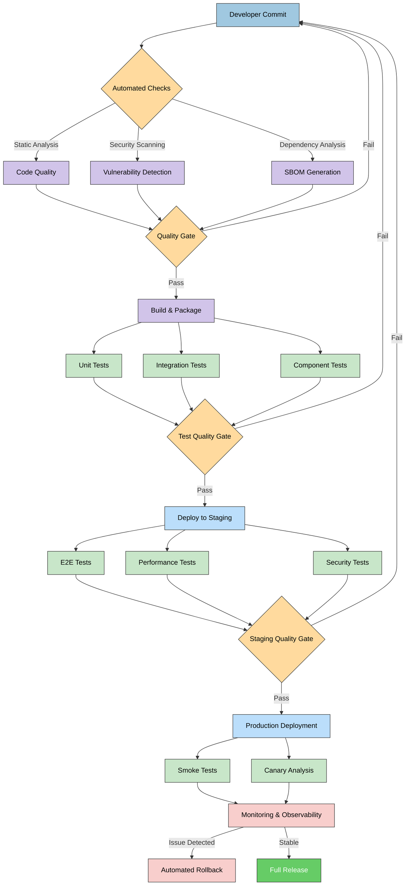
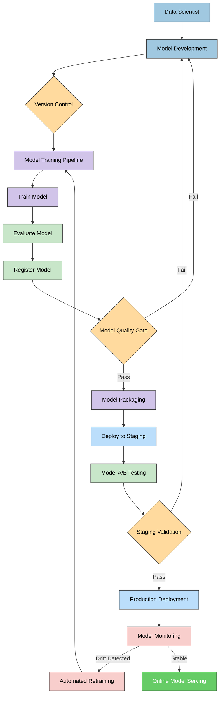
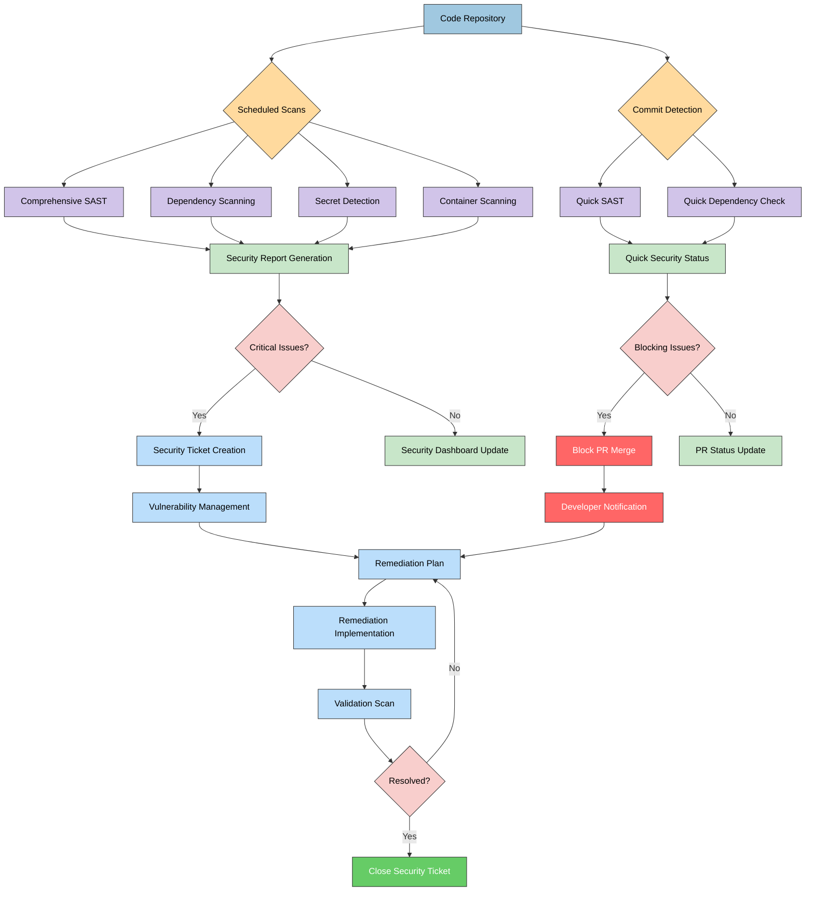
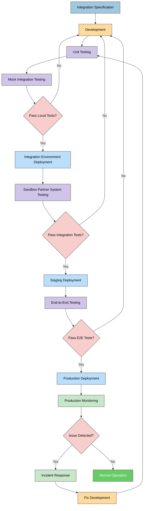

# Future CIA Compliance Manager DevOps and CI/CD Workflows

This document outlines the planned future state for CI/CD processes, development workflows, and operational automation that will support the CIA Compliance Manager's evolution into a sophisticated, context-aware security management platform.

## Related Architecture Documentation

- [Future Architecture Overview](FUTURE_ARCHITECTURE.md) - Core architectural vision and principles
- [Strategic Analysis](FUTURE_SWOT.md) - SWOT analysis and strategic roadmap
- [Process Flows](FUTURE_FLOWCHART.md) - Key workflows and processes
- [System States](FUTURE_STATEDIAGRAM.md) - State transitions and system behavior
- [Concept Maps](FUTURE_MINDMAP.md) - Hierarchical visualization of system components
- [Data Model](FUTURE_DATA_MODEL.md) - Enhanced data architecture

## Future DevOps Vision Overview

As the CIA Compliance Manager evolves toward an advanced context-aware architecture with machine learning capabilities and integration ecosystem, its supporting development and operational processes must also mature. The future DevOps vision embraces:

1. **Continuous Security**: Security integrated throughout the software development lifecycle
2. **Infrastructure as Code**: Fully automated environment provisioning with immutable infrastructure
3. **Observability**: Comprehensive monitoring, logging, and tracing across all systems
4. **ML Operations**: Specialized processes for machine learning model management
5. **Integration Automation**: Streamlined processes for security tool integrations

## Comprehensive CI/CD Pipeline

**DevOps Focus:** Illustrates the future end-to-end CI/CD pipeline that supports the advanced architecture, with specialized workflows for security, testing, and MLOps.

## Machine Learning CI/CD Pipeline

**ML Focus:** Demonstrates the specialized workflow for ML model development, training, validation, and deployment in the future machine learning-enhanced recommendation system.

## Continuous Security Pipeline

**Security Focus:** Shows how advanced security assessment and monitoring will be integrated into the development process to ensure the platform itself adheres to the security standards it recommends to users.

## Integration Development & Testing Workflow

**Integration Focus:** Demonstrates the specialized workflow for developing, testing, and deploying integration connectors to external security and GRC systems.

## Key Workflow Enhancements

### 1. Enhanced Security Automation

The future CI/CD pipeline incorporates advanced security measures:

- **Software Supply Chain Security**

  - Complete Software Bill of Materials (SBOM) generation and verification
  - Signed container images with provenance attestations
  - Dependency verification with policy enforcement
  - Secure build environments with ephemeral credentials

- **Comprehensive Security Testing**

  - Static Application Security Testing (SAST) with custom rule sets for context-aware components
  - Dynamic Application Security Testing (DAST) for API and frontend vulnerabilities
  - Interactive Application Security Testing (IAST) during automated UI tests
  - Regular penetration testing and security assessments

- **Continuous Vulnerability Management**
  - Real-time vulnerability monitoring of dependencies
  - Automated patching for non-breaking security updates
  - Risk-based prioritization of security issues
  - Security posture visualization dashboards

### 2. Quality Assurance Automation

Advanced QA processes ensure reliability as complexity increases:

- **Test Coverage Optimization**

  - Risk-based test selection for efficient test execution
  - Mutation testing to ensure test quality
  - AI-assisted test generation for edge cases
  - Visual regression testing for UI components

- **Performance Testing**

  - Automated performance benchmarking
  - Load testing with realistic user scenarios
  - Resource utilization profiling
  - Performance regression detection

- **Context-Aware Testing**
  - Parameterized tests for different organizational contexts
  - Property-based testing for business rule validation
  - Combinations testing for complex interactions
  - Domain-specific test scenarios

### 3. MLOps Infrastructure

Specialized infrastructure for ML-enhanced components:

- **Model Training Pipeline**

  - Automated feature engineering and selection
  - Hyperparameter optimization
  - Model versioning and lineage tracking
  - Experiment tracking and comparison

- **Model Evaluation Framework**

  - Comprehensive metrics collection
  - A/B testing infrastructure
  - Bias detection and fairness analysis
  - Model explainability reporting

- **Model Deployment Infrastructure**

  - Continuous training and deployment pipeline
  - Model serving with scalable inference API
  - Model monitoring for drift detection
  - Shadow deployment for safe model updates

- **Data Quality Pipeline**
  - Data validation and schema enforcement
  - Data drift detection
  - Automated data profiling
  - Privacy-preserving data transformations

### 4. Advanced Observability

Comprehensive monitoring for complex distributed system:

- **Distributed Tracing**

  - End-to-end transaction tracking
  - Performance bottleneck identification
  - Dependency mapping
  - Service level objective monitoring

- **Centralized Logging**

  - Structured logging with correlation IDs
  - Log aggregation and analysis
  - Pattern detection and anomaly identification
  - Security event monitoring

- **Metrics Collection**

  - Custom business metrics
  - Technical performance indicators
  - User experience metrics
  - Security posture metrics

- **Alerting and Incident Response**
  - Intelligent alert correlation
  - Automated incident classification
  - Runbook integration
  - Post-incident analysis automation

### 5. Infrastructure Automation

Infrastructure provisioning and management automation:

- **Infrastructure as Code**

  - Containerized application deployment
  - Kubernetes-based orchestration
  - GitOps deployment workflow
  - Policy-as-code enforcement

- **Environments Management**

  - Environment templating and standardization
  - On-demand ephemeral environments
  - Production mirroring capabilities
  - Data isolation between environments

- **Configuration Management**

  - Externalized configuration
  - Configuration versioning
  - Secrets management integration
  - Configuration validation

- **Disaster Recovery**
  - Automated backup and restore testing
  - Multi-region deployment support
  - Recovery time tracking
  - Chaos engineering practices

## Implementation Roadmap

The implementation of these advanced DevOps workflows will be phased to align with the evolution of the CIA Compliance Manager architecture:

### Phase 1: Foundation (0-6 months)

1. **Establish Core CI/CD Pipeline**

   - Implement basic automated build, test, and deployment
   - Set up container-based deployment
   - Integrate basic security scanning

2. **Set Up Monitoring Fundamentals**
   - Implement centralized logging
   - Configure basic metrics collection
   - Establish alerting for critical system components

### Phase 2: Advanced Automation (6-12 months)

1. **Enhance Security Pipeline**

   - Implement comprehensive SAST/DAST
   - Set up SBOM generation and verification
   - Create security dashboard

2. **Build MLOps Foundation**

   - Implement model versioning
   - Create basic model training pipeline
   - Set up model validation framework

3. **Improve Testing Automation**
   - Implement performance testing
   - Set up visual regression testing
   - Create context-aware test framework

### Phase 3: Full Maturity (12-24 months)

1. **Complete MLOps Infrastructure**

   - Implement continuous training pipeline
   - Set up model monitoring with drift detection
   - Create A/B testing infrastructure

2. **Advanced Observability**

   - Implement distributed tracing
   - Set up anomaly detection
   - Create comprehensive business metrics

3. **Integration Automation**
   - Build partner testing environments
   - Create automated integration verification
   - Implement API contract testing

## Expected Benefits

The implementation of these advanced DevOps workflows will yield several benefits:

1. **Increased Release Velocity**: Automated workflows will enable faster, more reliable releases
2. **Enhanced Security Posture**: Comprehensive security testing will reduce vulnerabilities
3. **Improved Quality**: Advanced testing will ensure high reliability despite increased complexity
4. **ML Reliability**: Specialized MLOps will ensure recommendation quality and consistency
5. **Operational Efficiency**: Automation will reduce manual effort and human error
6. **Faster Incident Resolution**: Advanced observability will speed problem identification and resolution
7. **Scalable Integration Management**: Automated integration testing will support the growing partner ecosystem

## Conclusion

The future CIA Compliance Manager DevOps and CI/CD workflows represent a significant evolution that aligns with the architectural advancement of the platform. By implementing these sophisticated processes, the platform will maintain high quality, security, and reliability while enabling rapid innovation and adaptation to changing requirements. The phased implementation approach ensures that DevOps capabilities grow in tandem with architectural complexity, providing appropriate support at each stage of the platform's evolution.
