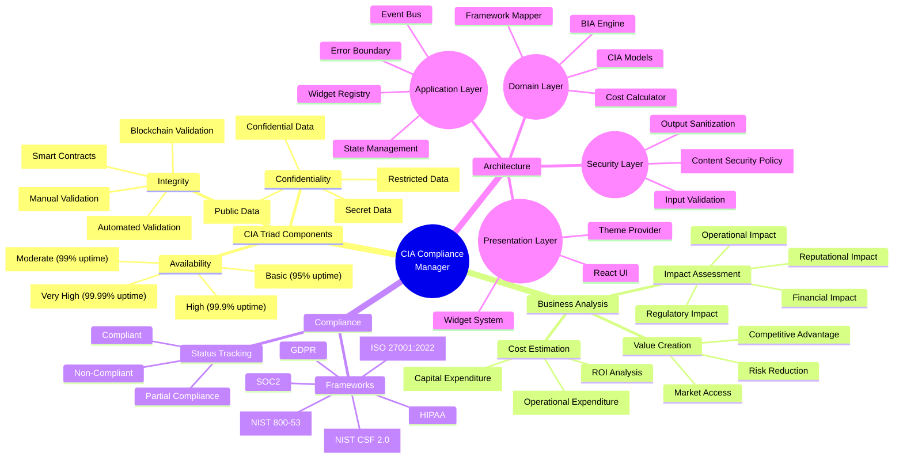
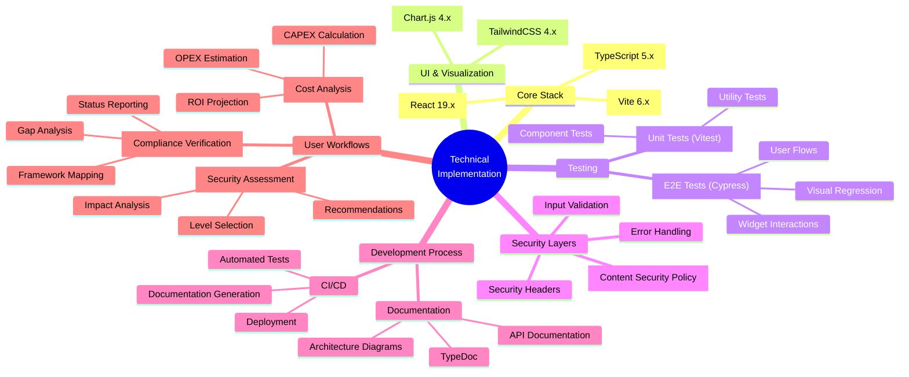
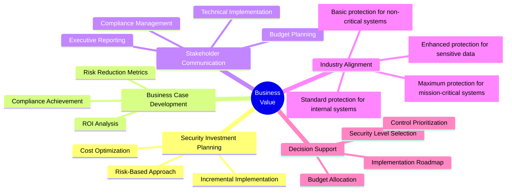

# CIA Compliance Manager Mindmap

This mindmap provides a visual overview of the CIA Compliance Manager's architecture, components, and key concepts.

## System Overview Mindmap

**Business Focus:** Maps the core business domains of the application, showing how the CIA triad integrates with business analysis, compliance frameworks, and architectural components.

**Security Focus:** Illustrates the security progression across each CIA element (Availability, Integrity, Confidentiality) from basic to very high levels, with corresponding implementation approaches.

## Technical Implementation Mindmap

**Architecture Focus:** Provides a technology-oriented view of the implementation stack, showing how different technologies work together to create a cohesive application.

**Development Focus:** Highlights the modern framework choices, testing strategies, security layers, and development processes that ensure code quality and security.

## Business Value Mindmap

**Business Focus:** Demonstrates how the CIA Compliance Manager creates value for organizations through strategic planning, business case development, and stakeholder communication.

**Investment Focus:** Shows the relationship between security level implementation and business outcomes, helping decision-makers understand the return on security investments.

The mindmaps above provide three different perspectives on the CIA Compliance Manager:

1. **System Overview** - Shows the core components, security levels, and key features of the CIA triad components, business analysis domains, compliance frameworks, and architecture layers
2. **Technical Implementation** - Focuses on the technology stack and implementation details including core frameworks, testing approaches, and development processes
3. **Business Value** - Illustrates how the system delivers value to stakeholders through strategic planning, business case development, and decision support

These visualizations complement the C4 diagrams by providing a different way to understand the system's structure and purpose. While the visual styling through CSS classes isn't available in GitHub's Mermaid implementation, the hierarchical organization of concepts provides clarity on relationships and categories.

**Color Legend (conceptual):**

- CIA components - blue shades
- Business analysis - orange/amber shades
- Compliance - purple shades
- Architecture - green shades
- Security levels - graduated colors from orange (basic) to green (very high)
