<p align="center">
  
</p>

<h1 align="center">🛡️ CIA Compliance Manager Security Architecture</h1>

<p align="center">
  <strong>🔐 Defense-in-Depth Security Controls</strong><br>
  <em>🔗 <a href="https://github.com/Hack23/ISMS-PUBLIC/blob/main/Secure_Development_Policy.md">Secure Development Policy</a> · <a href="https://github.com/Hack23/ISMS-PUBLIC/blob/main/Network_Security_Policy.md">Network Security Policy</a> · <a href="https://github.com/Hack23/ISMS-PUBLIC/blob/main/Access_Control_Policy.md">Access Control Policy</a> · <a href="https://github.com/Hack23/ISMS-PUBLIC/blob/main/Threat_Modeling.md">Threat Modeling</a> · <a href="https://github.com/Hack23/ISMS-PUBLIC/blob/main/Vulnerability_Management.md">Vulnerability Management</a></em>
</p>

**Version:** 1.1.32 | **Last Updated:** 2026-03-19 | **Status:** ✅ Production Ready

This document outlines the comprehensive security architecture of the CIA Compliance Manager, detailing how the system protects data through multiple security layers.

## 📊 Security Evidence & Validation

This security architecture is continuously validated through automated security scanning and compliance monitoring. The following badges provide real-time evidence of our security posture:

### 🏆 Supply Chain Security
[](https://scorecard.dev/viewer/?uri=github.com/Hack23/cia-compliance-manager)
[](https://github.com/Hack23/cia-compliance-manager/attestations)
[](https://bestpractices.coreinfrastructure.org/projects/10365)

**OpenSSF Scorecard:** Comprehensive supply chain security assessment covering code review, dependency management, vulnerability disclosure, and security practices.

**SLSA Level 3:** Software artifact provenance and integrity verification through build attestations, ensuring tamper-evident software supply chain.

**CII Best Practices:** Open Source Security Foundation's best practices for secure software development and maintenance.

### 📈 Code Quality & Security Analysis
[](https://sonarcloud.io/summary/new_code?id=Hack23_cia-compliance-manager)
[](https://sonarcloud.io/summary/new_code?id=Hack23_cia-compliance-manager)
[](https://sonarcloud.io/summary/new_code?id=Hack23_cia-compliance-manager)

**SonarCloud Quality Gate:** Static application security testing (SAST) with comprehensive code quality analysis, detecting security vulnerabilities, code smells, and technical debt.

**Security Rating:** Specific security vulnerability assessment including CWE detection, injection vulnerability analysis, and security hotspot identification.

### 📜 License Compliance & Threat Analysis
[](https://app.fossa.io/projects/git%2Bgithub.com%2FHack23%2Fcia-compliance-manager?ref=badge_shield)
[](https://github.com/Hack23/cia-compliance-manager/blob/main/docs/architecture/THREAT_MODEL.md)

**FOSSA:** Automated license compliance scanning ensuring all dependencies meet open source license requirements and legal obligations.

**Threat Model:** Comprehensive STRIDE-based threat analysis with MITRE ATT&CK mapping, attack trees, and quantitative risk assessment.

---

## 📑 Table of Contents

- [🔐 Security Documentation Map](#-security-documentation-map)
- [🔑 Authentication Architecture](#-authentication-architecture)
- [📜 Data Integrity & Auditing](#-data-integrity--auditing)
- [📊 Session & Action Tracking](#-session--action-tracking)
- [🔍 Security Event Monitoring](#-security-event-monitoring)
- [🌐 Network Security](#-network-security)
- [🔌 AWS Infrastructure Security](#-aws-infrastructure-security)
- [🏗️ High Availability Design](#-high-availability-design)
- [💾 Data Protection](#-data-protection)
- [☁️ AWS Security Infrastructure](#-aws-security-infrastructure)
- [🔰 AWS Foundational Security Best Practices](#-aws-foundational-security-best-practices)
- [🕵️ Threat Detection & Investigation](#-threat-detection--investigation)
- [🔎 Vulnerability Management](#-vulnerability-management)
- [⚡ Resilience & Operational Readiness](#-resilience--operational-readiness)
- [📋 Configuration & Compliance Management](#-configuration--compliance-management)
- [📊 Monitoring & Analytics](#-monitoring--analytics)
- [🤖 Automated Security Operations](#-automated-security-operations)
- [🔒 Application Security](#-application-security)
- [📜 Compliance Framework](#-compliance-framework)
- [🛡️ Defense-in-Depth Strategy](#-defense-in-depth-strategy)
- [🔄 Security Operations](#-security-operations)
- [💰 Security Investment](#-security-investment)
- [🏛️ CI/CD Security Architecture](#-cicd-security-architecture)
- [📚 ISMS Policy References](#-isms-policy-references)
- [📝 Conclusion](#-conclusion)

## 🔐 Security Documentation Map

| Document                                          | Focus          | Description                            |
| ------------------------------------------------- | -------------- | -------------------------------------- |
| [Security Architecture](SECURITY_ARCHITECTURE.md) | 🛡️ Security    | Complete security overview             |
| [End-of-Life Strategy](End-of-Life-Strategy.md)   | 📅 Lifecycle   | Security patching and updates          |
| [Workflows](WORKFLOWS.md)                         | 🔧 CI/CD       | Security-hardened CI/CD workflows      |
| [Development Guide](development.md)               | 🔧 Development | Security features and testing strategy |
| [Architecture](ARCHITECTURE.md)                   | 🏛️ Structure   | Overall system architecture            |

## 🔑 Authentication Architecture

**Current Status**: ❌ No Authentication - Client-Side Only Web Application

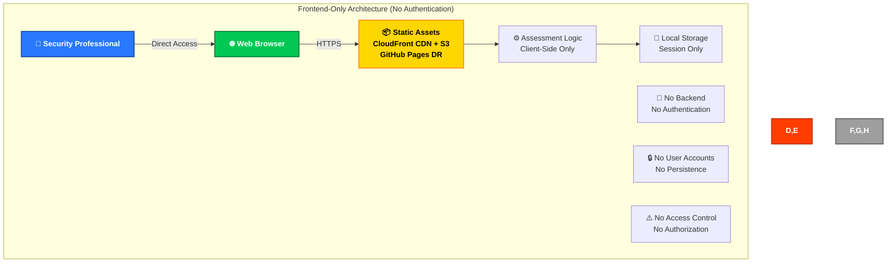

### Current Implementation

CIA Compliance Manager is a frontend-only compliance assessment platform with:

- **🌐 No Authentication System**: Direct browser access without login
- **💾 No Persistent Data**: All state stored in browser session only
- **🔄 No Backend Services**: Purely static content delivery via CloudFront CDN (primary) and GitHub Pages (DR)
- **⚠️ No Access Controls**: All content publicly accessible

### Security Implications

- **✅ Reduced Attack Surface**: No user accounts or authentication to compromise
- **✅ No Credential Storage**: No passwords or sensitive user data
- **✅ Privacy by Design**: No assessment data leaves the user's browser
- **❌ No Session Protection**: All assessment data lost on browser refresh
- **❌ No Multi-User Support**: Cannot protect individual assessment data

## 📜 Data Integrity & Auditing

**Current Status**: ❌ No Data Auditing - Session-Only Application

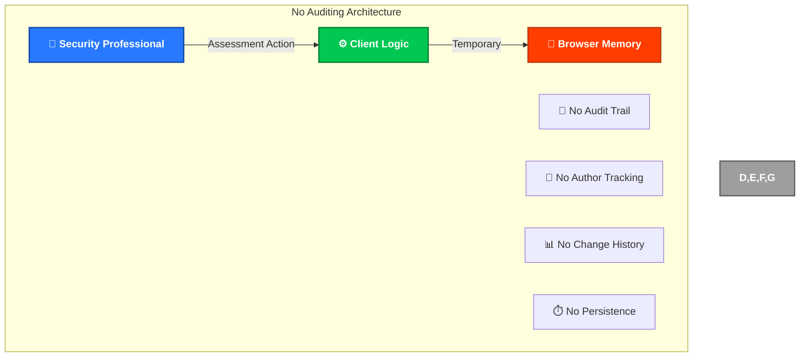

### Current Implementation

CIA Compliance Manager currently has:

- **🚫 No Data Auditing**: No tracking of assessment actions or configuration changes
- **🚫 No Change History**: No record of assessment sessions or progress
- **🚫 No Author Attribution**: Cannot track individual professional activities
- **🚫 No Persistence**: All assessment data lost when browser session ends

### Security Implications

- **✅ No Sensitive Data**: No personal information to audit
- **✅ Privacy by Design**: No assessment data collection or tracking
- **❌ No Analytics**: Cannot monitor for suspicious assessment patterns
- **❌ No Forensics**: No audit trail for security investigation

## 📊 Session & Action Tracking

**Current Status**: ❌ No Session Tracking - Client-Side Only

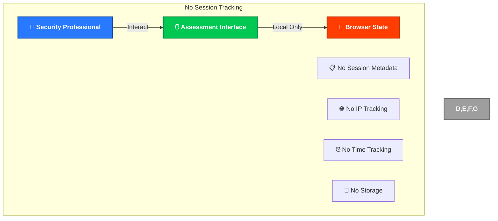

### Current Implementation

CIA Compliance Manager session handling:

- **🚫 No Session Tracking**: No server-side session management
- **🚫 No User Identification**: Anonymous usage only
- **🚫 No Activity Logging**: No record of assessment actions
- **🚫 No Metadata Collection**: No browser or device information stored

### Security Implications

- **✅ Maximum Privacy**: No tracking or data collection
- **✅ No Profiling**: Cannot build user behavior profiles
- **❌ No Client-Side Security Monitoring**: Cannot detect suspicious assessment activity within the SPA
- **❌ No Client-Side Analytics**: No usage patterns for security analysis
- **ℹ️ CI/CD Monitoring**: Security monitoring is performed at CI/CD and infrastructure levels (see [Monitoring & Analytics](#-monitoring--analytics))

## 🔍 Security Event Monitoring

**Current Status**: ❌ No Security Event Monitoring - Frontend Only

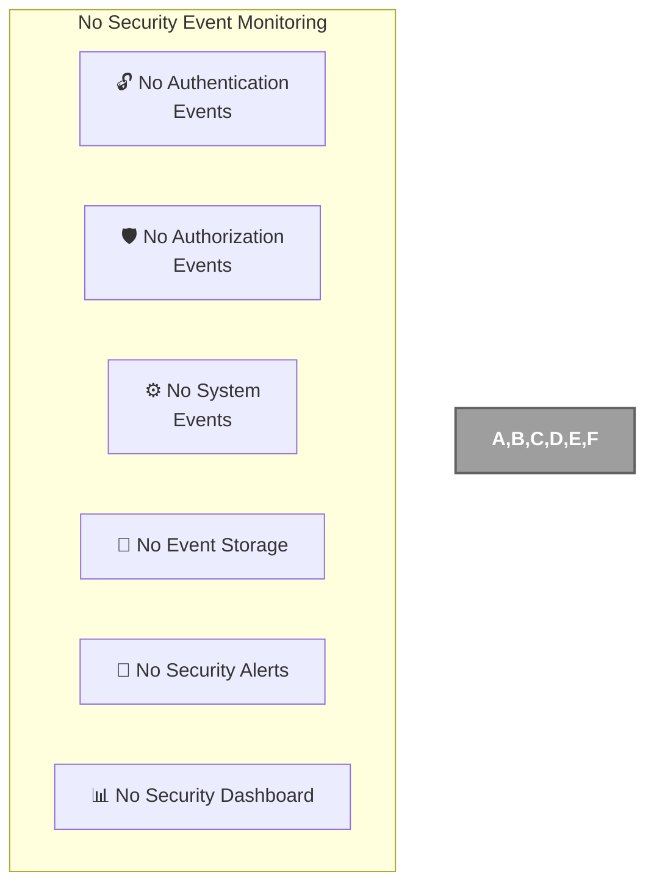

### Current Implementation

CIA Compliance Manager security monitoring:

- **🚫 No Authentication Events**: No login/logout to monitor
- **🚫 No Authorization Events**: No access control to track
- **🚫 No System Events**: Frontend-only with no server events
- **🚫 No Security Alerts**: No monitoring system in place

### Security Implications

- **✅ No Security Events**: No authentication to compromise
- **✅ Minimal Attack Surface**: Static content only
- **❌ No Client-Side Threat Detection**: Cannot identify attacks in the browser
- **❌ No Client-Side Incident Response**: No runtime system to detect incidents
- **ℹ️ CI/CD Detection**: Threat detection at build/deployment level (see [Threat Detection](#-threat-detection--investigation))

## 🌐 Network Security

**Current Status**: ✅ HTTPS Only - Static Content Delivery with DNS Security

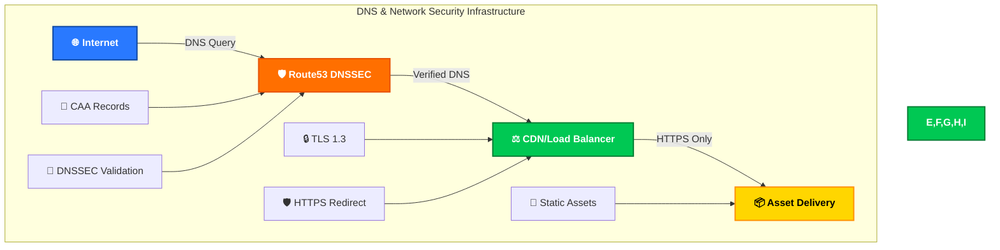

### Current Implementation

CIA Compliance Manager network security includes comprehensive DNS protection:

#### 🛡️ DNS Security (Route53 + DNSSEC)

- **✅ DNSSEC Enabled**: Domain Name System Security Extensions for DNS integrity
- **✅ Route53 Hosting**: AWS Route53 provides authoritative DNS with DNSSEC support
- **✅ DNS Query Validation**: Cryptographic verification of DNS responses
- **✅ Cache Poisoning Protection**: DNSSEC prevents DNS spoofing attacks

#### 🔐 Certificate Authority Authorization (CAA)

- **✅ CAA Records**: Specifies which Certificate Authorities can issue certificates
- **✅ Email Validation**: CAA records configured for email-based certificate validation
- **✅ Certificate Misuse Prevention**: Prevents unauthorized certificate issuance
- **✅ Compliance**: Follows CAB Forum baseline requirements

#### 🌐 Transport Security

- **✅ HTTPS Only**: All traffic encrypted with TLS
- **✅ Static Content**: No dynamic server-side processing
- **✅ CDN Delivery**: Distributed content delivery for performance
- **✅ No Backend**: No server infrastructure to secure

### DNS Security Configuration

```dns
; Example DNSSEC and CAA configuration for ciacompliancemanager.com
ciacompliancemanager.com.    IN    CAA    0 issue "letsencrypt.org"
ciacompliancemanager.com.    IN    CAA    0 issuewild "letsencrypt.org"
ciacompliancemanager.com.    IN    CAA    0 iodef "mailto:security@ciacompliancemanager.com"

; DNSSEC records automatically managed by Route53
ciacompliancemanager.com.    IN    DNSKEY    256 3 8 (base64-encoded-key)
ciacompliancemanager.com.    IN    DS        12345 8 2 (sha256-hash)
ciacompliancemanager.com.    IN    RRSIG     DNSKEY 8 2 86400 (signature-data)
```

### Security Benefits

- **🔒 Encrypted Traffic**: All communications protected by TLS
- **🛡️ DNS Integrity**: DNSSEC prevents DNS manipulation attacks
- **📜 Certificate Control**: CAA records prevent unauthorized certificate issuance
- **📦 Static Assets**: No dynamic content vulnerabilities
- **🌍 Global CDN**: Distributed delivery reduces single points of failure
- **⚡ Minimal Attack Surface**: No server-side code to exploit

### DNS Security Features

#### 🔐 DNSSEC Protection

- **Chain of Trust**: Complete cryptographic chain from root to domain
- **Response Authentication**: All DNS responses cryptographically signed
- **Data Integrity**: Prevents tampering with DNS records in transit
- **Non-Existence Proof**: NSEC3 records prevent zone enumeration

#### 📜 CAA Record Protection

- **Certificate Authority Control**: Explicitly authorizes trusted CAs
- **Email Notification**: Security contact for certificate-related incidents
- **Wildcard Protection**: Separate controls for wildcard certificates
- **Compliance**: Meets CAB Forum baseline requirements for domain validation

#### 🌐 Route53 Security Benefits

- **AWS Infrastructure**: Benefits from AWS's global security infrastructure
- **DDoS Protection**: Built-in protection against DNS-based DDoS attacks
- **High Availability**: Anycast network with multiple geographic locations
- **Monitoring**: CloudWatch integration for DNS query monitoring

### Domain Security Monitoring

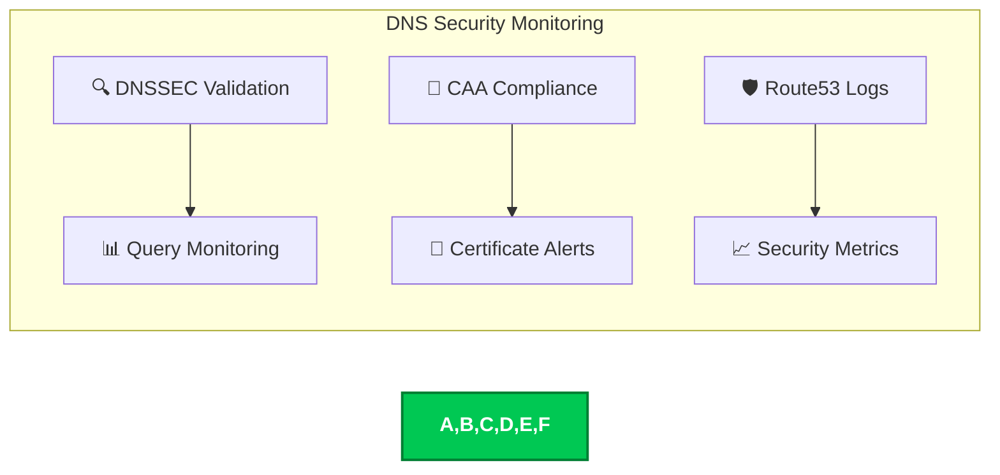

### Security Compliance

- **✅ RFC 4034**: DNSSEC DNS Security Extensions compliance
- **✅ RFC 6844**: DNS Certification Authority Authorization compliance
- **✅ CAB Forum**: Certificate Authority baseline requirements compliance
- **✅ Industry Standards**: Follows DNS security best practices

## 🔌 AWS Infrastructure Security

**Current Status**: ✅ Production AWS Infrastructure with IAM OIDC, CloudFront, and Multi-Region S3

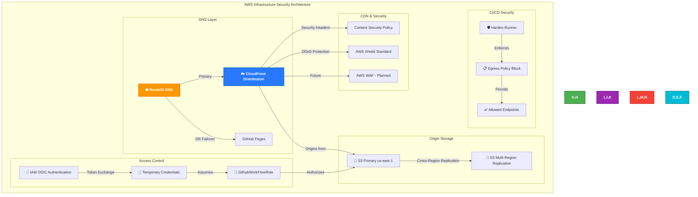

### AWS Security Architecture

The CIA Compliance Manager leverages AWS infrastructure with comprehensive security controls:

#### **🔐 IAM Identity & Access Management**

**OIDC (OpenID Connect) Authentication:**
- **No Long-Lived Credentials**: Uses OIDC token exchange instead of access keys
- **Temporary Credentials**: Short-lived STS tokens (< 1 hour validity)
- **Least Privilege**: IAM role `GithubWorkFlowRole` limited to specific actions
- **Audit Trail**: All API calls logged via CloudTrail (account-level)

**IAM Role Configuration:**
```yaml
Role ARN: arn:aws:iam::172017021075:role/GithubWorkFlowRole
Authentication: OIDC (GitHub Actions identity provider)
Permissions:
  - s3:PutObject, s3:GetObject, s3:ListBucket (specific bucket)
  - cloudfront:CreateInvalidation, cloudfront:GetDistribution
  - cloudformation:DescribeStacks (read-only)
Trust Policy: GitHub OIDC provider with repository condition
```

#### **☁️ CloudFront Distribution Security**

**Content Delivery & Security:**
- **Stack**: `ciacompliancemanager-frontend` CloudFormation stack
- **HTTPS Only**: Automatic TLS 1.3 with AWS Certificate Manager
- **Security Headers**: 
  - `Content-Security-Policy`: XSS and injection protection
  - `X-Content-Type-Options: nosniff`: MIME sniffing prevention
  - `X-Frame-Options: DENY`: Clickjacking protection
  - `Strict-Transport-Security`: HSTS enforcement
  - `Referrer-Policy: strict-origin-when-cross-origin`: Privacy protection
- **DDoS Protection**: AWS Shield Standard (automatic, no-cost)
- **Geographic Distribution**: Global edge locations for low-latency delivery
- **Cache Invalidation**: Automatic cache clearing after deployments

**Future Enhancement:**
- AWS WAF (Web Application Firewall) for advanced threat protection
- Rate limiting and IP reputation lists
- Geo-blocking for compliance requirements

#### **💾 S3 Bucket Security**

**Primary Bucket:** `ciacompliancemanager-frontend-us-east-1-172017021075`

**Security Controls:**
- **Encryption at Rest**: AES-256 server-side encryption (SSE-S3)
- **Bucket Policies**: Restrict access to CloudFront OAI and IAM role
- **Versioning**: Object versioning for rollback capability
- **Access Logging**: S3 access logs (future enhancement)
- **Public Access Block**: Default deny with CloudFront-only access
- **Multi-Region Replication**: Cross-region replication for resilience

**Cache Header Strategy:**
```yaml
Static Assets (CSS, JS, Images, Fonts):
  Cache-Control: public, max-age=31536000, immutable
  Rationale: 1-year cache for versioned assets (performance)

HTML Content:
  Cache-Control: public, max-age=3600, must-revalidate
  Rationale: 1-hour cache with revalidation (balance freshness/performance)

Metadata (XML, JSON, TXT):
  Cache-Control: public, max-age=86400
  Rationale: 1-day cache for sitemaps, robots.txt
```

#### **🌐 Route53 DNS Security**

**Domain:** ciacompliancemanager.com

**Configuration:**
- **Primary**: ALIAS record to CloudFront distribution
- **Disaster Recovery**: Can failover to GitHub Pages (< 15 min RTO)
- **DNSSEC**: Future enhancement under consideration
- **Health Checks**: CloudFront inherent health monitoring
- **TTL Strategy**: Balance between failover speed and query cost

#### **🛡️ CI/CD Security (Harden-Runner)**

**Network Security in GitHub Actions:**
- **Egress Policy**: Block all outbound traffic by default
- **Allowed Endpoints**: Explicit allowlist of required endpoints
  - AWS services: S3, CloudFront, CloudFormation, STS
  - GitHub: github.com, objects.githubusercontent.com
  - npm registry: registry.npmjs.org
  - External dependencies: fonts.googleapis.com, etc.
- **Monitoring**: Network activity logged and auditable
- **Threat Detection**: Anomalous network access blocked and reported

**Security Benefits:**
- Prevents data exfiltration from compromised dependencies
- Limits supply chain attack surface
- Provides visibility into workflow network activity
- Complies with least privilege principle for network access

### Compliance Mapping

**ISO 27001:**
- **A.9.4.1 Information Access Restriction**: IAM policies enforce least privilege
- **A.13.1.1 Network Controls**: Harden-runner egress policy controls
- **A.13.1.3 Segregation of Networks**: CloudFront/S3 origin separation
- **A.18.1.3 Protection of Records**: CloudTrail audit logging

**NIST Cybersecurity Framework:**
- **PR.AC-4 (Access Control)**: IAM OIDC with temporary credentials
- **PR.DS-1 (Data-at-Rest Protection)**: S3 encryption
- **PR.DS-2 (Data-in-Transit Protection)**: TLS 1.3 encryption
- **DE.CM-7 (Monitoring)**: CloudTrail and harden-runner logging

**CIS Controls:**
- **CIS Control 5 (Account Management)**: IAM role-based access
- **CIS Control 13 (Network Monitoring)**: Harden-runner egress monitoring
- **CIS Control 14 (Security Awareness)**: Documented security architecture
- **CIS Control 6.2 (Encryption)**: S3 encryption at rest, TLS in transit

### Security Monitoring & Audit

**Current:**
- ✅ CloudTrail API call logging (account-level)
- ✅ Harden-runner network activity logs
- ✅ GitHub Actions workflow logs
- ✅ CloudFront access logs (future enhancement)

**Future Enhancements:**
- AWS GuardDuty for threat detection
- AWS Security Hub for centralized security findings
- CloudWatch alarms for anomalous activity
- S3 access logging for forensics

CIA Compliance Manager does not use VPC infrastructure:

- **🚫 No VPC**: Frontend-only application with no AWS VPC
- **🚫 No Private Subnets**: Static content delivery only
- **🚫 No Endpoints**: No AWS service endpoints needed

## 🏗️ High Availability Design

**Current Status**: ❌ Not Applicable - Static Content Only

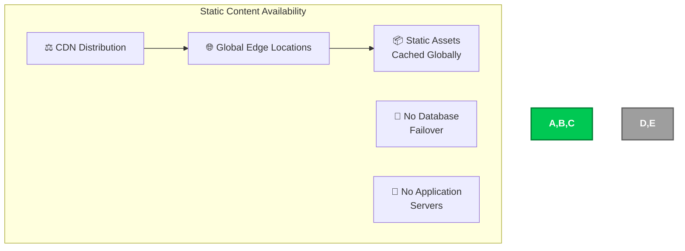

### Current Implementation

CIA Compliance Manager availability:

- **✅ CDN Distribution**: Global content delivery network
- **✅ Edge Caching**: Assets cached at multiple locations
- **🚫 No Database**: No database availability concerns
- **🚫 No Servers**: No application servers to manage

### Availability Benefits

- **🌍 Global Distribution**: Content available worldwide
- **⚡ Edge Caching**: Fast content delivery from nearby locations
- **🔄 Redundancy**: Multiple CDN edge locations provide redundancy

## 💾 Data Protection

**Current Status**: ✅ TLS Encryption - No Persistent Data

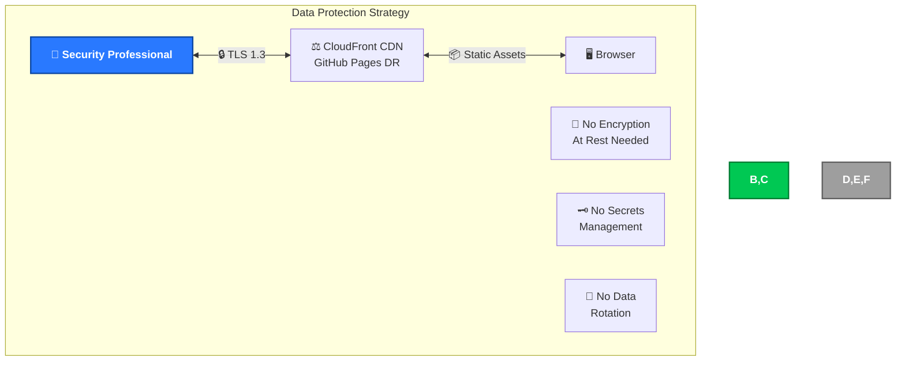

### Current Implementation

CIA Compliance Manager data protection:

- **✅ TLS Encryption**: All communications encrypted in transit
- **✅ No Persistent Data**: No data at rest to protect
- **✅ No Secrets**: No credentials or API keys to manage
- **✅ Browser Security**: Assessment data protected by browser security model

### Protection Benefits

- **🔒 Transit Security**: All network traffic encrypted
- **💾 No Data Leaks**: No persistent data to compromise
- **🔑 No Credential Theft**: No stored credentials to steal
- **🛡️ Browser Isolation**: Each professional's assessment data isolated by browser

## ☁️ AWS Security Infrastructure

**Current Status**: ✅ Production AWS Infrastructure with Multi-Layer Security

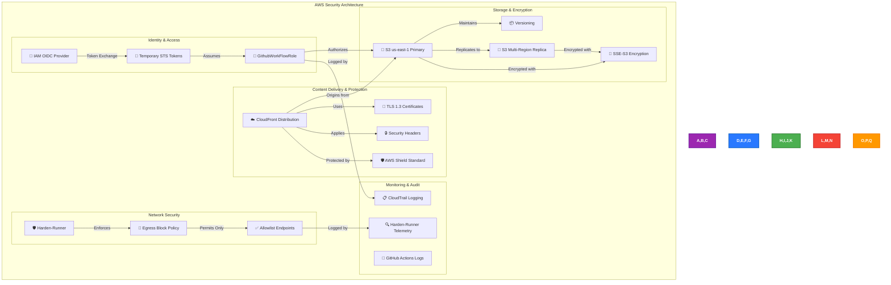

### AWS Infrastructure Security Layers

The CIA Compliance Manager implements comprehensive AWS security controls across multiple layers:

#### **Layer 1: Identity & Access Management**

**IAM OIDC Authentication:**
- **Secure Token Exchange**: GitHub Actions OIDC provider integration
- **Zero Long-Lived Credentials**: No AWS access keys stored in GitHub
- **Temporary Credentials**: STS tokens with automatic expiration (< 1 hour)
- **Role-Based Access**: `GithubWorkFlowRole` with least privilege permissions
- **Trust Policy**: Restricts access to specific GitHub repository and workflow

**IAM Role Details:**
```yaml
Role: GithubWorkFlowRole
ARN: arn:aws:iam::172017021075:role/GithubWorkFlowRole
Account: 172017021075
Region: us-east-1 (Primary)

Permissions:
  S3:
    - PutObject (ciacompliancemanager-frontend-us-east-1-172017021075/*)
    - GetObject (ciacompliancemanager-frontend-us-east-1-172017021075/*)
    - ListBucket (ciacompliancemanager-frontend-us-east-1-172017021075)
  CloudFront:
    - CreateInvalidation (ciacompliancemanager-frontend distribution)
    - GetDistribution (read-only)
  CloudFormation:
    - DescribeStacks (read-only, for distribution ID discovery)

Trust Relationship:
  Provider: token.actions.githubusercontent.com
  Audience: sts.amazonaws.com
  Subject: repo:Hack23/cia-compliance-manager:*
```

> **Note:** AWS account IDs (like 172017021075 above) are not considered sensitive information by AWS and are safe to share publicly. They are used for resource identification and cannot be used alone to access AWS resources. See [AWS Security Best Practices](https://docs.aws.amazon.com/IAM/latest/UserGuide/best-practices.html) and [AWS Account Identifiers](https://docs.aws.amazon.com/general/latest/gr/acct-identifiers.html).

**Security Benefits:**
- ✅ No credential leakage risk (ephemeral tokens only)
- ✅ Automatic token rotation (every workflow run)
- ✅ Granular permission control (specific resources only)
- ✅ Audit trail via CloudTrail (all API calls logged)
- ✅ Principle of least privilege enforced

#### **Layer 2: Content Delivery Security (CloudFront)**

**CloudFront Distribution Configuration:**
- **Stack Name**: `ciacompliancemanager-frontend`
- **Management**: CloudFormation Infrastructure as Code
- **HTTPS Enforcement**: TLS 1.3 with AWS Certificate Manager
- **Origin Access**: CloudFront Origin Access Identity (OAI) for S3
- **DDoS Protection**: AWS Shield Standard (automatic)

**Security Headers Applied:**

*App-level (via `index.html` meta tags and `vite.config.ts` dev server):*
```http
Content-Security-Policy: default-src 'self'; script-src 'self' 'unsafe-inline'; style-src 'self' 'unsafe-inline' https://fonts.googleapis.com https://fonts.gstatic.com; img-src 'self' data: https:; connect-src 'self'; font-src 'self' data: https://fonts.gstatic.com; object-src 'none'; base-uri 'self'; form-action 'self'; frame-ancestors 'none'; upgrade-insecure-requests;
X-Content-Type-Options: nosniff
X-Frame-Options: DENY
Cross-Origin-Opener-Policy: same-origin
Cross-Origin-Embedder-Policy: require-corp
Referrer-Policy: strict-origin-when-cross-origin
```

> **Note:** Additional headers like `Strict-Transport-Security`, `Cross-Origin-Resource-Policy`, and `Permissions-Policy` can be configured at the CloudFront distribution level via response headers policies if needed.

**Cache & Performance:**
- Edge location caching for global low-latency delivery
- Automatic cache invalidation after deployments
- Optimized cache headers per asset type (CSS/JS: 1yr, HTML: 1hr)
- Compression support (gzip, brotli)

**Future AWS WAF Integration:**
- SQL injection protection
- Cross-site scripting (XSS) filtering
- Rate limiting (DDoS mitigation)
- IP reputation lists
- Geo-blocking for compliance
- Bot control and CAPTCHA challenges

#### **Layer 3: Storage Security (S3)**

**Primary Bucket Configuration:**
```yaml
Bucket: ciacompliancemanager-frontend-us-east-1-172017021075
Region: us-east-1 (N. Virginia)
Purpose: Primary origin for CloudFront distribution

Security Features:
  Encryption:
    - Type: SSE-S3 (AES-256)
    - Default: Enabled for all objects
    - In-transit: TLS 1.3 required
  
  Access Control:
    - Public Access: Blocked by default
    - CloudFront OAI: Read access granted
    - IAM Role: Write access (GithubWorkFlowRole only)
    - Bucket Policy: Explicit deny for unauthorized access
  
  Versioning:
    - Status: Enabled
    - Benefit: Rollback capability, accidental deletion protection
  
  Replication:
    - Type: Cross-Region Replication (CRR)
    - Target: Secondary region (multi-region resilience)
    - Encryption: Maintained in replica
```

**Multi-Region Resilience:**
- **Primary Region**: us-east-1 (active serving)
- **Secondary Region**: Cross-region replication for disaster recovery
- **RPO**: Asynchronous S3 cross-region replication; monitor replication metrics and use S3 Replication Time Control (RTC) if deterministic SLAs required
- **RTO**: Target < 5 minutes when CloudFront origin failover (origin groups) is configured with health checks; otherwise RTO depends on manual failover or Route53 DNS changes as documented in the DR runbook

**Cache Control Strategy:**
```yaml
Static Assets (Versioned):
  Files: *.css, *.js, *.woff, *.woff2, *.png, *.jpg, *.webp, *.svg
  Cache-Control: public, max-age=31536000, immutable
  Rationale: Long-term caching for performance (1 year)
  
HTML Content (Dynamic):
  Files: *.html
  Cache-Control: public, max-age=3600, must-revalidate
  Rationale: Balance freshness and performance (1 hour)
  
Metadata Files:
  Files: *.xml, *.json, *.txt (sitemap, robots, manifest)
  Cache-Control: public, max-age=86400
  Rationale: Daily updates sufficient (1 day)
```

#### **Layer 4: Network Security (Harden-Runner)**

**CI/CD Network Isolation:**
```yaml
GitHub Actions: Harden-Runner v2.14.2
Policy: Egress Block (deny by default)

Allowed Endpoints (Explicit Allowlist):
  AWS Services:
    - sts.us-east-1.amazonaws.com:443 (STS authentication)
    - amazon-cloudfront-secure-static-site-s3bucketroot-14oliw5cmta06.s3.us-east-1.amazonaws.com:443 (S3 sync)
    - cloudfront.amazonaws.com:443 (CloudFront invalidation)
    - cloudformation.us-east-1.amazonaws.com:443 (Stack queries)
  
  GitHub Services:
    - github.com:443 (repository access)
    - api.github.com:443 (GitHub API)
    - objects.githubusercontent.com:443 (release artifacts)
    - raw.githubusercontent.com:443 (raw files)
  
  Build Dependencies:
    - registry.npmjs.org:443 (npm packages)
    - fonts.googleapis.com:443 (Google Fonts)
    - fonts.gstatic.com:443 (Font static assets)
  
  Security Tools:
    - sonarcloud.io:443 (code quality)
    - api.securityscorecards.dev:443 (scorecard)
    - app.fossa.io:443 (license compliance)

Security Benefits:
  - ✅ Prevents data exfiltration
  - ✅ Blocks supply chain attacks
  - ✅ Provides network audit trail
  - ✅ Limits lateral movement
  - ✅ Enforces least privilege for network
```

#### **Layer 5: Monitoring & Audit**

**CloudTrail Logging:**
- **Scope**: Account-level AWS API calls
- **Events Logged**: All IAM role assumptions, S3 API calls, CloudFront API calls
- **Retention**: Per AWS account CloudTrail configuration
- **Analysis**: Available via AWS CloudTrail Console or CLI

**GitHub Actions Logging:**
- **Workflow Logs**: Complete deployment workflow execution logs
- **Retention**: Per GitHub repository settings
- **Access**: Repository administrators and maintainers

**Harden-Runner Telemetry:**
- **Network Activity**: All outbound network connections logged
- **Blocked Attempts**: Unauthorized connection attempts recorded
- **Dashboard**: StepSecurity dashboard for workflow security insights

**Future Enhancements:**
- AWS GuardDuty: Machine learning-based threat detection
- AWS Security Hub: Centralized security findings and compliance checks
- CloudWatch Alarms: Real-time alerting for anomalous activity
- S3 Access Logs: Detailed access logging for forensics
- VPC Flow Logs: Network traffic analysis (if Lambda/backend added)

### Compliance Mapping

**ISO 27001 Controls:**
- **A.9.2 User Access Management**: IAM role-based access control
- **A.9.4.1 Information Access Restriction**: IAM policies, S3 bucket policies
- **A.10.1 Cryptographic Controls**: TLS 1.3, SSE-S3 encryption
- **A.12.4 Logging and Monitoring**: CloudTrail, harden-runner logs
- **A.13.1 Network Security Management**: Harden-runner egress control
- **A.13.1.1 Network Controls**: Security groups (future VPC), egress policies
- **A.13.1.3 Segregation of Networks**: CloudFront/S3 separation
- **A.18.1.3 Protection of Records**: Versioning, encryption, audit logs

**NIST Cybersecurity Framework:**
- **PR.AC-1 Identify Users**: IAM OIDC authentication
- **PR.AC-4 Access Permissions**: Least privilege IAM policies
- **PR.DS-1 Data-at-Rest**: S3 SSE-S3 encryption
- **PR.DS-2 Data-in-Transit**: TLS 1.3 encryption everywhere
- **PR.DS-5 Data Leak Protection**: Harden-runner egress blocking
- **PR.PT-1 Audit Logging**: CloudTrail, GitHub Actions logs
- **DE.CM-1 Network Monitoring**: Harden-runner telemetry
- **DE.CM-7 Monitoring Services**: CloudWatch (future)

**CIS AWS Foundations Benchmark:**
- **CIS 1.20**: Ensure IAM roles are used for application access (✅ OIDC)
- **CIS 2.1.1**: Ensure S3 buckets employ encryption (✅ SSE-S3)
- **CIS 2.1.2**: Ensure S3 bucket policies prevent public access (✅ Blocked)
- **CIS 3.1**: Ensure CloudTrail is enabled (✅ Account-level)
- **CIS 5.1**: Ensure no root account access keys exist (✅ IAM roles only)

**CIS Controls v8:**
- **CIS Control 5 (Account Management)**: IAM role lifecycle management
- **CIS Control 6 (Access Control)**: Least privilege enforcement
- **CIS Control 8 (Audit Logging)**: CloudTrail and workflow logs
- **CIS Control 13 (Network Monitoring)**: Harden-runner egress monitoring
- **CIS Control 14 (Security Awareness)**: Documented security architecture

### AWS Security Posture Summary

| Security Domain | Implementation | Status | Compliance |
|----------------|----------------|---------|-----------|
| **Identity Management** | IAM OIDC, temporary tokens | ✅ Production | ISO 27001 A.9.2, CIS 5 |
| **Data Encryption (Rest)** | S3 SSE-S3 AES-256 | ✅ Production | ISO 27001 A.10.1, NIST PR.DS-1 |
| **Data Encryption (Transit)** | TLS 1.3, HTTPS-only | ✅ Production | ISO 27001 A.10.1, NIST PR.DS-2 |
| **Access Control** | IAM policies, S3 bucket policies | ✅ Production | ISO 27001 A.9.4.1, CIS 6 |
| **Network Security** | Harden-runner egress control | ✅ Production | ISO 27001 A.13.1, CIS 13 |
| **DDoS Protection** | AWS Shield Standard | ✅ Production | NIST DE.DP-3 |
| **Security Headers** | CloudFront CSP, HSTS, etc. | ✅ Production | OWASP ASVS 14.4 |
| **Audit Logging** | CloudTrail, GitHub Actions | ✅ Production | ISO 27001 A.12.4, CIS 8 |
| **Multi-Region** | S3 CRR, CloudFront global | ✅ Production | NIST PR.IP-9 (resilience) |
| **Web Application Firewall** | AWS WAF | 🔮 Future | OWASP Top 10 protection |
| **Threat Detection** | AWS GuardDuty | 🔮 Future | NIST DE.CM-4 |
| **Security Hub** | Centralized findings | 🔮 Future | NIST RS.AN-1 |

**Risk Reduction:**
- ✅ **Credential Theft**: Eliminated via OIDC (no long-lived keys)
- ✅ **Data Exfiltration**: Blocked via harden-runner egress policy
- ✅ **Man-in-the-Middle**: Mitigated via TLS 1.3 enforcement
- ✅ **Data Loss**: Protected via S3 versioning and multi-region replication
- ✅ **DDoS Attacks**: Mitigated via AWS Shield Standard
- ✅ **Unauthorized Access**: Prevented via IAM policies and S3 bucket policies
- ⚠️ **Application-Level Attacks**: Partial (CSP headers), full with AWS WAF (future)
```

### Current Status

CIA Compliance Manager uses AWS infrastructure for static content delivery with comprehensive security controls:

- **✅ CloudFront CDN**: Global content delivery with AWS Shield Standard DDoS protection
- **✅ S3 Multi-Region Storage**: Primary bucket in us-east-1 with cross-region replication
- **✅ IAM OIDC Authentication**: Secure deployment without long-lived credentials
- **✅ TLS 1.3 Encryption**: End-to-end encryption for all content delivery
- **🚫 No Compute Services**: Frontend-only application (no EC2, Lambda, ECS)
- **🚫 No Database Services**: No persistent backend data (no RDS, DynamoDB)
- **🚫 No VPC**: Static content hosting only, no network infrastructure needed
- **🚫 No Security Groups**: No compute instances to protect

**Note**: While AWS infrastructure is used for content delivery and deployment, the application remains frontend-only with no backend services, databases, or user authentication. AWS usage is limited to CloudFront, S3, Route53, and IAM for deployment automation.

## 🔰 AWS Foundational Security Best Practices

**Current Status**: ⚠️ Partially Applicable - Limited AWS Service Usage

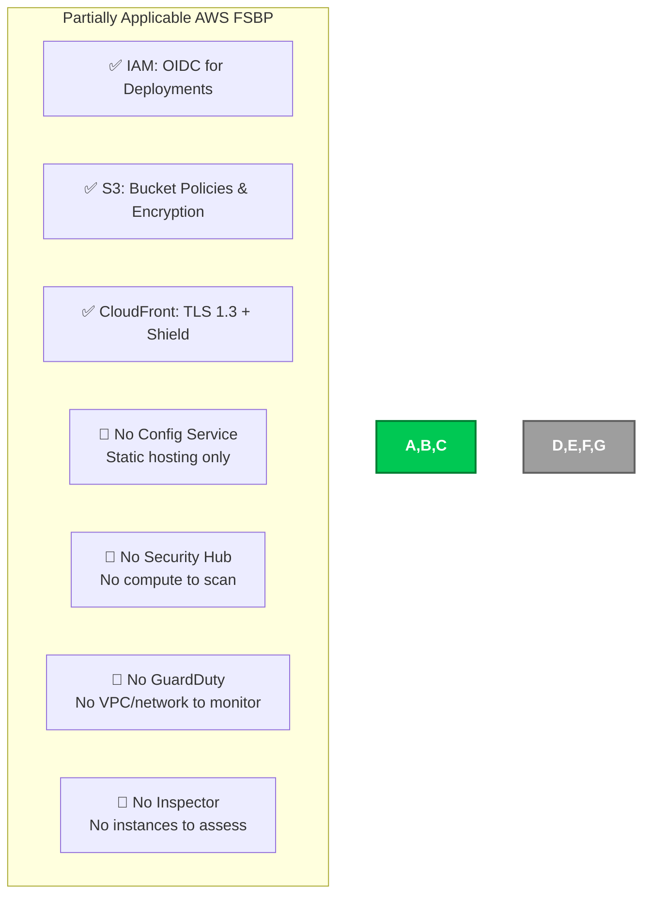

### Current Status

CIA Compliance Manager implements applicable AWS FSBP controls for static content delivery:

- **✅ IAM Security**: OIDC authentication for deployments (no long-lived credentials)
- **✅ S3 Security**: SSE-S3 encryption, versioning, bucket policies
- **✅ CloudFront Security**: TLS 1.3, AWS Shield Standard, security headers
- **🚫 No AWS Config**: No AWS resources requiring configuration management
- **🚫 No Security Hub**: No compute services generating security findings
- **🚫 No GuardDuty**: No VPC or network environment to monitor
- **🚫 No Inspector**: No EC2 instances or compute resources to assess

## 🕵️ Threat Detection & Investigation

**Current Status**: ⚠️ CI/CD & Infrastructure-Level Detection

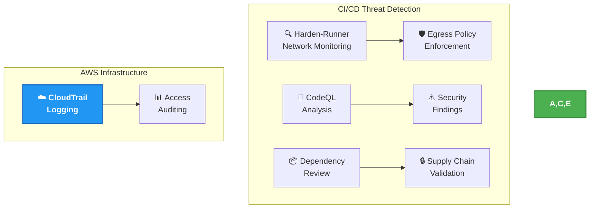

### Current Status

CIA Compliance Manager threat detection operates at CI/CD and infrastructure levels:

- **✅ Harden-Runner**: Network monitoring with egress policy enforcement in CI/CD
- **✅ CodeQL Analysis**: Automated code scanning for security vulnerabilities
- **✅ Dependency Review**: Supply chain threat detection on every PR
- **✅ CloudTrail Logging**: AWS infrastructure access auditing
- **❌ No Client-Side Detection**: No runtime monitoring in the frontend application

### Security Implications

- **✅ Build-Time Protection**: Threats detected during CI/CD pipeline execution
- **✅ Supply Chain Monitoring**: Dependency vulnerabilities detected automatically
- **✅ Infrastructure Logging**: AWS access events tracked via CloudTrail
- **❌ No Client-Side Visibility**: Cannot detect runtime client-side attacks

### Incident Response Process

Per [ISMS Threat Modeling Policy](https://github.com/Hack23/ISMS-PUBLIC/blob/main/Threat_Modeling.md), the following incident response workflow applies:

1. **🔍 Detection**: Automated alerts from CodeQL, Dependabot, Harden-Runner, and OSSF Scorecard
2. **📋 Triage**: GitHub Security Advisories reviewed and classified by severity
3. **🔧 Remediation**: Automated PR creation for dependency fixes; manual review for code-level findings
4. **✅ Verification**: CI/CD pipeline re-validates all security checks post-fix
5. **📝 Documentation**: Security advisories and fix records maintained in GitHub Security tab

## 🔎 Vulnerability Management

**Current Status**: ✅ Automated Vulnerability Scanning in CI/CD

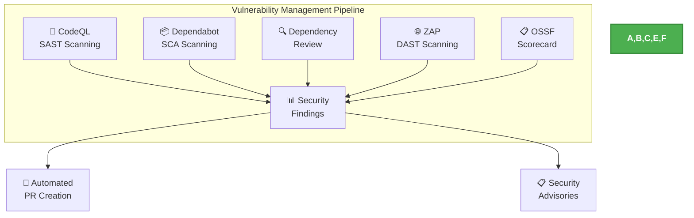

### Current Status

CIA Compliance Manager implements comprehensive automated vulnerability management:

- **✅ CodeQL SAST**: Static application security testing on every PR and push
- **✅ Dependabot SCA**: Automated dependency vulnerability detection and PR creation
- **✅ Dependency Review**: Blocks PRs introducing vulnerable dependencies
- **✅ ZAP DAST**: Dynamic application security testing against deployed application
- **✅ OSSF Scorecard**: Supply chain security best practices monitoring

### Security Considerations

- **✅ Automated Remediation**: Dependabot creates PRs for vulnerable dependencies
- **✅ Multi-Layer Scanning**: SAST + SCA + DAST coverage
- **✅ Supply Chain Security**: SLSA Level 3 with build provenance attestation
- **❌ No Runtime Scanning**: No server-side vulnerability scanning (client-side SPA)
- **❌ Dependency Risks**: Frontend dependencies need manual updates

### Vulnerability Remediation SLAs

Per [ISMS Vulnerability Management Policy](https://github.com/Hack23/ISMS-PUBLIC/blob/main/Vulnerability_Management.md), the following remediation SLAs apply:

| Severity | Remediation SLA | Escalation Path |
|----------|-----------------|-----------------|
| 🔴 **Critical** | **24 hours** | Immediate hotfix release; maintainer notified |
| 🟠 **High** | **7 days** | Priority PR; security advisory published |
| 🟡 **Medium** | **30 days** | Scheduled fix in next release cycle |
| 🟢 **Low** | **90 days** | Backlog prioritization; addressed in maintenance |

- **📊 Tracking**: All vulnerabilities tracked via GitHub Security Advisories and Dependabot alerts
- **🔄 Automation**: Dependabot auto-creates PRs for dependency vulnerabilities within SLA windows
- **📋 Reporting**: OSSF Scorecard provides continuous supply chain security posture assessment

## ⚡ Resilience & Operational Readiness

**Current Status**: ❌ Not Applicable - Static Content Delivery

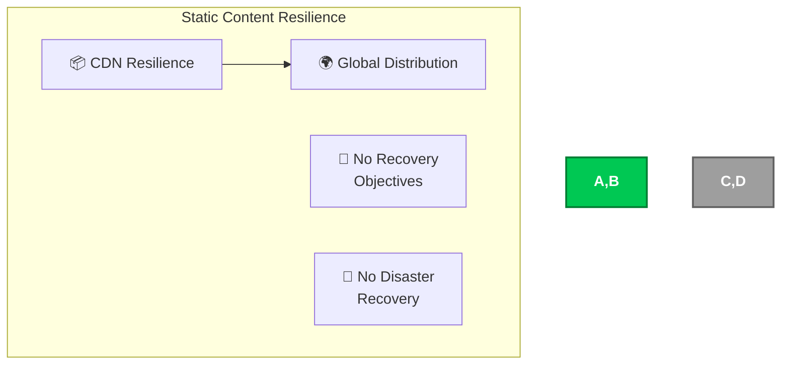

### Current Status

CIA Compliance Manager resilience:

- **✅ CDN Resilience**: Global content distribution provides natural resilience
- **🚫 No RTO/RPO**: No data persistence means no recovery objectives
- **🚫 No DR Planning**: Static content requires no disaster recovery

### Resilience Benefits

- **🌍 Geographic Distribution**: Content available from multiple locations
- **⚡ Automatic Failover**: CDN handles edge location failures automatically
- **🔄 No Data Loss**: No persistent data to lose

## 📋 Configuration & Compliance Management

**Current Status**: ✅ Infrastructure-as-Code & Build-Time Configuration

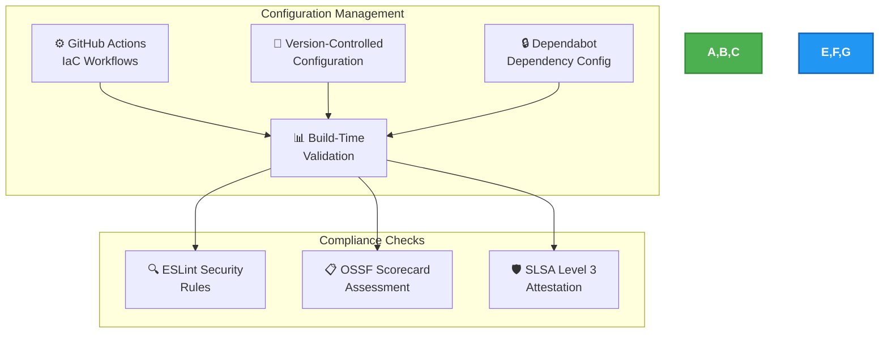

### Current Status

CIA Compliance Manager configuration management:

- **✅ Infrastructure-as-Code**: All CI/CD pipelines defined in GitHub Actions YAML workflows
- **✅ Version Control**: All configuration (Vite, TypeScript, ESLint, Tailwind) tracked in Git
- **✅ Dependency Configuration**: Dependabot configured for automated dependency updates
- **✅ Build-Time Validation**: TypeScript strict mode, ESLint rules, and security linting enforced at build
- **✅ OSSF Scorecard**: Continuous compliance assessment against supply chain best practices

### Configuration Approach

- **📦 Build-Time Configuration**: All configuration resolved during CI/CD build process
- **🔧 Immutable Deployments**: Static assets deployed as immutable artifacts to S3/CloudFront
- **✅ Version Control**: All configuration tracked in source control with full audit trail
- **🔒 Drift Prevention**: Immutable static deployments eliminate configuration drift
- **📋 Compliance as Code**: Security policies enforced through automated CI/CD checks per [ISMS Secure Development Policy](https://github.com/Hack23/ISMS-PUBLIC/blob/main/Secure_Development_Policy.md)

## 📊 Monitoring & Analytics

**Current Status**: ⚠️ Infrastructure & CI/CD Level Monitoring

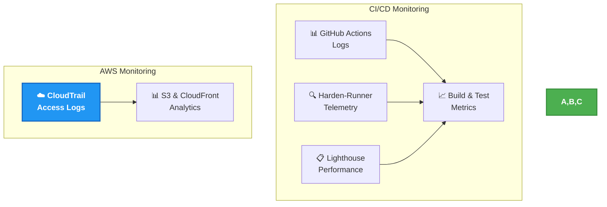

### Current Status

CIA Compliance Manager monitoring operates at infrastructure and CI/CD levels:

- **✅ GitHub Actions Logs**: Complete CI/CD pipeline execution tracking
- **✅ Harden-Runner Telemetry**: Network egress monitoring in CI/CD
- **✅ CloudTrail Logging**: AWS S3 and CloudFront access auditing
- **✅ Lighthouse Performance**: Automated performance monitoring via CI/CD
- **❌ No Client-Side Analytics**: No runtime application monitoring

### Monitoring Limitations

- **❌ No Client-Side Visibility**: Cannot monitor user behavior in the SPA
- **❌ No Real-Time Alerting**: No real-time monitoring system for application issues
- **❌ No Usage Analytics**: No client-side telemetry or usage pattern tracking

## 🤖 Automated Security Operations

**Current Status**: ✅ CI/CD Automated Security Operations

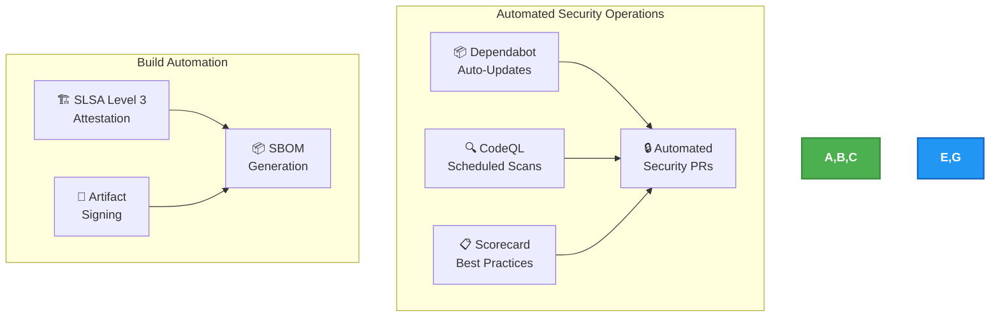

### Current Status

CIA Compliance Manager implements automated security operations via CI/CD:

- **✅ Dependabot**: Automated dependency update PRs for security patches
- **✅ CodeQL Scheduled Scans**: Automated weekly security scanning
- **✅ SLSA Level 3 Attestation**: Automated build provenance on releases
- **✅ SBOM Generation**: Automated software bill of materials
- **✅ Artifact Signing**: Automated cryptographic signing of releases

### Operational Benefits

- **✅ Automated Patching**: Dependabot creates PRs for vulnerable dependencies
- **✅ Continuous Scanning**: CodeQL and Scorecard run on every PR and schedule
- **✅ Supply Chain Integrity**: SLSA Level 3 ensures build provenance

## 🔒 Application Security

**Current Status**: ✅ Partial Implementation - Frontend Security Only

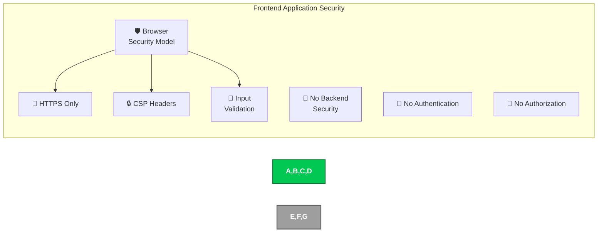

### Current Implementation

CIA Compliance Manager application security:

- **✅ HTTPS Enforcement**: All traffic over encrypted connections
- **✅ Browser Security Model**: Leverages browser sandboxing and isolation
- **✅ Content Security Policy**: Comprehensive CSP headers to prevent XSS
- **✅ Input Validation**: Client-side validation for assessment inputs
- **✅ Error Boundaries**: React 19.x error boundaries for graceful failure handling
- **🚫 No Backend Security**: No server-side security controls
- **🚫 No Authentication**: No user accounts or login system

### Security Features

- **🔒 Transport Security**: TLS encryption for all communications
- **🛡️ XSS Protection**: Content Security Policy headers with strict directives
- **🔍 Input Sanitization**: Validation of all assessment configuration inputs
- **🚪 Same-Origin Policy**: Browser enforces origin restrictions
- **⚠️ Error Handling**: React error boundaries prevent information disclosure

## ⚛️ React 19.x Security Architecture

**Current Status**: ✅ Implemented - React 19.2.4 with Enhanced Security

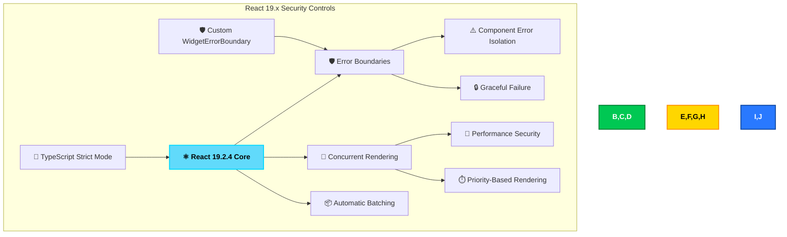

### React 19.x Security Features

#### 🛡️ Error Boundaries (v1.0 Enhancement)

- **Component Error Isolation**: Widget-level error boundaries prevent cascade failures
- **Graceful Degradation**: Application continues functioning when individual components fail
- **No Information Disclosure**: Error boundaries prevent sensitive stack traces from reaching users
- **Security Benefit**: Reduces attack surface by containing component failures

**Implementation:**
```typescript
// Error boundary wrapping for all widgets
import WidgetErrorBoundary from './components/common/WidgetErrorBoundary';

<WidgetErrorBoundary
  widgetName="Assessment Widget"
  onError={(error, info) => logErrorToService(error, info)}
>
  <AssessmentWidget />
</WidgetErrorBoundary>
```

#### 🔄 Concurrent Rendering Security

- **Priority-Based Updates**: Critical security UI updates prioritized
- **Smooth User Experience**: No blocking operations that could mask security issues
- **Performance Security**: Prevents DoS through efficient rendering
- **Security Benefit**: Maintains responsive security controls under load

#### 📦 Automatic Batching

- **Optimized State Updates**: Multiple security state changes batched efficiently
- **Reduced Re-renders**: Minimizes potential security state inconsistencies
- **Performance**: Faster assessment calculations and security validation
- **Security Benefit**: Prevents race conditions in security state management

### TypeScript Strict Mode Security

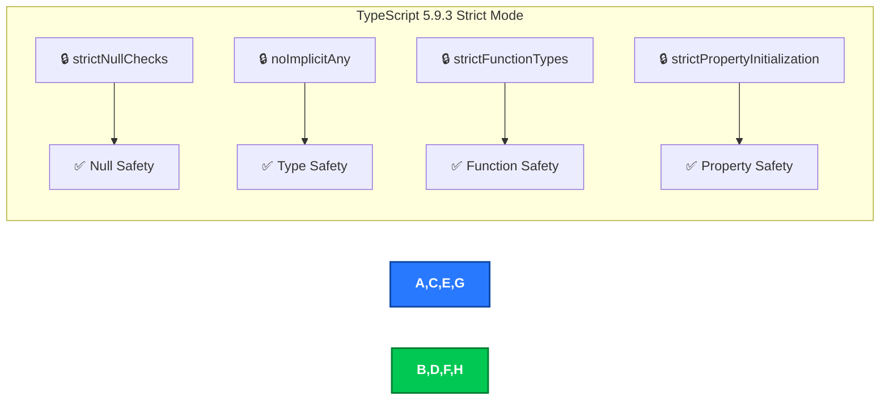

**Security Benefits:**
- **Zero `any` Types**: Complete type safety prevents type confusion attacks
- **Null Checks**: Prevents null reference vulnerabilities
- **Type Safety**: Compile-time detection of potential runtime errors
- **Property Validation**: Ensures all security-critical properties are initialized

## 🧪 Vitest & Cypress Test Security Architecture

**Current Status**: ✅ Implemented - Vitest 4.0.17 + Cypress 15.10.0

```mermaid
flowchart TD
    subgraph "Vitest & Cypress Security Testing"
        A[🧪 Vitest 4.0.17] --> B1[🔍 Unit Testing]
        A1[🧪 Cypress 15.10.0] --> B[🔍 Component Testing]
        A --> C[🌐 E2E Testing]
        A --> D[📸 Visual Testing]
        
        B --> E[🛡️ Widget Security Tests]
        C --> F[🔐 Workflow Security Tests]
        D --> G[⚠️ UI Security Validation]
        
        H[📊 83.26% Coverage] --> A
        I[🔄 Session Handling] --> C
    end

    style A fill:#00C853,stroke:#007E33,stroke-width:2px,color:white,font-weight:bold
    style B,C,D fill:#2979FF,stroke:#0D47A1,stroke-width:2px,color:white,font-weight:bold
    style E,F,G fill:#FFD600,stroke:#FF8F00,stroke-width:2px,color:black,font-weight:bold
    style H,I fill:#9C27B0,stroke:#6A1B9A,stroke-width:2px,color:white,font-weight:bold
```

### Vitest & Cypress Security Testing Features

#### 🔍 Component Testing Security

- **Isolated Widget Testing**: Each widget tested in isolation for security vulnerabilities
- **Input Validation Tests**: Comprehensive testing of all input sanitization
- **XSS Protection Tests**: Validation of Content Security Policy effectiveness
- **State Management Security**: Testing of secure state transitions

#### 🌐 E2E Security Testing

- **Workflow Security**: End-to-end testing of security assessment workflows
- **Session Security**: Testing of browser storage security and isolation
- **Navigation Security**: Validation of secure routing and navigation
- **Integration Security**: Testing of component interactions for security issues

#### 📸 Visual Security Testing

- **UI Security Validation**: Screenshot regression testing for security UI
- **Error State Testing**: Visual validation of error boundaries and fallbacks
- **Responsive Security**: Testing security controls across different viewports
- **Security Indicator Testing**: Validation of security status indicators

### Test Coverage Security Metrics

| Test Type | Coverage | Security Focus | v1.0 Status |
|-----------|----------|----------------|-------------|
| **Unit Tests** | 83.26% line coverage | Input validation, type safety, business logic security | ✅ Target Exceeded (>80%) |
| **Component Tests** | Widget-level coverage | XSS protection, error boundaries, state security | ✅ Comprehensive |
| **E2E Tests** | Critical path coverage | Workflow security, session handling, integration | ✅ Comprehensive |
| **Visual Tests** | UI security coverage | Security indicator visibility, error states | ✅ Implemented |


## 📜 Compliance Framework

**Current Status**: ✅ ISMS-Aligned Open Source Compliance

```mermaid
graph TD
    subgraph "Compliance Framework Mapping"
        A[🏛️ Hack23 ISMS<br>Policy Framework] --> B[🔐 Secure Development<br>Policy]
        A --> C[🔍 Vulnerability<br>Management]
        A --> D[📋 Open Source<br>Policy]
        A --> E[🏷️ Classification<br>Framework]
    end

    subgraph "Standards Alignment"
        F[📊 ISO 27001:2022] --> G[A.8.25 Secure Dev Lifecycle]
        H[🛡️ NIST CSF 2.0] --> I[PR.DS Data Security]
        J[📋 CIS Controls v8] --> K[Control 16 App Security]
        L[🇪🇺 CRA] --> M[Conformity Assessment]
    end

    A --> F
    A --> H
    A --> J
    A --> L

    style A fill:#4CAF50,stroke:#388E3C,stroke-width:2px,color:white,font-weight:bold
    style F,H,J,L fill:#2196F3,stroke:#1565C0,stroke-width:2px,color:white,font-weight:bold
```

### Current Status

CIA Compliance Manager compliance alignment:

- **✅ ISMS Policy Compliance**: Follows [Hack23 ISMS Secure Development Policy](https://github.com/Hack23/ISMS-PUBLIC/blob/main/Secure_Development_Policy.md)
- **✅ Open Source Governance**: Adheres to [Open Source Policy](https://github.com/Hack23/ISMS-PUBLIC/blob/main/Open_Source_Policy.md) for dependency and license management
- **✅ Data Classification**: Implements [Classification Framework](https://github.com/Hack23/ISMS-PUBLIC/blob/main/CLASSIFICATION.md) — application handles Public data only
- **✅ CRA Conformity**: Aligns with [CRA Conformity Assessment Process](https://github.com/Hack23/ISMS-PUBLIC/blob/main/CRA_Conformity_Assessment_Process.md) for EU Cyber Resilience Act
- **✅ Privacy by Design**: No personal data collection or storage

### Compliance Considerations

- **🎯 Assessment Tool**: Compliance assessment platform with no sensitive data
- **🔒 Privacy First**: No assessment data collection reduces compliance burden
- **🌍 Global Access**: No geographic restrictions or data residency requirements
- **📊 SLSA Level 3**: Supply chain security attestation provides verifiable build provenance
- **🛡️ OSSF Scorecard**: Continuous open source security best practices assessment

## 🛡️ Content Security Policy (CSP) Implementation

**Current Status**: ✅ Implemented - Comprehensive CSP Headers

```mermaid
flowchart TD
    subgraph "CSP Security Architecture"
        A[🛡️ CSP Headers] --> B[📜 default-src 'self']
        A --> C[📝 script-src Policy]
        A --> D[🎨 style-src Policy]
        A --> E[🖼️ img-src Policy]
        
        B --> F[🔒 Strict Default]
        C --> G[⚠️ 'unsafe-inline' Limited]
        D --> H[🎨 Google Fonts Allowed]
        E --> I[🖼️ Data URIs + HTTPS]
        
        J[🔒 X-Content-Type-Options] --> A
        K[🚫 X-Frame-Options: DENY] --> A
        L[🔐 Cross-Origin Policies] --> A
    end

    style A fill:#FF6F00,stroke:#E65100,stroke-width:2px,color:white,font-weight:bold
    style B,C,D,E fill:#2979FF,stroke:#0D47A1,stroke-width:2px,color:white,font-weight:bold
    style F,G,H,I fill:#00C853,stroke:#007E33,stroke-width:2px,color:white,font-weight:bold
    style J,K,L fill:#9C27B0,stroke:#6A1B9A,stroke-width:2px,color:white,font-weight:bold
```

### CSP Header Configuration

The application implements comprehensive Content Security Policy headers in `index.html`:

```html
<!-- Content Security Policy: Defines sources of content that can be loaded -->
<meta 
  http-equiv="Content-Security-Policy" 
  content="default-src 'self'; 
           script-src 'self' 'unsafe-inline'; 
           style-src 'self' 'unsafe-inline' https://fonts.googleapis.com https://fonts.gstatic.com; 
           img-src 'self' data: https:; 
           connect-src 'self'; 
           font-src 'self' data: https://fonts.gstatic.com; 
           object-src 'none'; 
           base-uri 'self'; 
           form-action 'self'; 
           frame-ancestors 'none'; 
           upgrade-insecure-requests;"
/>
```

### CSP Directive Breakdown

| Directive | Policy | Security Benefit |
|-----------|--------|------------------|
| **default-src 'self'** | Only load resources from same origin | Prevents unauthorized external resource loading |
| **script-src 'self' 'unsafe-inline'** | Scripts from same origin + inline | Allows React inline scripts while blocking external |
| **style-src 'self' 'unsafe-inline' fonts.google** | Styles from same origin + Google Fonts | Enables styling while preventing malicious style injection |
| **img-src 'self' data: https:** | Images from same origin, data URIs, HTTPS | Allows necessary images while preventing mixed content |
| **connect-src 'self'** | XHR/fetch only to same origin | Prevents data exfiltration to external servers |
| **object-src 'none'** | No plugins allowed | Prevents Flash, Java, and other plugin vulnerabilities |
| **frame-ancestors 'none'** | Cannot be framed | Prevents clickjacking attacks |
| **upgrade-insecure-requests** | Upgrade HTTP to HTTPS | Ensures all connections are encrypted |

### Additional Security Headers

```html
<!-- Prevent MIME-type sniffing -->
<meta http-equiv="X-Content-Type-Options" content="nosniff" />

<!-- Clickjacking protection: Prevent site from being embedded in frames -->
<meta http-equiv="X-Frame-Options" content="DENY" />

<!-- Cross-Origin isolation for Spectre vulnerability protection -->
<meta http-equiv="Cross-Origin-Opener-Policy" content="same-origin" />
<meta http-equiv="Cross-Origin-Embedder-Policy" content="require-corp" />

<!-- Referrer Policy: Control information sent in Referer header -->
<meta name="referrer" content="strict-origin-when-cross-origin" />
```

### XSS Protection Strategy

```mermaid
flowchart LR
    subgraph "Multi-Layer XSS Protection"
        A[🎯 Attack Vector] --> B[🛡️ CSP Headers]
        B --> C[⚛️ React Escaping]
        C --> D[🔒 TypeScript Types]
        D --> E[✅ Input Validation]
        E --> F[🚫 Attack Blocked]
    end

    style A fill:#FF3D00,stroke:#BF360C,stroke-width:2px,color:white,font-weight:bold
    style B,C,D,E fill:#00C853,stroke:#007E33,stroke-width:2px,color:white,font-weight:bold
    style F fill:#2979FF,stroke:#0D47A1,stroke-width:2px,color:white,font-weight:bold
```

**Defense-in-Depth XSS Protection:**
1. **CSP Headers**: Prevent execution of unauthorized scripts
2. **React Auto-Escaping**: Automatic XSS protection in JSX rendering
3. **TypeScript Safety**: Type system prevents many injection vulnerabilities
4. **Input Validation**: Sanitization of all user inputs
5. **No dangerouslySetInnerHTML**: Avoidance of unsafe DOM manipulation

## 🔗 SLSA Level 3 Supply Chain Security

**Current Status**: ✅ Implemented - SLSA Level 3 Attestation

```mermaid
flowchart TD
    subgraph "SLSA Level 3 Architecture"
        A[📦 GitHub Actions Build] --> B[🔏 Build Provenance]
        B --> C[📋 SBOM Generation]
        C --> D[🔐 Artifact Attestation]
        
        D --> E[✅ Tamper-Evident]
        D --> F[🔍 Verifiable]
        D --> G[📊 Transparent]
        
        H[🛡️ actions/attest-build-provenance] --> B
        I[📦 SBOM Attestation] --> C
        J[🔒 SHA-Pinned Actions] --> A
    end

    style A fill:#2979FF,stroke:#0D47A1,stroke-width:2px,color:white,font-weight:bold
    style B,C,D fill:#00C853,stroke:#007E33,stroke-width:2px,color:white,font-weight:bold
    style E,F,G fill:#FFD600,stroke:#FF8F00,stroke-width:2px,color:black,font-weight:bold
    style H,I,J fill:#9C27B0,stroke:#6A1B9A,stroke-width:2px,color:white,font-weight:bold
```

### SLSA Level 3 Requirements Met

| SLSA Requirement | Implementation | Security Benefit |
|------------------|----------------|------------------|
| **Build Provenance** | `actions/attest-build-provenance@v3` | Cryptographic proof of build integrity |
| **SBOM Generation** | SBOM attestation in release workflow | Complete dependency transparency |
| **Hermetic Builds** | GitHub Actions isolated environment | Reproducible, tamper-resistant builds |
| **Artifact Integrity** | SHA-256 checksums and signatures | Verifiable artifact authenticity |
| **Retention** | Build logs retained per GitHub policy | Audit trail for security investigation |
| **Non-Falsifiable** | GitHub-provided provenance | Cryptographically signed by GitHub |

### Build Attestation Implementation

```yaml
# From .github/workflows/release.yml
- name: Generate artifact attestation
  uses: actions/attest-build-provenance@977bb373ede98d70efdf65b84cb5f73e068dcc2a # v3.0.0
  with:
    subject-path: 'build/**/*'

- name: Generate SBOM attestation
  uses: actions/attest-sbom@4651f806c01d8637787e274ac3bdf724ef169f34 # v3.0.0
  with:
    subject-path: 'build/**/*'
    sbom-path: 'sbom.json'
```

### Supply Chain Security Benefits

```mermaid
flowchart LR
    subgraph "Supply Chain Threat Mitigation"
        A[🎯 Threat] --> B[🔒 Control]
        
        T1[📦 Package Tampering] --> C1[🔏 Build Provenance]
        T2[🔗 Dependency Attack] --> C2[📋 SBOM Verification]
        T3[⚙️ Build Compromise] --> C3[🛡️ Hermetic Builds]
        T4[🎭 Artifact Substitution] --> C4[🔐 Attestations]
    end

    style T1,T2,T3,T4 fill:#FF3D00,stroke:#BF360C,stroke-width:2px,color:white,font-weight:bold
    style C1,C2,C3,C4 fill:#00C853,stroke:#007E33,stroke-width:2px,color:white,font-weight:bold
```

**Mitigated Supply Chain Threats:**
- **Package Tampering**: Build provenance prevents artifact modification
- **Dependency Attacks**: SBOM enables vulnerability tracking and verification
- **Build Compromise**: Hermetic GitHub Actions environment isolates builds
- **Artifact Substitution**: Cryptographic attestations verify authenticity

### SLSA Badge & Verification

[](https://github.com/Hack23/cia-compliance-manager/attestations)

**Public Verification:**
- Build provenance publicly viewable at GitHub attestations endpoint
- SBOM available for dependency audit and compliance verification
- Cryptographic signatures verifiable by any third party
- Complete supply chain transparency for security professionals


## 🛡️ Defense-in-Depth Strategy

**Current Status**: ✅ Simplified Defense Strategy - Minimal Attack Surface

```mermaid
flowchart TD
    subgraph "Simplified Defense-in-Depth"
        A[🌐 Network Layer] --> B[🔒 HTTPS/TLS]
        C[🖥️ Application Layer] --> D[🛡️ Browser Security]
        E[👤 User Layer] --> F[🔍 Input Validation]

        G[🚫 No Identity Layer]
        H[🚫 No Data Layer]
        I[🚫 No Infrastructure Layer]
    end

    style A,B,C,D,E,F fill:#00C853,stroke:#007E33,stroke-width:2px,color:white,font-weight:bold
    style G,H,I fill:#9E9E9E,stroke:#616161,stroke-width:2px,color:white,font-weight:bold
```

### Current Implementation

CIA Compliance Manager's simplified defense approach:

1. **🌐 Network Security**: HTTPS-only communication with TLS encryption
2. **🖥️ Application Security**: Browser security model and CSP headers
3. **👤 Input Security**: Client-side validation and sanitization

### Missing Layers

- **🚫 Identity Security**: No authentication or user management
- **🚫 Data Security**: No persistent data to protect
- **🚫 Infrastructure Security**: No servers or cloud infrastructure

### Security Benefits

- **✅ Reduced Complexity**: Fewer layers mean fewer vulnerabilities
- **✅ Browser Isolation**: Each user's session isolated by browser
- **✅ No Data Breach Risk**: No persistent data to compromise

## 🔄 Security Operations

**Current Status**: ❌ No Security Operations - Static Content Only

```mermaid
flowchart TD
    subgraph "No Security Operations"
        A[🔍 No Monitoring]
        B[⚡ No Incident<br>Response]
        C[🔄 No Security<br>Maintenance]
        D[📊 No Threat<br>Intelligence]
    end

    style A,B,C,D fill:#9E9E9E,stroke:#616161,stroke-width:2px,color:white,font-weight:bold
```

### Current Status

CIA Compliance Manager security operations:

- **🚫 No Security Operations Center**: No infrastructure to monitor
- **🚫 No Incident Response**: No security events to respond to
- **🚫 No Threat Intelligence**: No active threats to track
- **🚫 No Security Maintenance**: Static content requires no maintenance

### Operational Approach

- **📦 Build-Time Security**: Security implemented during development
- **🔧 Static Security**: No runtime security operations needed
- **🛡️ Browser Reliance**: Security operations handled by user's browser

## 💰 Security Investment

**Current Status**: ✅ Minimal Security Investment - Frontend Only

```mermaid
flowchart TD
    subgraph "Minimal Security Investment"
        A[💰 Low Cost] --> B[📦 CDN Costs Only]
        A --> C[🔒 TLS Certificate]
        A --> D[🛠️ Development Time]

        E[🚫 No AWS Costs]
        F[🚫 No Monitoring Costs]
        G[🚫 No Operations Costs]
    end

    style A,B,C,D fill:#00C853,stroke:#007E33,stroke-width:2px,color:white,font-weight:bold
    style E,F,G fill:#9E9E9E,stroke:#616161,stroke-width:2px,color:white,font-weight:bold
```

### Current Investment

CIA Compliance Manager security investment:

- **💰 CDN Costs**: Content delivery network hosting costs
- **🔒 TLS Certificates**: HTTPS encryption (often free with CDN)
- **🛠️ Development Time**: Security implementation during development
- **🚫 No Infrastructure Costs**: No servers or cloud services to pay for
- **🚫 No Security Tools**: No paid security monitoring or scanning tools

### Implemented CI/CD Security

CIA Compliance Manager implements comprehensive CI/CD security:

1. **🔍 Static Analysis Security**:

   - **CodeQL Analysis**: Automated vulnerability scanning for JavaScript/TypeScript
   - **Dependency Review**: Checks for known vulnerabilities in dependencies
   - **OSSF Scorecard**: Supply chain security assessment with public scoring

2. **🔏 Build Security**:

   - **SLSA Build Provenance**: Cryptographic proof of build integrity
   - **SBOM Generation**: Software Bill of Materials for transparency
   - **Artifact Signing**: Secure signing of release artifacts

3. **🚀 Deployment Security**:

   - **GitHub Pages**: Secure static hosting with HTTPS enforcement
   - **Lighthouse Auditing**: Performance and security best practices validation
   - **ZAP Security Scanning**: Dynamic security testing of deployed application

4. **🛡️ Pipeline Security**:
   - **SHA Pinning**: All GitHub Actions pinned to specific commit hashes
   - **Runner Hardening**: StepSecurity harden-runner for audit logging
   - **Least Privilege**: Minimal permissions for all workflow steps

### Security Workflow Features

- **🔄 Continuous Scanning**: Every commit and pull request analyzed
- **📊 Security Reporting**: Centralized security findings in GitHub Security tab
- **⚡ Automated Remediation**: Dependency updates and vulnerability fixes
- **🏆 Supply Chain Protection**: Complete software supply chain visibility

### Key Security Benefits

- **🔍 Early Detection**: Security issues caught during development
- **📄 Transparency**: Complete audit trail of all changes and builds
- **🔒 Integrity**: Cryptographic verification of all artifacts
- **⚡ Automation**: Reduced human error through automated security checks

---

## 🆕 v1.1.0 Security Improvements

CIA Compliance Manager v1.1.0 introduces significant security enhancements across accessibility, performance, error handling, and design consistency—all contributing to improved security posture.

### ♿ Accessibility Security (WCAG 2.1 AA)

**Security Impact**: Accessibility improvements reduce attack surface and improve security usability.

```mermaid
flowchart LR
    A[♿ Accessibility Controls] --> B[🎯 Keyboard Navigation]
    A --> C[📢 Screen Reader Support]
    A --> D[🎨 Color Contrast]
    
    B --> E[🛡️ Reduces Phishing Risk]
    C --> F[🛡️ Security Alert Clarity]
    D --> G[🛡️ Security Status Visibility]
    
    style A fill:#00C853,stroke:#007E33,stroke-width:2px,color:white,font-weight:bold
    style B,C,D fill:#2979FF,stroke:#0D47A1,stroke-width:2px,color:white,font-weight:bold
    style E,F,G fill:#FFD600,stroke:#FF8F00,stroke-width:2px,color:black,font-weight:bold
```

**Implementation:**
- **ARIA Labels**: All 11 widgets with semantic descriptions improve security context understanding
- **Keyboard Navigation**: Full keyboard access prevents mouse-based social engineering attacks
- **Screen Reader Support**: Security warnings and errors announced to assistive technologies
- **Focus Indicators**: Clear visual feedback prevents UI confusion attacks

**Security Benefits:**
- **Clearer Security Communications**: Users with disabilities receive security alerts effectively
- **Reduced Cognitive Load**: Consistent UI patterns make security features more discoverable
- **Social Engineering Protection**: Better keyboard navigation reduces reliance on potentially malicious UI elements

**Evidence:** [ACCESSIBILITY_COMPLIANCE.md](../ACCESSIBILITY_COMPLIANCE.md) · [ACCESSIBILITY_REPORT.md](../ACCESSIBILITY_REPORT.md)

### ⚡ Performance Security

**Security Impact**: Performance optimization reduces DoS vulnerability and improves security responsiveness.

```mermaid
flowchart LR
    A[⚡ Performance Controls] --> B[📦 Bundle Optimization]
    A --> C[🔄 Lazy Loading]
    A --> D[📊 Monitoring]
    
    B --> E[🛡️ DoS Resilience]
    C --> F[🛡️ Resource Efficiency]
    D --> G[🛡️ Anomaly Detection]
    
    style A fill:#FF3D00,stroke:#BF360C,stroke-width:2px,color:white,font-weight:bold
    style B,C,D fill:#2979FF,stroke:#0D47A1,stroke-width:2px,color:white,font-weight:bold
    style E,F,G fill:#00C853,stroke:#007E33,stroke-width:2px,color:white,font-weight:bold
```

**Implementation:**
- **Bundle Size Reduction**: 85.6% smaller initial bundle (9.63 KB vs 67 KB) reduces attack surface
- **Lazy Loading**: On-demand widget loading minimizes initial code exposure
- **Code Splitting**: Isolated widget chunks prevent cross-widget vulnerabilities
- **Performance Monitoring**: Lighthouse CI detects performance degradation attacks

**Security Benefits:**
- **DoS Mitigation**: Smaller bundles reduce bandwidth-based DoS vulnerability
- **Faster Security Updates**: Smaller codebase enables faster security patch deployment
- **Resource Efficiency**: Optimized performance improves availability under load
- **Anomaly Detection**: Performance monitoring can detect malicious behavior

**Metrics:**
- Initial bundle: 9.63 KB (92% under 120 KB budget)
- Total bundle: 207 KB (59% under 500 KB budget)
- Page load: <2s (exceeds performance SLA)
- Core Web Vitals: All metrics in "Good" range

**Evidence:** [PERFORMANCE_COMPLIANCE.md](../PERFORMANCE_COMPLIANCE.md) · [performance-testing.md](../performance-testing.md) · [BUNDLE_ANALYSIS.md](../BUNDLE_ANALYSIS.md)

### 🛡️ Error Handling Security

**Security Impact**: Proper error handling prevents information disclosure and maintains application stability.

```mermaid
flowchart LR
    A[🛡️ Error Handling] --> B[⚠️ Error Boundaries]
    A --> C[📝 Error Service]
    A --> D[🚫 Safe Messages]
    
    B --> E[🔒 No Stack Traces]
    C --> F[🔒 Secure Logging]
    D --> G[🔒 No Info Disclosure]
    
    style A fill:#9C27B0,stroke:#6A1B9A,stroke-width:2px,color:white,font-weight:bold
    style B,C,D fill:#2979FF,stroke:#0D47A1,stroke-width:2px,color:white,font-weight:bold
    style E,F,G fill:#00C853,stroke:#007E33,stroke-width:2px,color:white,font-weight:bold
```

**Implementation:**
- **React Error Boundaries**: All 11 widgets wrapped with error boundaries prevent cascading failures
- **Centralized Error Service**: Consistent error handling reduces information disclosure risk
- **User-Friendly Messages**: Generic error messages prevent stack trace leakage
- **Error Context**: Internal logging maintains debug capability without exposing to users
- **Graceful Degradation**: Widgets fail independently maintaining application availability

**Security Benefits:**
- **Information Disclosure Prevention**: No technical details exposed to end users
- **Stack Trace Protection**: Error details logged internally, never displayed
- **Application Stability**: Errors contained to individual widgets prevent total failure
- **Security Monitoring**: Centralized logging enables security event correlation

**Evidence:** [ERROR_HANDLING.md](../ERROR_HANDLING.md) · [WidgetErrorHandlingGuide.md](../WidgetErrorHandlingGuide.md)

### 🎨 Design System Security

**Security Impact**: Consistent UI patterns reduce security vulnerabilities and improve security feature usability.

```mermaid
flowchart LR
    A[🎨 Design System] --> B[🎯 Design Tokens]
    A --> C[🔧 Components]
    A --> D[📐 Patterns]
    
    B --> E[🛡️ Consistent Security UI]
    C --> F[🛡️ Tested Components]
    D --> G[🛡️ Predictable Behavior]
    
    style A fill:#FFD600,stroke:#FF8F00,stroke-width:2px,color:black,font-weight:bold
    style B,C,D fill:#2979FF,stroke:#0D47A1,stroke-width:2px,color:white,font-weight:bold
    style E,F,G fill:#00C853,stroke:#007E33,stroke-width:2px,color:white,font-weight:bold
```

**Implementation:**
- **Centralized Design Tokens**: Single source of truth for spacing, colors, typography prevents inconsistencies
- **Reusable Components**: Common component library reduces code duplication and security bugs
- **Consistent Patterns**: Standardized UI patterns make security features more recognizable
- **TailwindCSS Integration**: CSS purging reduces attack surface through unused code elimination

**Security Benefits:**
- **Reduced Bug Surface**: Reusable components mean fewer places for security bugs
- **Consistent Security Indicators**: Standardized visual language for security status
- **Easier Security Reviews**: Centralized components simplify security audits
- **Faster Patching**: Single fix applies across all widget instances

**Evidence:** [DESIGN_SYSTEM.md](../DESIGN_SYSTEM.md) · [DESIGN_SYSTEM_IMPLEMENTATION_GUIDE.md](../DESIGN_SYSTEM_IMPLEMENTATION_GUIDE.md)

### 📋 Compliance Evidence Consolidation

**Security Impact**: Centralized evidence improves audit efficiency and compliance verification.

**Implementation:**
- **COMPLIANCE_EVIDENCE.md**: Single catalog of 40+ evidence artifacts across 8 categories
- **Test Coverage Evidence**: 83.81% line, 76.15% branch (exceeds 80%/70% requirements)
- **Security Scanning Evidence**: SAST, SCA, DAST, Secret Scanning results
- **Supply Chain Evidence**: SLSA Level 3, SBOM, OpenSSF Scorecard
- **Accessibility Evidence**: WCAG 2.1 AA conformance documentation
- **Performance Evidence**: Bundle analysis, Core Web Vitals, Lighthouse audits

**Security Benefits:**
- **Audit Efficiency**: Single source for all compliance evidence
- **Continuous Validation**: Automated evidence collection ensures currency
- **Framework Alignment**: Evidence mapped to NIST, ISO, CIS controls
- **Transparency**: Public evidence builds stakeholder trust

**Evidence:** [COMPLIANCE_EVIDENCE.md](../COMPLIANCE_EVIDENCE.md)

### v1.1.0 Security Summary

| 🎯 **Security Area** | 📋 **Improvement** | 📊 **Impact** | 🔗 **Evidence** |
|---------------------|-------------------|--------------|----------------|
| **Accessibility** | WCAG 2.1 AA (11/11 widgets) | Better security communication | [ACCESSIBILITY_COMPLIANCE.md](../ACCESSIBILITY_COMPLIANCE.md) |
| **Performance** | 85.6% bundle reduction | DoS resilience, faster updates | [PERFORMANCE_COMPLIANCE.md](../PERFORMANCE_COMPLIANCE.md) |
| **Error Handling** | Error boundaries (11/11 widgets) | No information disclosure | [ERROR_HANDLING.md](../ERROR_HANDLING.md) |
| **Design System** | Centralized tokens & components | Reduced bug surface | [DESIGN_SYSTEM.md](../DESIGN_SYSTEM.md) |
| **Test Coverage** | 83.81% line, 76.15% branch | Better security validation | [COMPLIANCE_EVIDENCE.md](../COMPLIANCE_EVIDENCE.md) |
| **Compliance Evidence** | 40+ artifacts in 8 categories | Audit efficiency | [COMPLIANCE_EVIDENCE.md](../COMPLIANCE_EVIDENCE.md) |

---

## 📚 ISMS Policy References

This security architecture is governed by and aligns with the following [Hack23 ISMS](https://github.com/Hack23/ISMS-PUBLIC) policies:

| Policy | Purpose | Relevance |
|--------|---------|-----------|
| [Secure Development Policy](https://github.com/Hack23/ISMS-PUBLIC/blob/main/Secure_Development_Policy.md) | Secure SDLC requirements | Governs CI/CD security, code review, and security testing practices |
| [Threat Modeling](https://github.com/Hack23/ISMS-PUBLIC/blob/main/Threat_Modeling.md) | Threat identification and mitigation | Defines threat detection, incident response, and risk assessment processes |
| [Vulnerability Management](https://github.com/Hack23/ISMS-PUBLIC/blob/main/Vulnerability_Management.md) | Vulnerability scanning and remediation | Establishes remediation SLAs (Critical 24h, High 7d, Medium 30d, Low 90d) |
| [Open Source Policy](https://github.com/Hack23/ISMS-PUBLIC/blob/main/Open_Source_Policy.md) | Open source governance | Governs dependency management, license compliance, and supply chain security |
| [CRA Conformity Assessment Process](https://github.com/Hack23/ISMS-PUBLIC/blob/main/CRA_Conformity_Assessment_Process.md) | EU Cyber Resilience Act alignment | Ensures conformity with CRA requirements for software products |
| [Classification Framework](https://github.com/Hack23/ISMS-PUBLIC/blob/main/CLASSIFICATION.md) | Data classification and handling | Defines data sensitivity levels and corresponding security controls |
| [Network Security Policy](https://github.com/Hack23/ISMS-PUBLIC/blob/main/Network_Security_Policy.md) | Network security controls | Governs transport security, DNS security, and perimeter protection |
| [Access Control Policy](https://github.com/Hack23/ISMS-PUBLIC/blob/main/Access_Control_Policy.md) | Identity and access management | Defines authentication and authorization requirements |

## 📝 Conclusion

CIA Compliance Manager implements a **security-first approach optimized for a frontend-only compliance assessment platform**. While the application architecture intentionally avoids many traditional security concerns through its stateless, client-side-only design, it implements robust security controls where applicable.

### Current Security Strengths

1. **🔒 Transport Security**: HTTPS-only communication with TLS encryption
2. **🛡️ Minimal Attack Surface**: No backend servers, databases, or user accounts to compromise
3. **🔐 CI/CD Security**: Comprehensive security scanning and SLSA Level 3 attestation in the build pipeline
4. **🎯 Privacy by Design**: No personal data collection or storage
5. **🌐 Global Availability**: GitHub Pages CDN-based delivery with natural resilience
6. **⚛️ Modern Framework**: React 19.x with error boundaries and concurrent rendering security
7. **🛡️ Comprehensive CSP**: Content Security Policy headers protecting against XSS attacks

### Security Architecture Benefits

1. **💰 Cost Effective**: Minimal security infrastructure and operational costs
2. **🔄 Zero Maintenance**: No ongoing security patching or monitoring required for infrastructure
3. **🚀 High Performance**: Security controls designed for minimal performance impact
4. **🌍 Global Access**: No geographic restrictions or compliance complexities
5. **🎯 Assessment Focus**: Security approach supports the compliance assessment mission

### Future Security Considerations

As documented in the [End-of-Life Strategy](End-of-Life-Strategy.md), any future evolution toward backend services or user accounts would require implementing the traditional security layers currently marked as "not applicable."
- **🔄 Continuous Scanning**: Every commit and pull request analyzed
- **📊 Security Reporting**: Centralized security findings in GitHub Security tab
- **⚡ Automated Remediation**: Dependency updates and vulnerability fixes
- **🏆 Supply Chain Protection**: Complete software supply chain visibility

### Key Security Benefits

- **🔍 Early Detection**: Security issues caught during development
- **📄 Transparency**: Complete audit trail of all changes and builds
- **🔒 Integrity**: Cryptographic verification of all artifacts via SLSA Level 3 attestation
- **⚡ Automation**: Reduced human error through automated security checks

