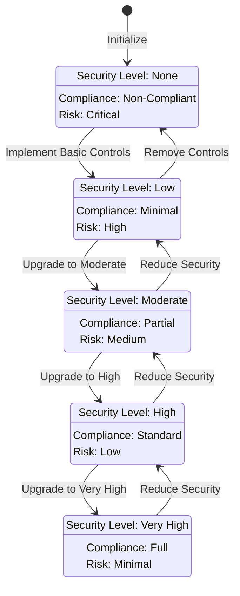
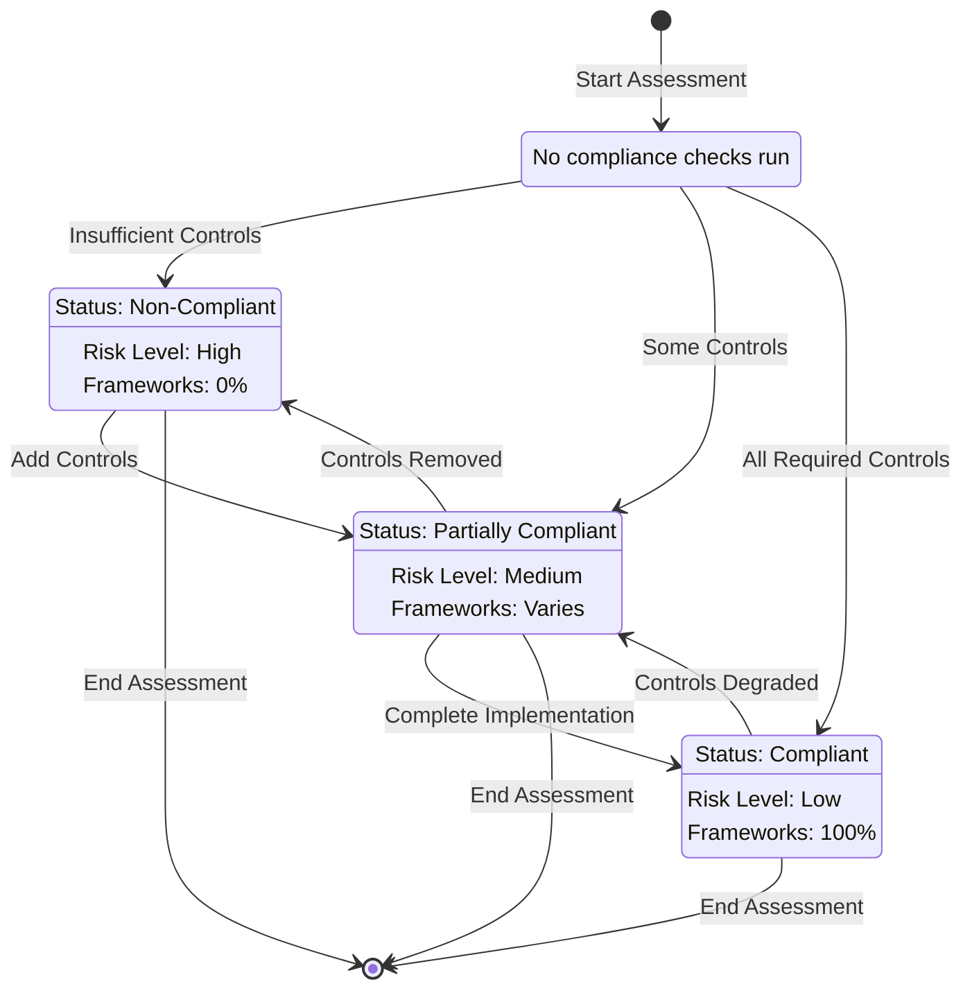

# CIA Compliance Manager State Diagrams

This document contains state diagrams that illustrate key states and transitions within the CIA Compliance Manager.

## Security Profile State Diagram

## Compliance Status State Diagram

These state diagrams illustrate the different security states a system can transition through and how the compliance status changes based on the implementation of security controls. They help visualize the progression from low to high security levels and the corresponding changes in compliance status.
