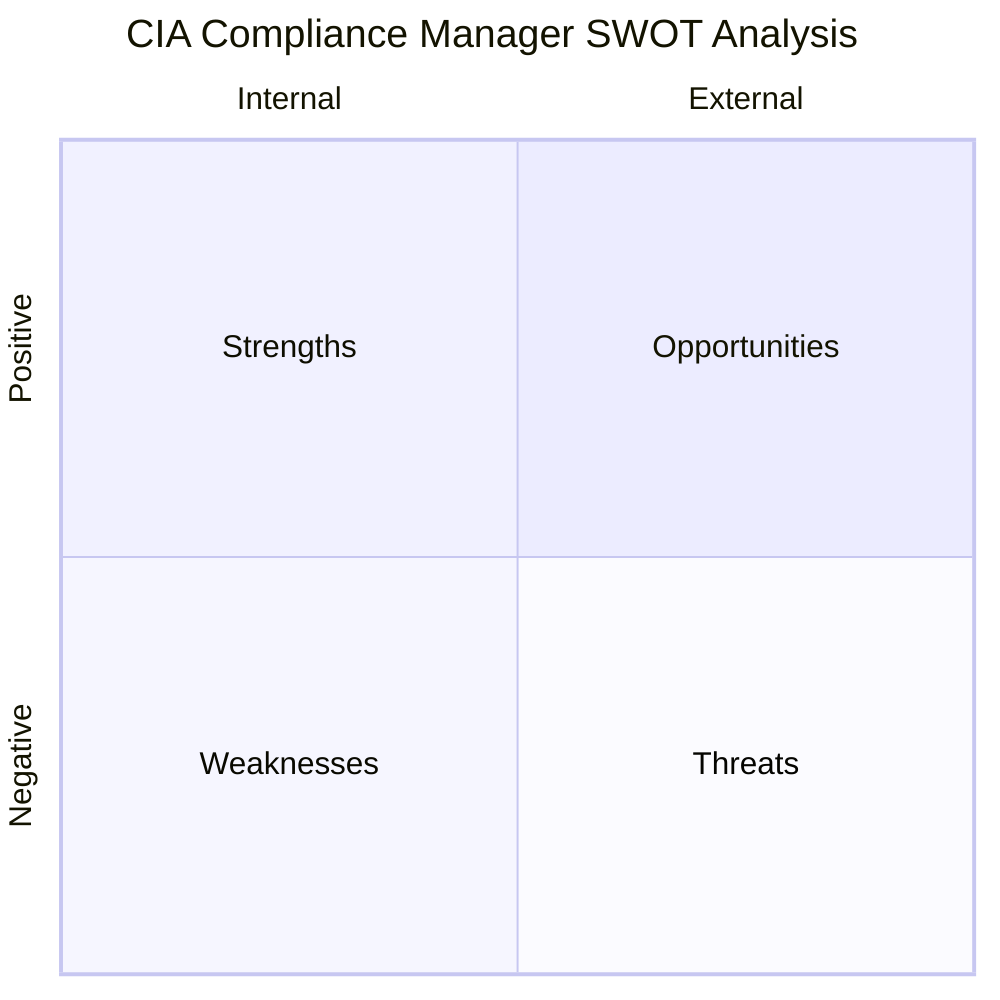
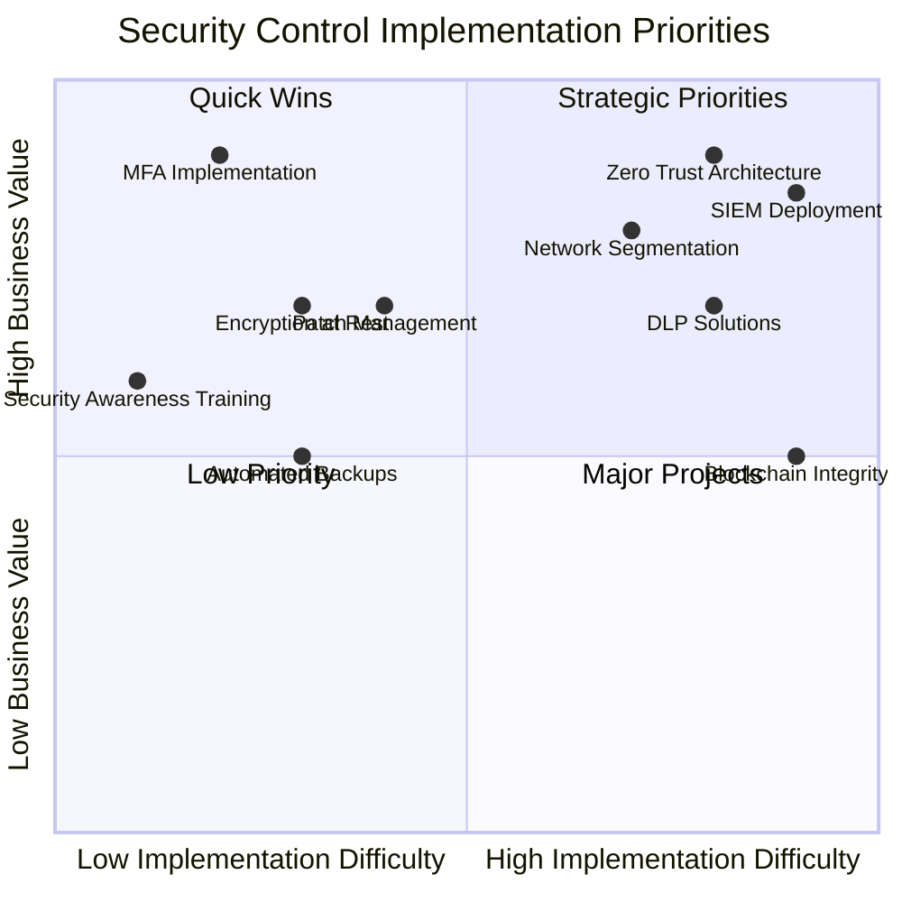

# CIA Compliance Manager SWOT Analysis

This document provides a strategic assessment of the CIA Compliance Manager project through a SWOT (Strengths, Weaknesses, Opportunities, Threats) analysis to identify internal and external factors affecting the project.

## SWOT Analysis Overview

## Strengths (Internal Positive)

- **Comprehensive CIA Security Model**: Detailed security levels (None, Low, Moderate, High, Very High) with concrete technical implementations.
- **Business Impact Quantification**: Clear mapping between security investments and business outcomes.
- **Compliance Framework Mapping**: Strong alignment with industry standards (NIST 800-53, ISO 27001, NIST CSF 2.0).
- **Component-Based Architecture**: Well-structured, modular design with clear separation of concerns.
- **Extensive Documentation**: C4 diagrams, mindmaps, flowcharts and state diagrams for clear understanding.
- **Comprehensive Test Coverage**: Both unit and E2E tests with resilient testing patterns.
- **Modern Technology Stack**: Uses current technologies (React 19, TypeScript 5, Vite 6) with strong typing.

## Weaknesses (Internal Negative)

- **Application Complexity**: Multiple interdependent components increase maintenance difficulty.
- **Performance Considerations**: Heavy calculations for security assessments may affect responsiveness.
- **Documentation Dependency**: Requires extensive documentation for users to understand security levels.
- **Offline Limitations**: Limited functionality when not connected to the internet.
- **Learning Curve**: Potentially steep learning curve for new users due to security domain complexity.
- **Single-User Focus**: No server-side component for multi-user collaboration on security assessments.

## Opportunities (External Positive)

- **Growing Cybersecurity Market**: Increased regulatory focus on security compliance creates demand.
- **Integration Potential**: Opportunities to integrate with other security and governance tools.
- **Framework Expansion**: Addition of more compliance frameworks to expand applicability.
- **SaaS Model Development**: Cloud-hosted version could create recurring revenue.
- **AI-Enhanced Recommendations**: Implementing AI for more sophisticated security control recommendations.
- **Mobile Capabilities**: Development of companion mobile apps for monitoring security status.

## Threats (External Negative)

- **Evolving Security Landscape**: Rapid changes in security threats requiring frequent updates.
- **Competitive Products**: Other security assessment tools competing in the same space.
- **Regulatory Changes**: Updates to compliance standards requiring significant rework.
- **Dependency Vulnerabilities**: Security issues in third-party dependencies.
- **Technical Debt**: Challenge of maintaining the complex codebase over time.
- **Assessment Accuracy Risks**: Potential for inaccurate security assessments leading to misguided decisions.

## Strategic Implementation Matrix

The following quadrant chart helps visualize different security control implementations based on their implementation difficulty and business value, helping organizations prioritize their security investments:

## Recommendations Based on SWOT

### Leverage Strengths

1. Continue enhancing the comprehensive security level documentation with concrete examples
2. Develop case studies showcasing the business impact quantification capabilities
3. Highlight compliance mapping capabilities in marketing materials

### Address Weaknesses

1. Implement performance optimizations for complex calculations
2. Develop an offline mode with core functionality
3. Create user onboarding flows to reduce the learning curve

### Pursue Opportunities

1. Develop API integrations with popular security tools
2. Add support for additional compliance frameworks
3. Explore AI-driven recommendation engine

### Mitigate Threats

1. Implement automated dependency scanning in the CI/CD pipeline
2. Establish a regular review process for compliance framework updates
3. Create a robust validation system for security assessments

## Conclusion

The CIA Compliance Manager has strong technical foundations and addresses a growing market need for security compliance tools. By addressing the identified weaknesses and threats while capitalizing on strengths and opportunities, the project can establish itself as a valuable tool for organizations seeking to improve their security posture and compliance status.
