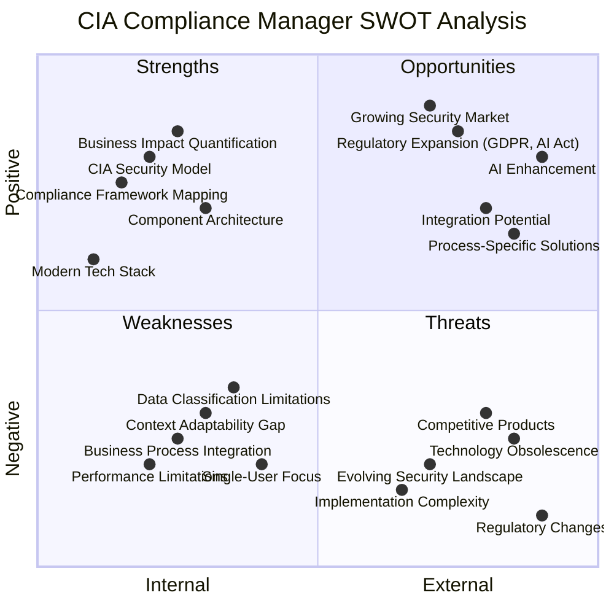
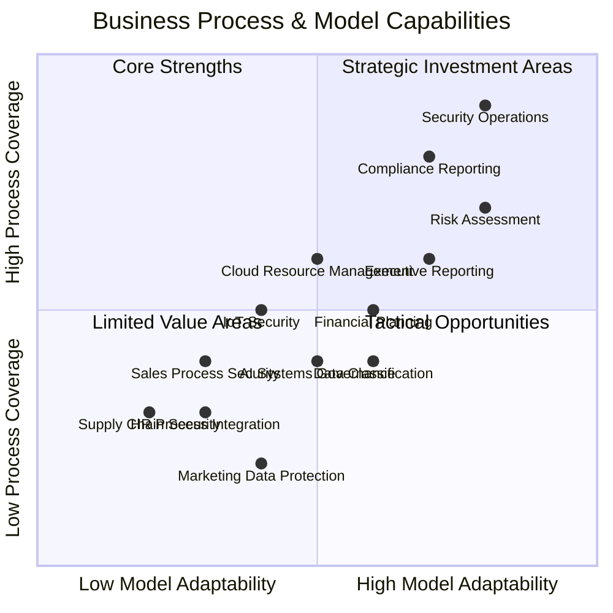
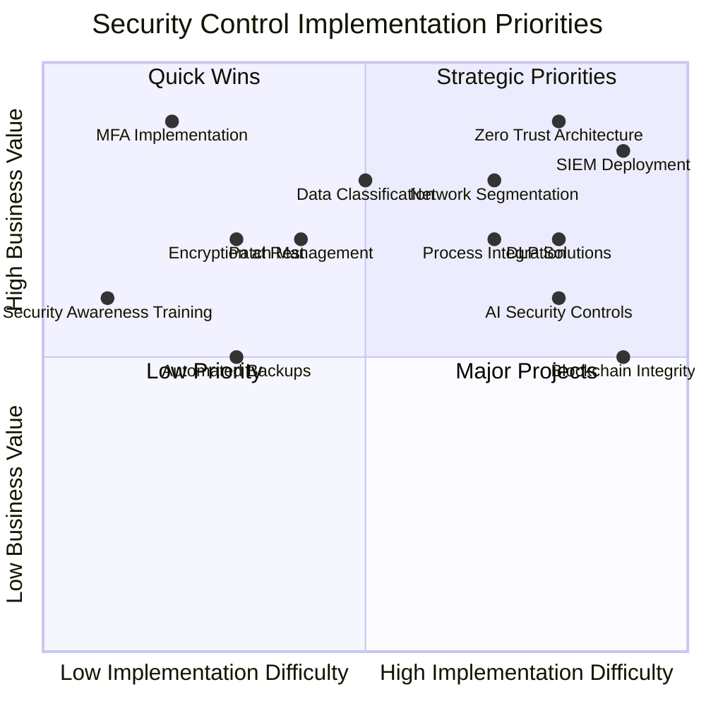

# CIA Compliance Manager Strategic Analysis

This comprehensive analysis provides a multi-dimensional assessment of the CIA Compliance Manager, examining its strategic position from business, technical, and model perspectives.

## Executive Summary

The CIA Compliance Manager demonstrates strong technical foundations and addresses growing market demand for security compliance tools. Its component-based architecture and comprehensive security model provide significant business value, though opportunities exist to enhance contextual adaptability, business process integration, and regulatory alignment.

## Business & Technology SWOT Analysis

**Strategic Focus:** Provides a high-level visualization of the project's internal and external factors, organized by positive and negative impact across business and technical dimensions.

## Business Process & Model Analysis

**Model Focus:** Examines the system's capability to support different business processes and adapt to various organizational contexts across different sectors.

## Detailed SWOT Analysis

### Strengths (Internal Positive)

#### Business Value Drivers

- **Comprehensive CIA Security Model**: Detailed security levels with concrete technical implementations matching business risk acceptance
- **Business Impact Quantification**: Clear mapping between security investments and business outcomes with ROI calculation
- **Financial Modeling**: CAPEX/OPEX breakdown allows for strategic budget planning and alignment with fiscal cycles
- **Investment Prioritization**: The quadrant-based visualization helps prioritize security investments based on business value

#### Technology Enablers

- **Compliance Framework Mapping**: Strong alignment with industry standards (NIST 800-53, ISO 27001, NIST CSF 2.0, GDPR)
- **Component-Based Architecture**: Well-structured, modular design with clear separation of concerns
- **Modern Technology Stack**: Uses current technologies (React 19, TypeScript 5, Vite 6) with strong typing
- **Visual Analytics**: Interactive data visualization helps communicate complex security concepts to non-technical stakeholders

#### Quality & Process

- **Extensive Documentation**: C4 diagrams, mindmaps, flowcharts and state diagrams for clear understanding
- **Comprehensive Test Coverage**: Both unit and E2E tests with resilient testing patterns
- **CI/CD Integration**: Automated builds, testing, and deployment with security scanning

### Weaknesses (Internal Negative)

#### Business Limitations

- **Business Context Adaptability Gap**: Limited ability to adapt security assessments to specific business contexts (e.g., B2B vs B2C, different industry verticals)
- **Business Process Integration**: Weak integration with HR, sales, marketing, and other business functions that require security guidance
- **Multi-stakeholder Collaboration**: No capability for different business units to collaborate on security assessment

#### Technical Constraints

- **Application Complexity**: Multiple interdependent components increase maintenance difficulty
- **Performance Considerations**: Heavy calculations for security assessments may affect responsiveness
- **Single-User Focus**: No server-side component for multi-user collaboration on security assessments
- **Data Classification Limitations**: Limited ability to categorize and label different types of organizational data

#### User Experience Issues

- **Documentation Dependency**: Requires extensive documentation for users to understand security levels
- **Offline Limitations**: Limited functionality when not connected to the internet
- **Learning Curve**: Potentially steep learning curve for new users due to security domain complexity

### Opportunities (External Positive)

#### Market & Business Growth

- **Growing Cybersecurity Market**: Increased regulatory focus on security compliance creates demand
- **Vertical-Specific Solutions**: Opportunity to create industry-specific templates (healthcare, finance, government)
- **Operational Efficiency**: Potential to generate significant operational efficiency by streamlining security processes
- **Risk Reduction ROI**: Security incidents cost companies $4.45M on average (IBM 2023), offering clear ROI for prevention

#### Technology Innovation

- **AI-Enhanced Recommendations**: Implementing AI for more sophisticated security control recommendations
- **Blockchain Integration**: Using blockchain for immutable security assessment records
- **Process Automation**: Opportunity to automate routine security assessments and compliance checks

#### Regulatory & Compliance

- **Regulatory Expansion**: Addition of more compliance frameworks to expand applicability:
  - **Privacy Regulations**: GDPR, CCPA, CPRA
  - **AI Regulations**: EU AI Act, upcoming AI regulatory frameworks
  - **Industry-Specific**: HIPAA, PCI-DSS, SOC2, CMMC
- **SaaS Model Development**: Cloud-hosted version could create recurring revenue
- **Mobile Capabilities**: Development of companion mobile apps for monitoring security status

### Threats (External Negative)

#### Market & Competition

- **Evolving Security Landscape**: Rapid changes in security threats requiring frequent updates
- **Competitive Products**: Other security assessment tools competing in the same space, often with more features
- **Implementation Barriers**: Organizations may struggle with implementation due to resource constraints
- **Market Perception**: Risk of being perceived as too technical or complex for business users

#### Technical & Regulatory

- **Regulatory Changes**: Updates to compliance standards requiring significant rework
- **Dependency Vulnerabilities**: Security issues in third-party dependencies
- **Technology Obsolescence**: Rapid changes in frontend frameworks could create maintenance challenges
- **Assessment Accuracy Risks**: Potential for inaccurate security assessments leading to misguided decisions

## Financial & Operational Impact Analysis

### Value Creation Potential

The CIA Compliance Manager offers significant financial and operational value creation opportunities:

| Business Area            | Current State Pain Points      | Solution Value                     | Estimated Impact          |
| ------------------------ | ------------------------------ | ---------------------------------- | ------------------------- |
| Security Budget Planning | Ad-hoc, reactive spending      | Structured CAPEX/OPEX forecasting  | 15-25% cost optimization  |
| Compliance Management    | Manual, time-consuming         | Automated controls mapping         | 40-60% time reduction     |
| Risk Assessment          | Subjective, inconsistent       | Quantified, consistent methodology | 30-50% improved accuracy  |
| Audit Preparation        | Scrambling to collect evidence | Continuous compliance posture      | 50-70% time savings       |
| Security Incidents       | Frequent, high-impact          | Proactive control implementation   | 20-40% incident reduction |

### Implementation Economics

| Implementation Approach | Initial Investment                 | Operational Cost              | ROI Timeline | Best For                                 |
| ----------------------- | ---------------------------------- | ----------------------------- | ------------ | ---------------------------------------- |
| Basic Security Level    | Low CAPEX (5-10% of IT budget)     | Low OPEX (5-10% annually)     | 6-12 months  | SMBs, low-regulation industries          |
| Moderate Security Level | Medium CAPEX (15-20% of IT budget) | Medium OPEX (15-20% annually) | 12-18 months | Mid-size companies, moderately regulated |
| High/Very High Security | High CAPEX (25-60% of IT budget)   | High OPEX (40-70% annually)   | 18-36 months | Enterprises, highly regulated industries |

## Business Process Integration Matrix

The following matrix illustrates how the CIA Compliance Manager can integrate with different business processes and departments:

| Business Function        | Current Integration             | Potential Enhancement              | Business Value              |
| ------------------------ | ------------------------------- | ---------------------------------- | --------------------------- |
| **Security Operations**  | High - Core functionality       | AI-driven recommendations          | Improved threat response    |
| **Compliance**           | High - Framework mapping        | Automated evidence collection      | Reduced audit costs         |
| **Executive Leadership** | Medium - Dashboard reporting    | Strategic forecasting              | Better risk management      |
| **Finance**              | Medium - CAPEX/OPEX modeling    | Budget integration                 | Optimized security spending |
| **HR**                   | Low - Basic policy guidance     | Employee security scoring          | Reduced insider threats     |
| **Sales/Marketing**      | Low - Limited guidance          | Customer data protection templates | Competitive advantage       |
| **Product Development**  | Medium - Security requirements  | Security-by-design integration     | Reduced remediation costs   |
| **IT Operations**        | Medium - Control implementation | Automated deployment               | Faster implementation       |
| **Legal**                | Medium - Compliance support     | Contract security requirements     | Reduced liability           |

## Strategic Implementation Priorities

**Investment Focus:** Visualizes security controls based on implementation difficulty versus business value, helping organizations prioritize their security investments.

## Strategic Recommendations

### 1. Business Value Enhancement

1. **Develop Vertical-Specific Templates**: Create industry-specific security profiles for healthcare, finance, retail, manufacturing, and government sectors
2. **Enhance Business Process Integration**: Develop specific modules for HR, Sales, Marketing, and Product Development security requirements
3. **Introduce Context-Aware Assessment**: Implement organizational context parameters to adapt security recommendations to specific business environments

### 2. Technical Capability Expansion

1. **Build Multi-User Collaboration**: Implement server-side capabilities to enable team-based security assessments
2. **Develop Data Classification Framework**: Create a comprehensive data classification system to help organizations categorize their information assets
3. **Improve Performance Optimization**: Implement caching and incremental calculations to improve responsiveness for complex assessments

### 3. Market Positioning

1. **Develop SMB-Focused Package**: Create a streamlined version for small/medium businesses with simplified workflows
2. **Establish Enterprise Integration Strategy**: Build connectors to popular enterprise tools (JIRA, ServiceNow, Power BI)
3. **Create Partner Enablement Program**: Develop resources for MSPs and security consultants to utilize the platform with clients

### 4. Risk Mitigation

1. **Implement Automated Dependency Scanning**: Ensure continuous monitoring of third-party dependencies
2. **Establish Regulatory Monitoring Process**: Create a systematic approach to track and respond to regulatory changes
3. **Develop Validation Framework**: Create robust validation mechanisms to ensure assessment accuracy

## Conclusion

The CIA Compliance Manager has strong technical foundations and addresses a growing market need for security compliance tools. Its comprehensive security model and business impact quantification capabilities provide significant value to organizations seeking to improve their security posture and compliance status.

By addressing the identified weaknesses in context adaptability and business process integration while capitalizing on opportunities in vertical-specific solutions and AI enhancement, the platform can establish itself as an essential tool for organizations navigating the complex landscape of security compliance and risk management.

The project's focus on quantifying security investments and connecting them to business outcomes positions it uniquely in a market that often struggles to demonstrate ROI for security expenditures. With strategic enhancements to improve adaptability and expand integration capabilities, the CIA Compliance Manager can become a cornerstone of organizational security and compliance programs.
