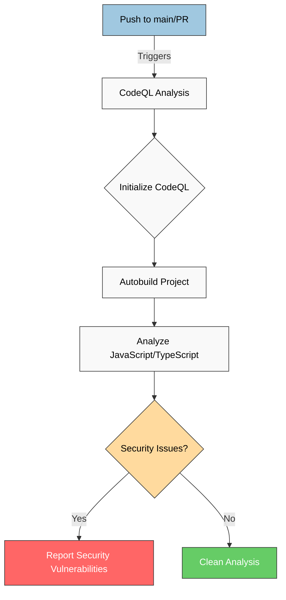
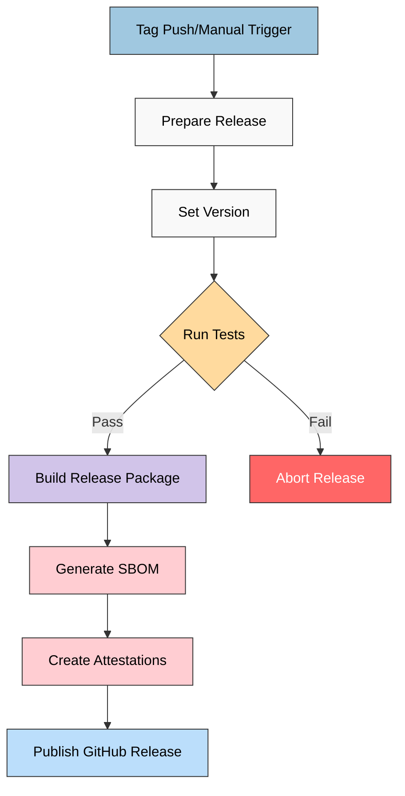
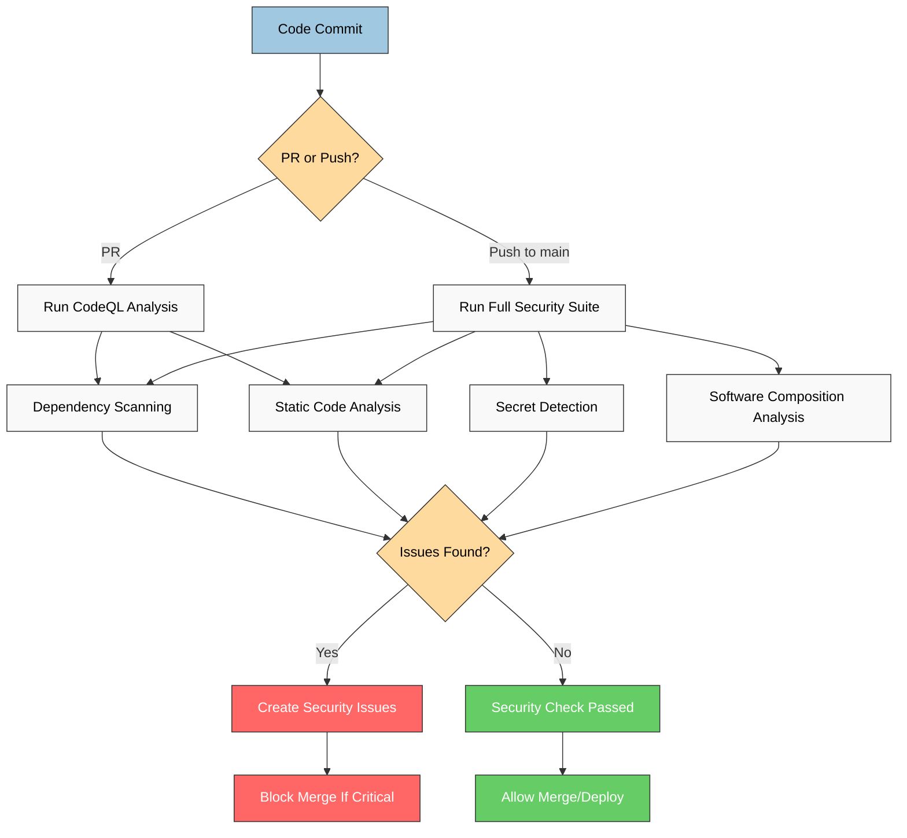

# CIA Compliance Manager CI/CD Workflows

This document describes the CI/CD workflows implemented for the CIA Compliance Manager project, illustrating the automated processes for code quality, security checks, testing, and release management.

## Overview of CI/CD Pipeline

The project implements a comprehensive CI/CD pipeline with distinct workflows for:

1. Continuous Integration (CI) workflows that run on each PR and push
2. Security analysis workflows for vulnerability detection
3. Release automation for creating verified, attested releases

## CodeQL Security Analysis Workflow

**Security Focus:** Automatically analyzes code for potential security vulnerabilities and coding errors using GitHub's CodeQL engine.

**Risk Management Focus:** Provides early detection of security issues during development, preventing vulnerabilities from reaching production.



## Release Workflow

**Supply Chain Security Focus:** Implements secure build processes with attestations and provenance to ensure release integrity and verify authenticity.

**Release Management Focus:** Automates the versioning, building, testing, and publishing process for new releases with comprehensive artifacts.



## Detailed Release Process

```mermaid
stateDiagram-v2
    [*] --> Preparation: Version Tag or Manual Trigger

    state Preparation {
        [*] --> Versioning
        Versioning --> TestPrep
        TestPrep --> [*]
    }

    Preparation --> Testing: Start Test Suite

    state Testing {
        [*] --> UnitTests
        UnitTests --> E2ETests
        E2ETests --> [*]
    }

    Testing --> Build: Tests Pass
    Testing --> [*]: Tests Fail

    state Build {
        [*] --> CompileCode
        CompileCode --> CreateArtifacts
        CreateArtifacts --> SecurityAttestation
        SecurityAttestation --> SBOM
        SBOM --> [*]
    }

    Build --> Release

    state Release {
        [*] --> DraftRelease
        DraftRelease --> PublishRelease
        PublishRelease --> [*]
    }

    Release --> [*]

    classDef preparation fill:#a0c8e0,stroke:#333,stroke-width:1px,color:black;
    classDef testing fill:#e8f5e9,stroke:#333,stroke-width:1px,color:black;
    classDef build fill:#d1c4e9,stroke:#333,stroke-width:1px,color:black;
    classDef release fill:#bbdefb,stroke:#333,stroke-width:1px,color:black;
    classDef terminal fill:#f5f5f5,stroke:#333,stroke-width:1px,color:black;

    class Preparation preparation;
    class Testing testing;
    class Build build;
    class Release release;
    class [*] terminal;
```

## Security Scanning Integration

**Security Focus:** Shows how automated security scans are integrated throughout the development lifecycle to identify vulnerabilities early.

**Compliance Focus:** Illustrates the implementation of automated compliance checks and security policy enforcement via CI/CD.



## Key Workflow Features

### 1. CodeQL Security Scanning

The CodeQL workflow automatically scans for security vulnerabilities in:

- JavaScript and TypeScript code
- React component vulnerabilities
- Potential injection attacks
- Insecure coding patterns

Results are reported through GitHub Security tab with automated alerts for maintainers.

### 2. Comprehensive Testing Integration

The release workflow ensures quality through:

- Vitest unit tests with high coverage requirements
- Cypress end-to-end tests for user flows
- Visual regression tests for UI components
- Test reports and artifacts published for review

### 3. Software Bill of Materials (SBOM)

Every release includes:

- Complete SBOM in SPDX JSON format
- Dependency listing with versions
- License compliance information
- Known vulnerability status

### 4. Release Attestations

The workflow creates cryptographically signed attestations certifying:

- Build provenance (who built it, when, and how)
- SBOM verification for dependency transparency
- Artifact integrity through secure hashing

### 5. Pipeline Security Controls

Security throughout the CI/CD pipeline is maintained by:

- Hardened CI runner environments
- Limited pipeline permissions
- Pinned action versions with SHA hashes
- Dependency caching for build reproducibility
- Audit logging of all CI/CD operations

## Benefits of the CI/CD Approach

1. **Consistent Quality:** Automated testing ensures code quality across all changes
2. **Security Integration:** Security scanning is built into the development process
3. **Release Confidence:** Every release has verified provenance and integrity
4. **Compliance Support:** Automated attestations help meet regulatory requirements
5. **Developer Experience:** Fast feedback on code quality and security issues
