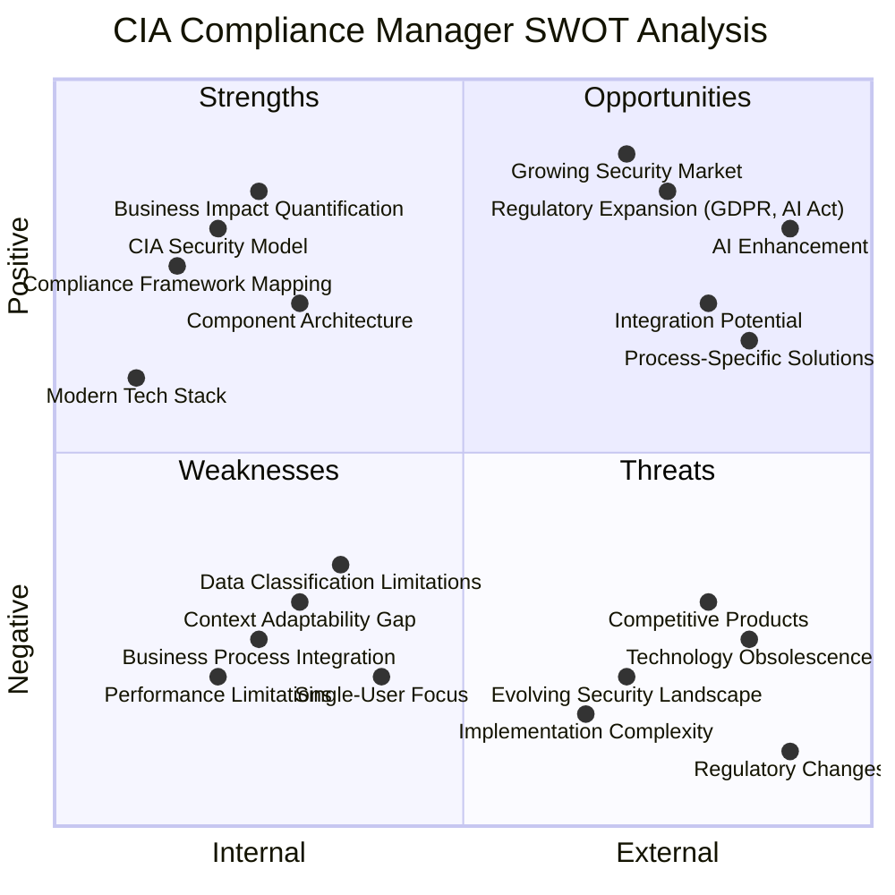
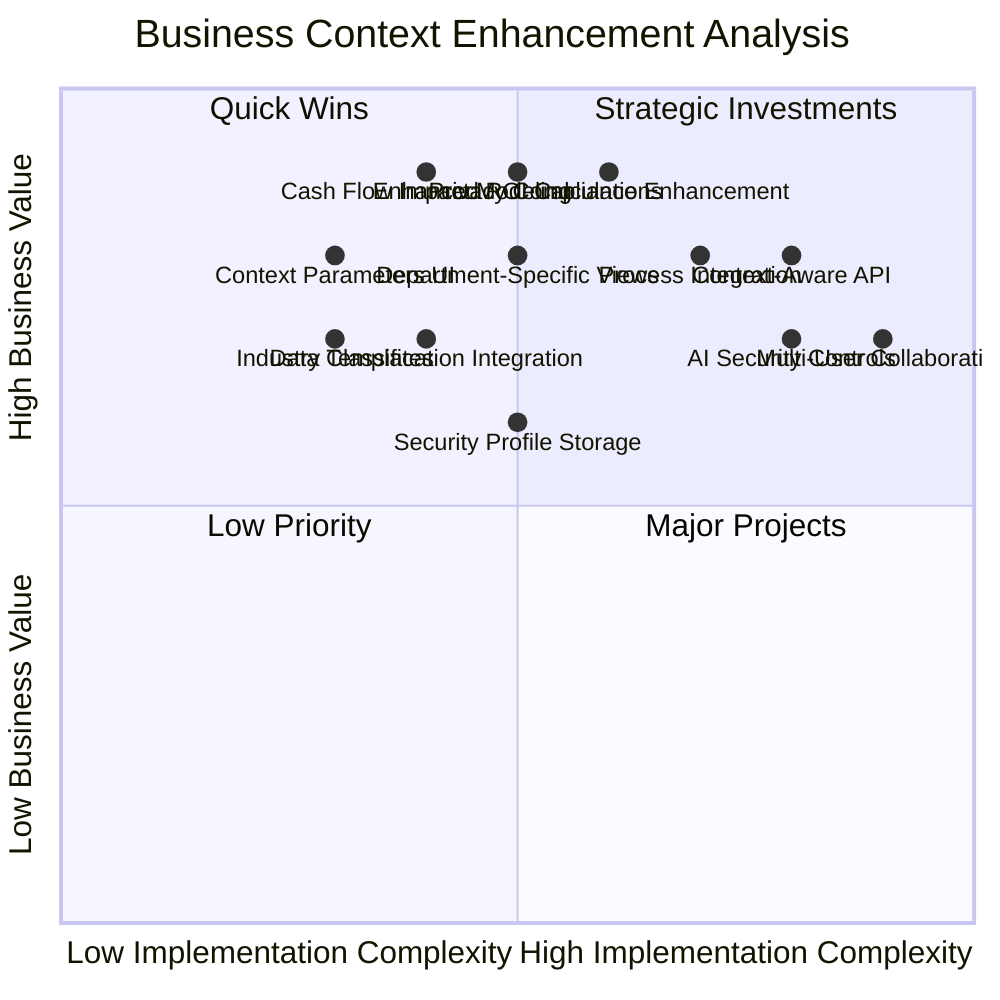
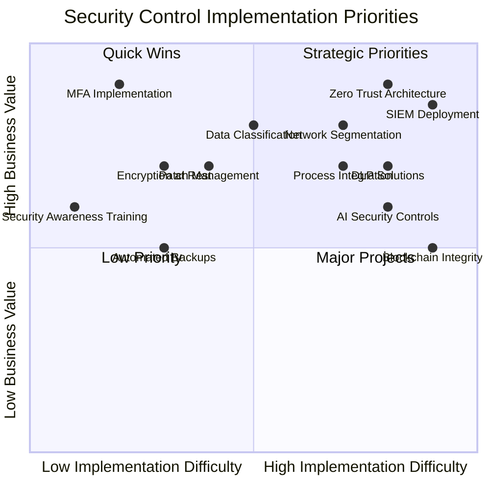

# CIA Compliance Manager Strategic Analysis

This comprehensive analysis provides a multi-dimensional assessment of the CIA Compliance Manager, examining its strategic position from business, technical, and model perspectives.

## Executive Summary

The CIA Compliance Manager demonstrates strong technical foundations and addresses growing market demand for security compliance tools. Its component-based architecture and comprehensive security model provide significant business value, though opportunities exist to enhance contextual adaptability, business process integration, and regulatory alignment through the proposed context-aware security assessment capabilities.

## Business & Technology SWOT Analysis

**Strategic Focus:** Provides a high-level visualization of the project's internal and external factors, organized by positive and negative impact across business and technical dimensions.

## Business Context Enhancement Analysis

**Enhanced Focus:** Evaluates how the proposed context-aware security assessment capabilities address key business context gaps and improve adaptation to specific organizational needs.

## Detailed SWOT Analysis of Context-Aware Enhancements

### Strengths (Internal Positive)

#### Business Value Enhancement

- **Organizational Context Adaptation**: The proposed BusinessContext model enables tailored security recommendations based on specific organizational factors
- **Comprehensive Context Parameters**: Captures critical dimensions including cash flow, department focus, data classification, privacy needs, and AI considerations
- **ROI Precision**: Enables more accurate ROI calculations based on specific organizational context and industry
- **Multi-Dimensional Analysis**: Combines financial, operational, regulatory and technological perspectives for holistic recommendations

#### Implementation Approach

- **Progressive Enhancement**: Designed as an extension to existing functionality without breaking changes
- **Modular Design**: Context parameters can be applied independently or in combination
- **Type-Safety**: Strong TypeScript typing ensures consistent use of context parameters
- **Backward Compatibility**: Maintains support for existing implementations while adding context awareness

### Weaknesses (Internal Negative)

#### Implementation Challenges

- **UI Complexity**: Adding context parameters increases form complexity and potential user confusion
- **Performance Impact**: Additional context processing may affect application responsiveness
- **Default Values**: Determining appropriate defaults for context parameters will be challenging
- **Testing Complexity**: Exponentially more test cases needed to validate all context combinations

#### Business Limitations

- **Implementation Effort**: Significant development work required to fully implement context-awareness
- **User Research Gaps**: Limited validation with actual users about which contexts matter most
- **Initial Focus**: First implementation limited to key context parameters with others planned for future

### Opportunities (External Positive)

#### Market Differentiation

- **Unique Value Proposition**: Context-aware security assessment is a significant differentiator in the market
- **Enterprise Appeal**: Enhanced context parameters make the solution more appealing to large enterprises
- **Cross-Industry Application**: Industry-specific templates open new market segments
- **Precision Marketing**: Ability to demonstrate quantifiable value specifically to each customer's context

#### Technical Advancement

- **Machine Learning Integration**: Future potential to apply ML for even more precise context-based recommendations
- **API Ecosystem**: Context-aware API enables integration with enterprise systems for automatic context gathering
- **Data Insights**: Aggregated anonymous context data could provide valuable industry benchmarking

### Threats (External Negative)

#### Adoption Barriers

- **Data Collection Concerns**: Organizations may be reluctant to provide detailed contextual information
- **Configuration Overhead**: Additional setup time may discourage adoption
- **Accuracy Expectations**: Higher precision expectations may lead to disappointment if not met
- **Competitive Response**: Competitors may quickly implement similar capabilities

#### Technical Risks

- **Scalability Concerns**: Context processing may create performance bottlenecks at scale
- **Context Storage Security**: Storing organizational context creates new security considerations
- **Algorithm Bias**: Risk of built-in biases in context-driven recommendations

## Financial & Operational Impact Analysis

### Value Creation Potential

The CIA Compliance Manager offers significant financial and operational value creation opportunities:

| Business Area            | Current State Pain Points      | Solution Value                     | Estimated Impact          |
| ------------------------ | ------------------------------ | ---------------------------------- | ------------------------- |
| Security Budget Planning | Ad-hoc, reactive spending      | Structured CAPEX/OPEX forecasting  | 15-25% cost optimization  |
| Compliance Management    | Manual, time-consuming         | Automated controls mapping         | 40-60% time reduction     |
| Risk Assessment          | Subjective, inconsistent       | Quantified, consistent methodology | 30-50% improved accuracy  |
| Audit Preparation        | Scrambling to collect evidence | Continuous compliance posture      | 50-70% time savings       |
| Security Incidents       | Frequent, high-impact          | Proactive control implementation   | 20-40% incident reduction |

### Implementation Economics

| Implementation Approach | Initial Investment                 | Operational Cost              | ROI Timeline | Best For                                 |
| ----------------------- | ---------------------------------- | ----------------------------- | ------------ | ---------------------------------------- |
| Basic Security Level    | Low CAPEX (5-10% of IT budget)     | Low OPEX (5-10% annually)     | 6-12 months  | SMBs, low-regulation industries          |
| Moderate Security Level | Medium CAPEX (15-20% of IT budget) | Medium OPEX (15-20% annually) | 12-18 months | Mid-size companies, moderately regulated |
| High/Very High Security | High CAPEX (25-60% of IT budget)   | High OPEX (40-70% annually)   | 18-36 months | Enterprises, highly regulated industries |

## Business Process Integration Matrix

The following matrix illustrates how the CIA Compliance Manager can integrate with different business processes and departments:

| Business Function        | Current Integration             | Potential Enhancement              | Business Value              |
| ------------------------ | ------------------------------- | ---------------------------------- | --------------------------- |
| **Security Operations**  | High - Core functionality       | AI-driven recommendations          | Improved threat response    |
| **Compliance**           | High - Framework mapping        | Automated evidence collection      | Reduced audit costs         |
| **Executive Leadership** | Medium - Dashboard reporting    | Strategic forecasting              | Better risk management      |
| **Finance**              | Medium - CAPEX/OPEX modeling    | Budget integration                 | Optimized security spending |
| **HR**                   | Low - Basic policy guidance     | Employee security scoring          | Reduced insider threats     |
| **Sales/Marketing**      | Low - Limited guidance          | Customer data protection templates | Competitive advantage       |
| **Product Development**  | Medium - Security requirements  | Security-by-design integration     | Reduced remediation costs   |
| **IT Operations**        | Medium - Control implementation | Automated deployment               | Faster implementation       |
| **Legal**                | Medium - Compliance support     | Contract security requirements     | Reduced liability           |

## Strategic Implementation Priorities

**Investment Focus:** Visualizes security controls based on implementation difficulty versus business value, helping organizations prioritize their security investments.

## Strategic Recommendations

### 1. Business Value Enhancement

1. **Develop Vertical-Specific Templates**: Create industry-specific security profiles for healthcare, finance, retail, manufacturing, and government sectors
2. **Enhance Business Process Integration**: Develop specific modules for HR, Sales, Marketing, and Product Development security requirements
3. **Introduce Context-Aware Assessment**: Implement organizational context parameters to adapt security recommendations to specific business environments

### 2. Technical Capability Expansion

1. **Build Multi-User Collaboration**: Implement server-side capabilities to enable team-based security assessments
2. **Develop Data Classification Framework**: Create a comprehensive data classification system to help organizations categorize their information assets
3. **Improve Performance Optimization**: Implement caching and incremental calculations to improve responsiveness for complex assessments

### 3. Market Positioning

1. **Develop SMB-Focused Package**: Create a streamlined version for small/medium businesses with simplified workflows
2. **Establish Enterprise Integration Strategy**: Build connectors to popular enterprise tools (JIRA, ServiceNow, Power BI)
3. **Create Partner Enablement Program**: Develop resources for MSPs and security consultants to utilize the platform with clients

### 4. Risk Mitigation

1. **Implement Automated Dependency Scanning**: Ensure continuous monitoring of third-party dependencies
2. **Establish Regulatory Monitoring Process**: Create a systematic approach to track and respond to regulatory changes
3. **Develop Validation Framework**: Create robust validation mechanisms to ensure assessment accuracy

## Conclusion

The CIA Compliance Manager has strong technical foundations and addresses a growing market need for security compliance tools. Its comprehensive security model and business impact quantification capabilities provide significant value to organizations seeking to improve their security posture and compliance status.

By addressing the identified weaknesses in context adaptability and business process integration while capitalizing on opportunities in vertical-specific solutions and AI enhancement, the platform can establish itself as an essential tool for organizations navigating the complex landscape of security compliance and risk management.

The project's focus on quantifying security investments and connecting them to business outcomes positions it uniquely in a market that often struggles to demonstrate ROI for security expenditures. With strategic enhancements to improve adaptability and expand integration capabilities, the CIA Compliance Manager can become a cornerstone of organizational security and compliance programs.
